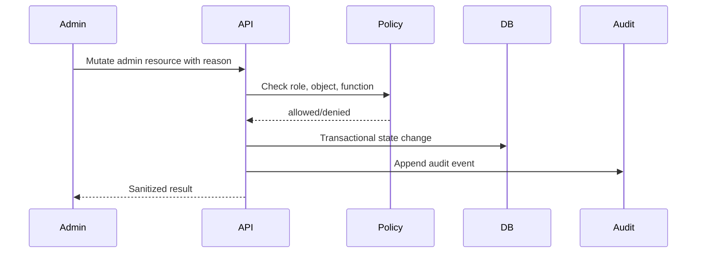

# Veel V2 Admin And Operations Dashboard

Status: accepted
Scope: admin, business operations, support, devops visibility
Last updated: 2026-06-04
Source of truth: yes

Owns:
- admin operations dashboard decisions for its named domain

Defers to:
- INDEX.md, route-map.md, OpenAPI, schema blueprint, and ADRs where narrower

Does not own:
- unrelated domains, implementation shortcuts, provider secrets, or hidden source-of-truth rules

Launch scope:
- accepted v2 launch or phased behavior stated in this document

Non-goals:
- historical-context inference, duplicate systems, and unapproved provider/product expansion

This document defines the admin and operations surface required to run Veel as a business. It complements `safety-admin-ai.md`, which covers safety and AI boundaries. The admin dashboard is a separate protected product surface, not part of the normal user app shell.

Current implementation state:

- `GET /v1/admin/ops/summary` returns role-gated payment, unlock, provider event, report, provider health, and queue health counts.
- `GET /v1/admin/payments/intents` returns sanitized payment intent reconciliation rows with server-owned product, amount, state, reference address, submitted/confirmed signatures, settlement attempt count, and linked entitlement ID.
- `GET /v1/admin/unlocks` returns sanitized entitlement rows for content unlock and access investigation.
- `GET /v1/admin/provider-events` returns sanitized provider event status and timing only.
- The `/admin` web surface is separate from normal user navigation and mirrors the read-only payment/unlock/provider ops projection for smoke coverage.
- Event ticket operations are inspectable through payment intent state, ticket entitlement state, QR/check-in state, and provider event state; admin mutations remain deferred to their dedicated role-policy slices.
- Admin reads require a valid session whose app user has an active staff membership in an operations, finance, support, creator-success, readonly-auditor, admin, or owner role.
- Raw provider payloads, webhook bodies, private media URLs, stream keys, provider secrets, wallet private keys, service-role keys, and frontend-computed payment truth are not returned.

## Admin Principles

- Admin is role-gated and separate from user navigation.
- Every admin mutation is audited.
- Dangerous actions require explicit confirmation.
- Provider diagnostics are sanitized.
- No provider secrets, stream keys, private media URLs, raw identity documents, wallet private keys, or raw sensitive payloads are exposed.
- Admin reads can be broad, but admin writes must be scoped by role, policy, and reason.
- Admin tools support business operations, support, compliance, moderation, and devops visibility.

## Admin Route Map

```text
/admin
/admin/users
/admin/content
/admin/reports
/admin/payments
/admin/unlocks
/admin/referrals
/admin/subscriptions
/admin/creator-earnings
/admin/live
/admin/media-providers
/admin/events
/admin/dating
/admin/messages
/admin/age-kyc
/admin/ai
/admin/audit-log
/admin/support
/admin/ops
```

## Role Model

| Role | Scope |
| --- | --- |
| Super admin | Full admin access, break-glass actions, role management |
| Operations | Provider status, queues, deployments, webhooks, diagnostics |
| Finance | payments, settlements, referrals, subscriptions, refunds, creator earnings |
| Trust and safety | reports, moderation, blocks, age/KYC review state |
| Support | user lookup, safe payment/access status, ticket escalation |
| Creator success | creator dashboards, onboarding, monetisation readiness |
| Event ops | event ticketing, check-ins, refunds/escalations |
| AI ops | AI sessions/tools/audit, no money or safety bypass |

Role permissions should be explicit in code and documented as policy tests.

## Dashboard Overview

The admin landing dashboard should show:

- GMV, platform revenue, creator earnings, referral commissions
- active users, creators, subscribers, paying users
- content unlock conversion and failed payment rate
- live rooms active, waiting, replay processing
- media upload/processing health
- reports/moderation queue counts
- age/KYC pending/fail/success counts
- webhook health and queue lag
- provider status summary
- incident banner when provider or deploy health is degraded

## Business Operations Modules

Payments and unlocks:

- search payment intent by user, wallet, creator, content, signature, reference, or status
- view server-computed splits
- view confirmed chain evidence
- view entitlement/access grant result
- inspect duplicate/replay attempts
- mark manual review, not manual success, unless a break-glass policy exists

Referrals and commissions:

- referral link and attribution chain
- referrer/referred user relationship
- payment intent and settlement linkage
- commission amount and source share
- self-referral/duplicate rejection reasons
- fraud/suspicious attribution flags

Subscriptions:

- platform subscription state
- creator subscription state
- renewal/failure/grace/cancel state
- entitlement scope
- provider billing/webhook audit
- churn and revenue metrics

Creator earnings:

- confirmed settlement-derived earnings
- pending review items
- KYC/KYB readiness
- creator wallet changes
- refunds/disputes/revocations

Events:

- event status
- ticket inventory
- paid/free ticket issuance
- check-in/QR status
- refunds/disputes
- event owner and moderation state

## Product Operations Modules

Users:

- safe user profile
- linked wallets
- age/access state
- KYC/KYB state summary
- blocks/reports/suspensions
- audit history

Content:

- media status
- monetisation/access state
- creator ownership
- moderation state
- takedown/reinstate actions
- purchased access impact warning before destructive changes

Live:

- live room status
- host/creator authorization state
- viewer/pass counts
- replay processing status
- sanitized Livepeer diagnostics
- no stream key/ingest URL in viewer-like admin views unless a break-glass role explicitly allows masked host support

Media providers:

- Bunny video ID/status
- Livepeer asset/stream status
- upload/processing timings
- webhook delivery state
- retry controls
- sanitized provider payload projection

Messages:

- support-safe thread metadata
- paid-message status
- report/block context
- no private message content access unless support/compliance policy explicitly allows and audits it

Dating:

- opt-in state
- match/report/block safety queues
- no accidental exposure of private match content outside role policy

AI/MCP:

- AI sessions
- tool calls
- permission scopes
- user consent
- admin-only tool usage
- blocked/failed tool attempts

## Devops And Platform Operations

The `/admin/ops` module should expose:

- API health
- web health
- worker health
- queue lag
- webhook delivery failures
- Supabase Postgres/Auth/Realtime health
- Redis/queue health if used
- provider API status summaries
- recent deploy version
- error rate and latency
- rate-limit spikes
- storage/CDN errors
- suspicious auth/payment/webhook activity

Use dashboards and links to observability systems rather than building a full log viewer inside the admin UI.

## Operational KPIs

Business:

- GMV
- platform revenue
- net platform revenue after referral commissions
- creator earnings
- paying conversion rate
- content unlock conversion rate
- subscription MRR/ARR/churn
- event ticket sales
- creator retention

Product:

- DAU/WAU/MAU
- feed engagement
- like/comment/save/share rates
- live room attendance
- message send/reply rates
- create-to-publish completion
- upload processing success

Risk:

- payment failure rate
- webhook lag
- duplicate/replay attempts
- moderation queue age
- report volume
- age/KYC failure rate
- chargeback/refund/dispute count where applicable

## Admin Mutation Pattern



Every admin mutation must include:

- actor
- role
- target
- action
- reason
- before/after safe diff where useful
- request ID
- timestamp

## Tests Required

- role cannot access unauthorized module
- role cannot perform unauthorized mutation
- admin mutation writes audit event
- dangerous action requires confirmation/reason
- payment lookup does not expose secrets
- provider diagnostics are sanitized
- support role cannot access raw private message content by default
- finance role can inspect settlement and split records
- ops role can view provider health but not mutate money state

Current dating ops implementation:

- `GET /v1/admin/dating/safety` returns aggregate open dating reports, active matches, and stale matches.
- Admin dating visibility is aggregate-only for this slice; private match message content remains outside default admin visibility.
