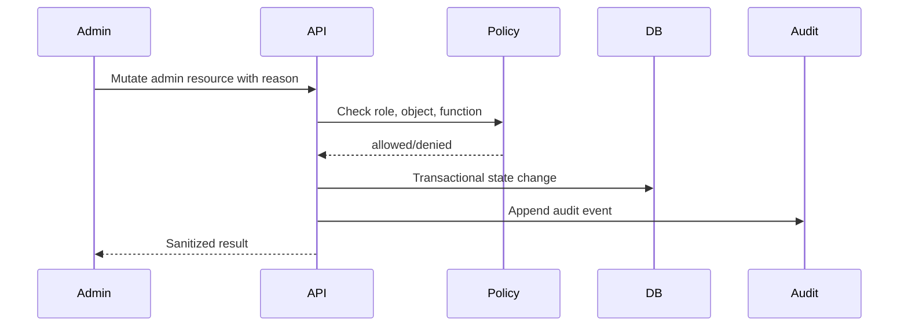

# Veel V2 Admin And Operations Dashboard

Status: accepted
Scope: admin, business operations, support, devops visibility
Last updated: 2026-08-24
Source of truth: yes

Owns:
- admin operations dashboard decisions for its named domain

Defers to:
- INDEX.md, route-map.md, OpenAPI, schema blueprint, and ADRs where narrower

Does not own:
- unrelated domains, implementation shortcuts, provider secrets, or hidden source-of-truth rules

Launch scope:
- accepted v2 launch or phased behavior stated in this document

Non-goals:
- historical-context inference, duplicate systems, and unapproved provider/product expansion

This document defines the admin and operations surface required to run Veel as a business. It complements `safety-admin-ai.md`, which covers safety and AI boundaries. The admin dashboard is a separate protected product surface, not part of the normal user app shell.

Current implementation state:

- `GET /v1/admin/me` returns one typed effective-access projection from the canonical registry: active staff roles plus registered role/explicit permissions. Every admin route and action now checks its exact permission key; analytics, AI, and MCP management no longer accept broad active-staff access.
- Staff lifecycle is available through `GET /v1/admin/staff`, `POST /v1/admin/staff/invitations`, `PATCH /v1/admin/staff/memberships/{membershipId}`, `GET /v1/staff/invitations/current`, and `POST /v1/staff/invitations/{invitationId}/respond`. Invitations target existing canonical users only, expire within seven days, require acceptance, notification, recent authentication and confirmation for sensitive owner actions, protect the final active owner, revoke application sessions on suspension/revocation, and audit safe before/after state.

- `GET /v1/admin/ops/summary` returns role-gated payment, unlock, provider event, subscription lifecycle, creator media-offer, structured-request, recurring-provider readiness, report, provider health, and per-worker queue health. Queue projections include pending, processing, failed, dead-letter, and oldest-pending state for subscription collections, notification delivery, payment confirmation email, provider-event replay, media moderation, Analytics Core projection, and live-safety suspension.
- `POST /v1/admin/worker-queues/{queueName}/jobs/{jobId}/retry` is the only API recovery boundary for exhausted worker jobs. It accepts only `dead_letter` jobs, requires a reason and `Idempotency-Key`, restores the queue-specific initial state, clears stale lease/failure state, records `worker_queue_recovery_requests`, and writes an audit event. It never marks provider work successful and never bypasses subscription reconciliation or access/payment authority.
- `GET /v1/admin/payments/intents` returns sanitized payment intent reconciliation rows with server-owned product, amount, state, reference address, submitted/confirmed signatures, settlement attempt count, and linked entitlement ID.
- `GET /v1/admin/unlocks` returns sanitized entitlement rows for content unlock and access investigation.
- `GET /v1/admin/provider-events` returns sanitized provider event status, timing, and latest replay-request state only.
- `POST /v1/admin/provider-events/{providerEventId}/replay` enqueues an audited, idempotent replay request for the worker boundary. It requires `Idempotency-Key` and reason text, writes `provider_event_replay_requests` plus `audit_events`, and returns `202` only after queueing. It does not expose raw provider payloads and does not mark provider truth as replayed by itself.
- `GET /v1/admin/live/rooms` and `GET /v1/admin/media/assets` return sanitized Livepeer/Bunny provider projections. They expose provider state, provider IDs, and booleans for playback URL or stream-key presence only; host stream keys, ingest URLs, signed playback URLs, raw payloads, and provider secrets remain server-only.
- `POST /v1/admin/live/rooms/{roomId}/suspension` is a recent-authenticated, idempotent action restricted to owner/admin/trust-safety roles. Suspend blocks local playback and canonical release before the provider call; resume remains suspended until Livepeer confirms recovery. The admin surface requires a reason and exposes no host secret.
- `GET /v1/admin/age-kyc/age-checks` and `GET /v1/admin/age-kyc/identity-checks` return sanitized age, identity, KYC, and KYB provider projections. They expose normalized state, provider identifiers, country/jurisdiction hints, and presence booleans only; raw identity documents, legal-name values, provider payloads, and PII remain server-only.
- `GET /v1/admin/ai/sessions` and `GET /v1/admin/ai/tool-calls` return sanitized AI/MCP operations projections. They expose scope, state, tool names, confirmation state, and human-readable summaries only; redacted JSON payloads, idempotency keys, tool input/output bodies, and secrets remain server-only.
- `GET /v1/admin/audit` returns sanitized audit event id, subject type, action, and timestamp only. It intentionally omits `metadata`, raw provider payloads, reasons, idempotency keys, PII, wallet evidence, and secrets.
- `GET /v1/admin/users`, `GET /v1/admin/users/{userId}`, `GET /v1/admin/content`, `PATCH /v1/admin/content/{contentId}/moderation`, `GET /v1/admin/reports`, and `PATCH /v1/admin/reports/{reportId}` expose the first user/content/report moderation queue. Reads are sanitized and omit email, phone, raw identity records, provider payloads, report metadata, and secrets. Content-moderation and report-review mutations require `Idempotency-Key` and reason text, and atomically write their state transition plus `audit_events` through the shared Postgres transaction boundary.
- `GET /v1/admin/events` and `GET /v1/admin/event-access-passes` expose read-only Event Access operations projections using the same sanitized Event and Event Access Pass schemas as user-facing routes. Ticket-named admin aliases are removed from launch-facing contracts and code. They do not expose stream keys, raw QR hashes, provider payloads, balances, or payout state.
- `GET /v1/refunds/requests` and `POST /v1/refunds/requests` let authenticated, age-verified users open refund, dispute, or access-issue review requests for their own payment intents. These routes create review/audit state only and never execute refunds, reverse settlements, create balances, create payout queues, or override blockchain payment truth.
- `GET /v1/admin/refunds/disputes` and `PATCH /v1/admin/refunds/disputes/{refundDisputeId}` expose sanitized refund/dispute review state to staff. Admin updates require `Idempotency-Key`, write `audit_events`, and may only change review state/resolution; creator/admin refund execution and entitlement revocation/replacement remain separate policy-approved slices.
- `GET /v1/admin/data-requests` and `PATCH /v1/admin/data-requests/{dataRequestId}` expose the privacy request lifecycle to staff. Rows are sanitized lifecycle records only, user-visible through owner/staff RLS, and carry the `sanitized_identity_minimized_no_raw_exports` boundary. Admin updates require `Idempotency-Key`, reason text, and audit events.
- `GET /v1/admin/feature-flags` and `PATCH /v1/admin/feature-flags/{featureFlagKey}` expose software policy controls to staff. Feature flags are audited software controls only and carry the `software_policy_only_no_payment_access_or_social_priority` boundary; they must never become payment truth, access truth, reporting truth, bookkeeping truth, recommendation priority, Mutuals treatment, visibility boost, or message priority.
- `safety.content_creation_abuse_policy` is seeded as an active safety feature flag for backend-enforced create/upload quotas. Staff can tune `dailyContentDraftQuota`, `dailyMediaUploadQuota`, and `rollingWindowHours` through the audited feature-flag form; the policy only affects backend abuse limits and cannot buy or create moderation priority, visibility, recommendations, Mutuals treatment, message priority, payment truth, or access truth.
- `GET /v1/admin/mutuals/safety` exposes aggregate open Mutuals reports, active Mutuals, and stale Mutuals with the hard social-money boundary. Dating-named admin safety routes are removed from launch-facing contracts and code.
- The `/admin` web surface is a separate responsive shell whose navigation is derived from `/v1/admin/me`. The overview fetches only overview plus explicitly permitted health resources; each modular subroute loads only its own authority, and organization members are resolved from returned organizations instead of a hardcoded ID. It fails closed when the current role lacks the section permission and never renders fixture money, provider, tax, or receipt rows.
- Event Access operations are inspectable through payment intent state, pass entitlement state, QR/check-in state, compliance ledger state, and provider event state; admin Event Access mutations remain deferred to their dedicated role-policy slices.
- DAC7/VAT readiness is surfaced through read-only compliance routes before export or filing workflows are enabled. DAC8/CARF reporting reads are additionally gated by the `compliance.carf_exports` feature flag, which is seeded as paused until counsel/tax review explicitly enables it.
- Admin reads require a valid canonical session, active user and active staff membership whose effective permission set contains the route's exact key.
- Raw provider payloads, webhook bodies, private media URLs, stream keys, provider secrets, wallet private keys, service-role keys, and frontend-computed payment truth are not returned.
- Real VAPID secrets/staging push-service verification, provider-specific launch approvals, and any future admin subroute expansion remain planned production gates. They must be implemented as role-gated sanitized projections, not broad database or provider-payload exposure.

## Admin Principles

- Admin is role-gated and separate from user navigation.
- Every admin mutation is audited.
- Dangerous actions require explicit confirmation.
- Provider diagnostics are sanitized.
- No provider secrets, stream keys, private media URLs, raw identity documents, wallet private keys, or raw sensitive payloads are exposed.
- Admin reads can be broad, but admin writes must be scoped by role, policy, and reason.
- Admin tools support business operations, support, compliance, moderation, and devops visibility.

## Admin Route Map

```text
/admin
/admin/users
/admin/content
/admin/safety
/admin/payments
/admin/subscriptions
/admin/live
/admin/events
/admin/providers
/admin/organizations
/admin/analytics
/admin/privacy
/admin/compliance
/admin/ai
/admin/audit
/admin/staff
/admin/settings
```

## Role Model

| Role | Scope |
| --- | --- |
| Owner | Complete registered authority, staff governance, and bounded break-glass operations |
| Admin | Broad administration without staff invitation, role replacement, or revocation by default |
| Operations | Provider state, queues, replay, health, analytics operations, flags, and audit; no refund or moderation decision |
| Finance | Payments, subscription recovery, refunds, commercial policy, compliance and analytics; no moderation or staff governance |
| Trust and safety | Users, content, reports, live safety, privacy reads and audit; no payment policy or organization contracts |
| Support | Sanitized user, content, report, event, payment, subscription, refund, organization and privacy reads plus support cases |
| Creator success | Creator-safe user/content/report, analytics, organization and support reads |
| Event ops | Event Access and live operations with bounded payment/refund reads |
| Compliance | Reporting, privacy processing and financial reads; no money mutation or provider secret access |
| AI ops | AI/MCP session and audit reads only |
| Readonly auditor | Explicit sanitized `*.read` permissions only; zero writes |

The code registry is the permission source of truth; this table documents intent and policy tests prevent drift.

## Dashboard Overview

Launch 09 adds organization, managed-creator relationship, and confirmed management-allocation counts to the summary. These are operational state counts only; they do not represent balances, withdrawals, escrow, or a payout queue. Organization KYB and Enterprise entitlement remain independent gates, and operations must see pending invitations/proposals plus failed or terminated relationships without raw provider evidence.

The admin landing dashboard should show:

- GMV, platform revenue, creator earnings, referral commissions
- active users, creators, members, paying users
- content unlock conversion and failed payment rate
- live rooms active, waiting, replay processing
- media upload/processing health
- reports/moderation queue counts
- age/KYC pending/fail/success counts
- webhook health and queue lag
- provider status summary
- incident banner when provider or deploy health is degraded
- notification projection, device health, and delivery queue health, including dead-letter count, are visible through `GET /v1/admin/notifications/health`; the worker can send browser push through server-only VAPID Web Push configuration, and production ops must verify real VAPID delivery across target browsers before user-facing delivery claims
- Analytics Core projection health is visible through `GET /v1/admin/analytics/health`, including version, watermark/data-through lag, queued/leased/retry/dead-letter counts, latest reconciliation state and variance, and aggregate suppression count. The dashboard exposes no raw audience identity or canonical provider payload.
- deeper Studio/Enterprise organization health and contract status after later organization slices land
- `PATCH /v1/admin/organizations/{organizationId}/kyb` updates KYB review state server-side, derives active/pending organization state, requires `Idempotency-Key`, and writes an `audit_events` record with reason and before/after state
- `GET /v1/admin/organizations/{organizationId}/members` and `PATCH /v1/admin/organizations/{organizationId}/members/{membershipId}` expose the admin organization member governance workflow. Member mutations are role/state changes only, require `Idempotency-Key`, preserve at least one active owner, and write `audit_events`; they never create balances, payout queues, payment truth, recommendation priority, Mutuals preference, or preferential social treatment.
- `GET /v1/admin/support/cases`, `PATCH /v1/admin/support/cases/{supportCaseId}`, `GET /v1/admin/support/policies`, and `PATCH /v1/admin/support/policies/{supportPolicyId}` expose the support queue and organization support policy workflow. Support policy mutations require `Idempotency-Key`, write `audit_events`, and may only change software SLA/admin handling state; support priority must never buy people access, visibility, recommendation rank, Mutuals treatment, or message priority.
- The admin web dashboard includes command forms for organization KYB state, organization member role/state, and organization support SLA policy. These forms submit backend commands with generated idempotency keys and mandatory reasons, then refresh the server-owned projection. The browser must not infer the final organization, KYB, member, or support-policy state from form values.
- `GET /v1/admin/refunds/disputes` and `PATCH /v1/admin/refunds/disputes/{refundDisputeId}` expose the refund/dispute review queue. They are support/compliance/finance visibility and decision records only. They do not mutate payment truth, do not move funds, and do not create bookkeeping facts; any future creator-initiated refund transaction evidence must be reconciled through blockchain settlement evidence and compliance ledger corrections.
- `GET /v1/admin/data-requests` and `PATCH /v1/admin/data-requests/{dataRequestId}` expose privacy request lifecycle management. Data request state is compliance/support workflow state only; exports or deletion execution require separate policy-approved workers and must not expose raw PII through the admin API.
- The admin web dashboard includes command forms for support case state, refund/dispute review state and resolution notes, and data-request lifecycle state. These forms submit idempotent backend commands with mandatory reasons. They never execute refunds, move funds, revoke/replace entitlements, expose raw exports, or create reporting/bookkeeping truth.
- `GET /v1/admin/feature-flags` and `PATCH /v1/admin/feature-flags/{featureFlagKey}` expose audited feature policy controls. Feature flags can pause or enable software behavior after policy approval, but cannot override the source-of-truth split between blockchain payments, entitlement access, compliance reporting, and accounting bookkeeping.
- The admin web dashboard includes a feature-flag policy form that submits the full JSON policy value, state, and reason to the backend with an idempotency key. The form is an audited software-policy command only; the browser must never treat a flag value as payment, access, reporting, bookkeeping, recommendation, Mutuals, visibility, or message-priority truth.
- `GET /v1/admin/referrals/programs`, `GET /v1/admin/referrals/partner-campaigns`, and `GET /v1/admin/tier-waivers` are visible in the admin dashboard as governance projections. They expose software/commercial policy state only and must never become pay-to-boost, pay-to-match, recommendation priority, Mutuals treatment, visibility, or message-priority controls.
- `GET /v1/admin/compliance/carf/reports` requires the `compliance.carf_exports` flag to be `active` with `value.enabled = true`. A paused/missing flag returns a fail-closed `403` and does not call CARF report storage.
- `GET /v1/admin/audit` exposes a narrow read-only audit log projection for operations review. Audit metadata remains backend-only until a narrower resource-specific contract is approved.
- `GET /v1/admin/users`, `GET /v1/admin/content`, and `GET /v1/admin/reports` expose the current moderation queue without raw PII/provider payloads. `PATCH /v1/admin/content/{contentId}/moderation` and `PATCH /v1/admin/reports/{reportId}` are audited state transitions only; they do not create social rank, paid visibility, or payment/access facts.
- `GET /v1/admin/events` and `GET /v1/admin/event-access-passes` expose read-only Event Access ops state. Provider-event replay requests now go through the worker replay boundary; provider-specific replay adapters remain launch-gated and a UI/admin state flip must never masquerade as provider replay.
- current Studio dashboards expose backend-derived RBAC permission rows with denial reasons; the frontend must not infer organization authority from role labels alone

## Business Operations Modules

Payments and unlocks:

- search payment intent by user, wallet, creator, content, signature, reference, or status
- view server-computed splits
- view confirmed chain evidence
- view entitlement/access grant result
- inspect duplicate/replay attempts
- mark manual review, not manual success, unless a break-glass policy exists

Referrals and commissions:

- referral link and attribution chain
- referrer/referred user relationship
- payment intent and settlement linkage
- commission amount and source share
- self-referral/duplicate rejection reasons
- fraud/suspicious attribution flags

Memberships and platform plans:

- platform plan state
- Creator Membership state
- renewal/failure/grace/cancel state
- entitlement scope
- delegated authorization, collection, and revoke audit
- churn and revenue metrics

Compliance:

- immutable compliance ledger entries by product, buyer, seller, wallet, receipt, invoice, entitlement, and payment intent
- DAC7 report preparation by reporting year, seller, due-diligence status, line count, export state, and correction state
- DAC8/CARF readiness behind `carf_reporting_required = false` until counsel enables reporting
- VAT/MWST determinations by seller-of-record, buyer/seller country, B2B/B2C/VIES state, rate, amount, and review status
- privacy request lifecycle state with identity-minimized admin projections
- audited feature policy controls for compliance and provider rollout gates
- user-visible receipts and access receipts
- formal VAT invoices and platform fee statements
- tax adjustments and correction entries
- compliance review queue and export records

Creator earnings:

- confirmed settlement-derived earnings
- pending review items
- KYC/KYB readiness
- creator wallet changes
- refunds/disputes/revocations

Events:

- event status
- pass inventory
- paid/free pass issuance
- check-in/QR status
- refunds/disputes
- event owner and moderation state

## Product Operations Modules

Users:

- safe user profile
- linked wallets
- age/access state
- KYC/KYB state summary
- blocks/reports/suspensions
- audit history

Content:

- media status
- monetisation/access state
- creator ownership
- moderation state
- takedown/reinstate actions
- purchased access impact warning before destructive changes

Live:

- live room status
- host/creator authorization state
- viewer/pass counts
- replay processing status
- sanitized Livepeer diagnostics
- no stream key/ingest URL in viewer-like admin views unless a break-glass role explicitly allows masked host support

Media providers:

- Bunny video ID/status
- Livepeer asset/stream status
- upload/processing timings
- webhook delivery state
- retry controls
- sanitized provider payload projection

Messages:

- support-safe thread metadata
- creator media-offer and structured-request status
- report/block context
- no private message content access unless support/compliance policy explicitly allows and audits it

Mutuals:

- opt-in state
- Mutual/report/block safety queues
- no accidental exposure of private Mutual chat content outside role policy

AI/MCP:

- AI sessions
- tool calls
- permission scopes
- user consent
- admin-only tool usage
- blocked/failed tool attempts

## Devops And Platform Operations

The `/admin/ops` module should expose:

- API health
- web health
- worker health
- queue lag
- webhook delivery failures
- Supabase Postgres/Auth/Realtime health
- Redis/queue health if used
- provider API status summaries
- recent deploy version
- error rate and latency
- rate-limit spikes
- storage/CDN errors
- suspicious auth/payment/webhook activity

Use dashboards and links to observability systems rather than building a full log viewer inside the admin UI.

## Operational KPIs

Business:

- GMV
- platform revenue
- net platform revenue after referral commissions
- creator earnings
- paying conversion rate
- content unlock conversion rate
- membership and platform plan MRR/ARR/churn
- Event Access Pass sales
- creator retention

Product:

- DAU/WAU/MAU
- feed engagement
- like/comment/save/share rates
- live room attendance
- message send/reply rates
- create-to-publish completion
- upload processing success

Risk:

- payment failure rate
- webhook lag
- duplicate/replay attempts
- moderation queue age
- report volume
- age/KYC failure rate
- chargeback/refund/dispute count where applicable

## Admin Mutation Pattern



Every admin mutation must include:

- actor
- role
- target
- action
- reason
- before/after safe diff where useful
- request ID
- timestamp

## Tests Required

- role cannot access unauthorized module
- role cannot perform unauthorized mutation
- admin mutation writes audit event
- dangerous action requires confirmation/reason
- payment lookup does not expose secrets
- provider diagnostics are sanitized
- support role cannot access raw private message content by default
- finance role can inspect settlement and split records
- ops role can view provider health but not mutate money state
- analytics health requires staff authorization; an unconfigured admin repository fails closed
- analytics queue recovery uses the existing audited worker-recovery command and cannot edit facts, metric definitions, projection rows, or watermarks directly

Current Mutuals ops implementation:

- `GET /v1/admin/mutuals/safety` is the canonical route for aggregate open Mutuals reports, active Mutuals, and stale Mutuals. Dating-named admin safety routes are removed from launch-facing contracts and code.
- Admin Mutuals visibility is aggregate-only for this slice; private Mutual chat content remains outside default admin visibility.
