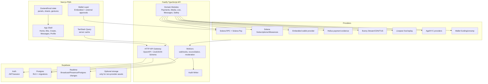
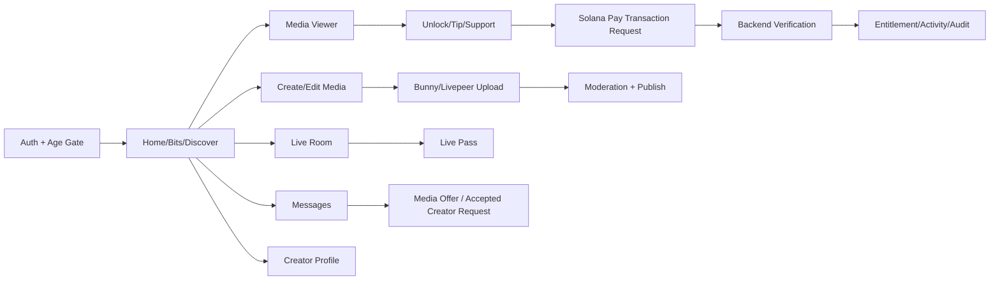

# Veel V2 Enterprise Blueprint

Status: accepted
Scope: full product architecture
Last updated: 2026-08-15
Source of truth: yes

Owns:
- whole-platform module boundaries and runtime responsibilities

Defers to:
- route map, OpenAPI, schema, provider ADRs for exact contracts

Does not own:
- screen-level visual design or provider account setup

Launch scope:
- provider-first modular monolith architecture

Non-goals:
- custom infrastructure where provider features solve the problem

This document defines the target architecture for a clean provider-first Veel v2 repository. Use it as the app architecture source for the new repo after the v2 decision is approved.

## Decision Summary

Recommended v2 direction:

- Keep a Next.js PWA, but build the app shell and product surfaces around a smaller design/component system.
- Use a TypeScript backend built on Fastify.
- Use Supabase Postgres as the primary database, VEEL wallet sessions plus optional Supabase Auth for identity/session recovery, and Supabase Realtime selectively for messages, notifications, live room state, and activity events.
- Keep all money/access/media/provider truth behind the backend. Supabase RLS protects direct realtime reads, but Fastify remains the business policy layer.
- Add a wallet-first onboarding path with embedded noncustodial Solana wallets or Phantom/Solflare/external wallet connect, then optional email recovery/profile management.
- Use Hono only for small edge/public endpoints if a real edge deployment need appears. Do not mix Hono into the core API.
- Keep pnpm as the monorepo package manager and Node.js LTS as the production runtime for v2 launch. Bun can be evaluated later for isolated tooling/services, but should not be added as another moving part during the backend/auth/realtime build.
- Use official provider SDKs/APIs where they reduce custom code: Solana JS/Pay, Bunny Stream TUS/API, Livepeer APIs, age/KYC provider APIs.
- Build through contract-first vertical slices; do not copy historical context code wholesale.

## Architecture Diagram

Renderer-safe diagram:

```text
Next.js PWA
  ├─ App shell, Home, Bits, Create, Messages, Profile
  ├─ Wallet layer: embedded wallet + external wallet adapter
  ├─ TanStack Query server cache
  └─ Zustand/local UI state
        │
        ▼
Fastify API
  ├─ OpenAPI/schema validation
  ├─ Auth/session/profile policy
  ├─ Payments, referrals, entitlements
  ├─ Media/live/messages/safety/admin modules
  └─ Audit/idempotency
        │
        ├───────────────┐
        ▼               ▼
Supabase             Providers
  ├─ Auth              ├─ Solana RPC / Solana Pay
  ├─ Postgres          ├─ Embedded wallet provider
  ├─ Realtime          ├─ Helius payment evidence
  └─ RLS               ├─ Bunny Stream/CDN/TUS
                       ├─ Livepeer live/replay
                       ├─ Age/KYC providers
                       ├─ Solana Subscriptions/Allowances
                       └─ Wallet funding/onramp
```

Mermaid source for GitHub or Mermaid-enabled previews:



## Core Principles

- Providers do provider jobs.
- Veel backend owns business truth.
- Frontend owns UX, state presentation, and explicit user confirmation.
- Supabase owns identity primitives, Postgres, and realtime transport, not business policy.
- No client calculates payment success, access grants, splits, commissions, Event Access Passes, or KYC state.
- No provider secrets, stream keys, Bunny keys, Helius keys, signed private URLs, or raw PII enter frontend bundles.
- All money/access/provider callbacks are idempotent, auditable, and replay-safe.
- Every route, API, event, database table, and provider payload is documented before implementation.

## V2 Stack

| Layer | Choice | Reason |
| --- | --- | --- |
| Web | Next.js App Router, TypeScript, Tailwind v4, TanStack Query, Zustand | Current frontend stack is viable; clean up architecture instead of switching frameworks. |
| API | Fastify TypeScript | Lower overhead, schema-first validation/serialization, direct provider SDK use, less boilerplate than Nest. |
| Edge | Hono only for tiny public/edge endpoints | Hono is excellent at edge, but mixing it into core business API adds unnecessary architecture surface. |
| Auth | Backend-verified VEEL wallet sessions plus optional Supabase Auth | Wallet-first onboarding avoids mandatory email while Supabase can still provide recovery/profile-management sessions and RLS integration where used. |
| Wallet onboarding | Embedded wallet provider + external wallet adapter | Reduces conversion friction while preserving noncustodial user approval and backend settlement verification. |
| DB | Supabase Postgres | Relational money/access/media truth needs Postgres, transactions, constraints, and auditability. |
| Realtime | Supabase Realtime Broadcast/Presence + selective Postgres Changes | Avoids custom websocket infrastructure for messages/live/activity while keeping backend policy. |
| Queue/workers | Fastify-compatible worker process with pg-boss launch default | Webhooks, provider reconciliation, moderation, media status, and retries need controlled background jobs; BullMQ/Redis is a measured scale option. |
| Contracts | OpenAPI generated from Fastify schemas or shared Zod schema source | API contracts must remain source of truth for frontend client types. |
| Package manager | pnpm workspaces | Current repo already uses pnpm; lowest migration risk for monorepo and CI. |
| Runtime | Node.js LTS | Best provider SDK and ops compatibility for launch. |
| Payments | Official Solana JS/Solana Pay tooling, selected Commerce Kit Solana Pay codec in Slice 06, and Solana Subscriptions/Allowances after staging approval | Server composes requests and retains exact split/settlement authority; Commerce Kit is an isolated URL/QR/deep-link interoperability dependency, not a second wallet, checkout, order, or verifier. |
| Media | Bunny Stream for VOD, Livepeer for live/replay | Provider-first, no custom media infra. |
| Observability | OpenTelemetry + structured logs + provider/audit tables | Required for payments, media, safety, and launch ops. |

## Why Fastify, Not NestJS

Fastify is the recommended core API framework for v2 because:

- It is directly schema-first, which fits OpenAPI, request validation, and response serialization.
- It has less framework ceremony than Nest while still supporting plugins and encapsulated modules.
- It works cleanly with official Node/TypeScript provider SDKs.
- It keeps the backend small if modules are disciplined.

NestJS remains a valid alternative if the team prefers a heavily opinionated DI framework. For this project, the better tradeoff is Fastify plus strict local conventions:

- module folders
- typed service interfaces
- explicit dependency registration
- contract-first schemas
- policy functions
- transaction wrappers
- test factories

## Bun And Hono Boundaries

Bun:

- Not the v2 launch package manager.
- Not the v2 launch production runtime.
- Can be tested later as a dev accelerator or isolated worker runtime.

Hono:

- Not part of the core business API.
- Useful only for isolated edge endpoints after a real edge requirement exists.

This keeps the v2 platform from combining too many migrations at once.

## Where Hono Fits

Hono should not be part of the main business API at launch. Use it only if there is a proven edge need:

- public link redirect/tracking endpoint
- lightweight webhook edge prefilter
- geo/static metadata endpoint
- cacheable public profile/feed projection

Hono must not own payments, entitlements, provider secrets, age/KYC, admin, or audit mutations.

## Supabase Boundary

Supabase is not a replacement for backend business logic.

Allowed direct client use:

- Supabase Auth session handling.
- Realtime subscriptions to rows/channels already authorized by RLS.
- Presence/broadcast for low-risk typing/online/live viewer state.

Not allowed direct client ownership:

- payment intent creation
- payment confirmation
- access grants
- commissions
- content publish decisions
- Event Access Pass issuance
- creator earning/KYC state
- moderation/admin actions
- provider upload object creation without backend policy

## Main Product Flow Map

Renderer-safe flow:

```text
Auth + age gate
  -> Home / Bits / Discover
  -> Media viewer
  -> Unlock / Tip / Support
  -> Solana Pay transaction request
  -> Backend verification
  -> Entitlement / activity / audit

Create / Edit
  -> Bunny or Livepeer upload
  -> Provider webhook/status refresh
  -> Moderation
  -> Publish

Live room
  -> Live pass
  -> Playback + chat
  -> Replay asset

Messages
  -> Consent-bound chat, approved media offer, or structured creator request
  -> Private realtime invalidation
```

Mermaid source for GitHub or Mermaid-enabled previews:



## V2 Documentation Set

Read these in order:

1. `build-plan.md`
2. `stack-decision.md`
3. `product-flows.md`
4. `frontend-architecture.md`
5. `engagement-strategy.md`
6. `native-ui-ux-screens.md`
7. `landing-page-gsap.md` (landing-only GSAP scope for first-viewport scroll choreography)
8. `backend-fastify-architecture.md`
9. `auth-supabase-realtime.md`
10. `embedded-wallet-onboarding.md`
11. `data-model.md`
12. `payments-and-monetisation.md`
13. `business-monetisation.md`
14. `media-live-providers.md`
15. `realtime-messages-activity.md`
16. `safety-admin-ai.md`
17. `admin-operations-dashboard.md`
18. `deployment-topology.md`
19. `slice-workflow.md`

## Immediate Non-Code Next Step

Before implementation starts, approve these greenfield decisions:

- Fastify TypeScript API.
- Supabase Auth/Realtime/Postgres as platform foundation.
- Embedded wallet provider and user-wallet funding path.
- Provider-first payment/media architecture.
- Contract-first vertical slice order in `build-plan.md`.
