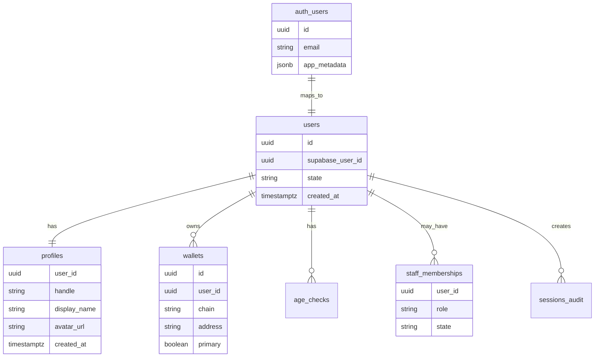
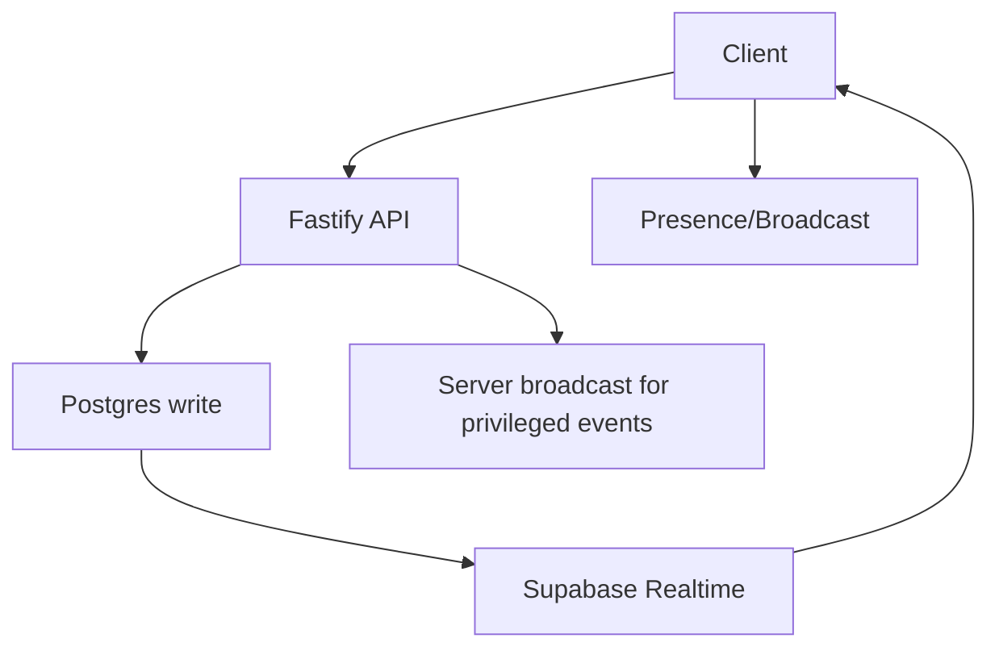

# Veel V2 Auth, Supabase, And Realtime Architecture

Status: accepted
Scope: auth, DB, realtime
Last updated: 2026-06-03
Source of truth: yes

Owns:
- auth supabase realtime decisions for its named domain

Defers to:
- INDEX.md, route-map.md, OpenAPI, schema blueprint, and ADRs where narrower

Does not own:
- unrelated domains, implementation shortcuts, provider secrets, or hidden source-of-truth rules

Launch scope:
- accepted v2 launch or phased behavior stated in this document

Non-goals:
- historical-context inference, duplicate systems, and unapproved provider/product expansion

## Decision

Use Supabase Auth for identity/session and Supabase Postgres for data. Use Supabase Realtime selectively. The Fastify backend remains the business policy layer.

V2 should not require an external wallet before signup. Use Supabase Auth for mainstream email/social/passkey entry, create or link a user-controlled wallet through the wallet architecture in `embedded-wallet-onboarding.md`, then complete the single age-verification gate before protected app access.

## Identity Model



## Auth Flow

1. User signs in through Supabase Auth.
2. Frontend receives session/JWT.
3. Frontend calls Fastify `/v1/session`.
4. Fastify verifies JWT and loads Veel profile, wallet, age, restrictions, monetisation, and app permissions.
5. Fastify returns frontend-safe session payload.

Signup paths and onboarding order:

- Step 1: user chooses email/social/passkey with embedded wallet, or external/native wallet sign-in.
- Step 2: backend links/creates the mandatory wallet path and audits it.
- Step 3: third-party age verification completes the app age gate.
- Email/social/passkey: creates a Veel profile and creates or loads a noncustodial embedded wallet by default.
- External wallet: uses signed wallet challenge and can attach to an existing Supabase-authenticated user or become the primary wallet path.
- Returning user: Fastify resolves profile, primary wallet, linked wallets, age/access, restrictions, and monetisation state.

Protected app access requires both age verification and a wallet path. Supabase Auth alone is not enough to enter the app shell.

## Wallet Linking

Wallet linking is not Supabase Auth by itself.

- Backend issues nonce/challenge.
- Wallet signs.
- Backend verifies signature.
- Backend links wallet to the authenticated Supabase user profile.
- Wallet link events are audited.

Embedded wallets are also linked to the Veel profile, but they are not a backend custody account. The selected wallet provider must support a noncustodial/user-controlled model where Veel cannot move funds without user approval.

Wallet path is mandatory before protected app access because Veel is wallet-native and every user must be able to receive or approve noncustodial Solana actions.

Wallet readiness means one of:

- embedded noncustodial wallet created or loaded for identity-first users
- native/external Solana wallet linked and set as primary for wallet-first users

Wallet approval is required for wallet actions:

- content unlock
- tip/support
- paid message
- creator subscription
- live pass
- event ticket
- creator payout/earning setup

Wallet is not required for public landing pages, public teaser/deep-link capture, or reading public marketing content. It is required before the protected 18+ app shell opens. Supabase Auth alone is not enough.

## RLS Strategy

Use RLS for tables that clients may subscribe to directly:

- conversations participant rows
- messages visible to participants
- notifications for current user
- live room presence/broadcast authorization
- safe activity projections

Do not expose raw tables for:

- payment intents
- settlements
- splits
- commissions
- provider payloads
- audit logs
- admin/moderation internals
- age/KYC raw provider references

## Realtime Strategy



Use:

- Broadcast for typing, live viewer presence, lightweight room events.
- Presence for online state.
- Postgres Changes for messages, notifications, room status, and activity projections after RLS review.

Avoid:

- direct realtime for financial internals
- direct realtime for provider payloads
- broad table subscriptions

## Session Security

- Frontend uses Supabase anon key and user JWT.
- Backend uses service role key only server-side.
- JWT verification keys/config must be cached and rotated safely.
- Admin role comes from backend profile/role tables, not client-editable metadata.
- High-risk actions re-check backend profile, age, restrictions, wallet, and role.

## Age/KYC Separation

- Age gate: required for protected viewing/app access.
- KYC/KYB: required for earning/payout/compliance flows.
- Normal viewer access should not require KYC unless product/legal policy says so.
- Frontend receives only state/action, never raw provider payload.

## Locked Onboarding Decision

```text
Public teaser / landing / referral capture
  -> identity: email, social, passkey, or external wallet
  -> wallet path: embedded wallet created/loaded or native wallet linked
  -> age verification
  -> protected 18+ app shell
```

Rules:

- No protected app entry without age verification.
- No protected app entry without a wallet path.
- No double age verification per media item after the app-level age gate, unless a future jurisdiction/product rule explicitly requires it.
- KYC/KYB remains separate from age verification and is only required for creator earning/payout/risk workflows by default.

## Implementation Decisions Required Before Coding

- define account creation and identity-linking flow
- define wallet link challenge and primary-wallet flow
- choose embedded wallet provider and onramp provider
- define wallet creation timing: signup vs first paid action
- define session refresh and JWT verification behavior
- define user ID mapping between Supabase Auth and app `users`
- define passwordless/passkey support requirements
- define deletion/anonymization behavior
