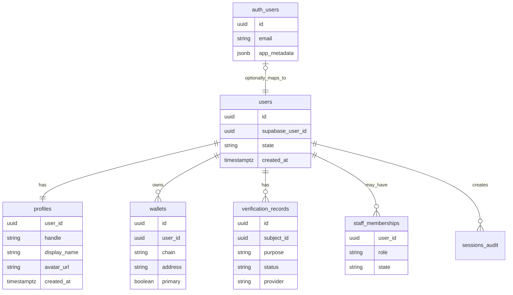
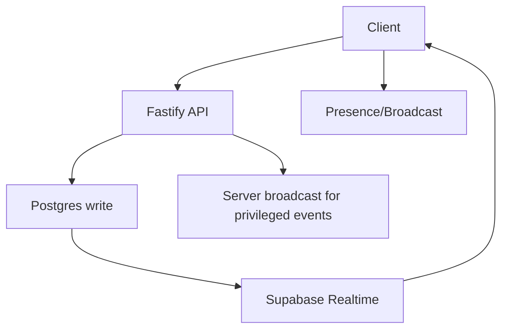

# WeVid V2 Auth, Supabase, And Realtime Architecture

Status: accepted
Scope: auth, DB, realtime
Last updated: 2026-08-14
Source of truth: yes

Owns:
- auth supabase realtime decisions for its named domain

Defers to:
- INDEX.md, route-map.md, OpenAPI, schema blueprint, and ADRs where narrower

Does not own:
- unrelated domains, implementation shortcuts, provider secrets, or hidden source-of-truth rules

Launch scope:
- accepted v2 launch or phased behavior stated in this document

Non-goals:
- historical-context inference, duplicate systems, and unapproved provider/product expansion

## Decision

Use Supabase Auth for optional recovery/account-management sessions and Supabase Postgres for data. Use Supabase Realtime selectively. The Fastify backend remains the business policy layer.

The locked onboarding target has three visible steps: Account + Wallet, Minimal Profile, and Age Verification. A user either connects an external noncustodial Solana wallet or authenticates through Privy and creates/retrieves a noncustodial embedded Solana wallet. Both paths sign the same backend challenge and create the same WeVid application session. Supabase email/social signup is optional recovery linking, not an onboarding step.

## Identity Model



## Auth Flow

1. Account + Wallet: the user chooses a mainstream Privy method or an external wallet, receives/uses a Solana wallet, signs one domain-bound backend challenge, and receives the canonical WeVid session.
2. Minimal Profile: the user claims a unique handle; display name and avatar are optional or safely prefilled. The profile stays provisional, non-discoverable, unable to publish/message/receive money, and excluded from search/feeds until age succeeds.
3. Age Verification: a provider returns normalized over-threshold evidence; protected access then opens. Age does not grant KYC, earning, adult-publisher, performer, KYB, Enterprise, or paid-product capability.
4. Fastify loads the universal profile, primary/linked wallets, age, restrictions, monetisation, and capability state and returns a frontend-safe session projection.

Signup paths and onboarding order:

- Step 1 of 3 combines provider entry, wallet create/retrieve/connect, ownership signature, user bootstrap, and session creation into one continuous action. The Privy target must not stop at “wallet created; continue again.”
- Step 2 of 3 requires only `handle`; `displayName` and avatar are optional target fields. The current contract still requires `displayName`, so that contract/runtime correction belongs to Slice 01/02 and must not be described as implemented.
- Step 3 of 3 completes third-party age assurance and activates eligible protected access.
- Supabase email/social/passkey: optional recovery/account-management access. It is not the primary app-access proof; it can be linked to a wallet-created account only after both wallet-session proof and Supabase-session proof are present.
- External wallet: uses the signed wallet challenge without mandatory email, Privy, password, Supabase, KYC, or payment.
- Returning user: Fastify resolves profile, primary wallet, linked wallets, age/access, restrictions, and monetisation state.

Protected app access requires both age verification and a wallet path. Supabase Auth alone is not enough to enter the app shell.

Current implementation boundary:

- Supabase Auth login and magic-link recovery are wired through the official SSR callback pattern: OAuth/PKCE callbacks exchange the returned `code` with `exchangeCodeForSession`, and email magic links verify `token_hash` plus `type` with `verifyOtp`.
- Wallet login creates or restores an app-owned wallet session whose bearer token maps to the internal `users.supabase_user_id` compatibility identifier. The preferred target stores the raw token only in a secure HttpOnly cookie and only its hash server-side; the existing cookie-backed implementation and any route-specific bearer compatibility must converge under the Slice 01/02 session contract.
- Supabase Auth remains recovery/account-management only. The browser renders email/social recovery providers only when Supabase browser config exists and the matching `NEXT_PUBLIC_SUPABASE_AUTH_*_ENABLED` flag is set for a provider that is also enabled in the Supabase Auth dashboard.
- Supabase recovery callbacks resolve `/v1/session` before entering `/app/*`. If the Supabase identity has no linked wallet/profile state, the user is routed back to wallet onboarding instead of being treated as wallet-authenticated.
- `POST /v1/auth/recovery-link` links Supabase recovery to a wallet-created account after the server proves both sessions: a valid Supabase bearer token in `Authorization` and the active wallet session in its HttpOnly cookie. The wallet token is never accepted in the JSON body. The API updates the existing wallet-owned `users` row to the verified Supabase subject, so future wallet login and future Supabase login resolve to the same profile, wallet, age, creator KYC, and organization KYB state.
- `POST /v1/auth/wallet/logout` revokes the hashed wallet session server-side and expires the HttpOnly cookie. Provider SDK logout and Supabase local sign-out remain frontend orchestration steps around this backend authority.
- Recovery linking fails with `409` if that Supabase identity already belongs to a different WeVid account. The API never silently merges two users, profiles, wallets, age records, verification records, payments, or organization memberships.

## Profile Bootstrap

Current compatibility behavior allows `GET /v1/session` to create the backend `users` row for a verified Supabase Auth user, although it does not create a public profile. This is not the locked launch entry path and must stay out of ordinary onboarding. Slice 01/02 must constrain optional recovery sign-in to a proved existing link (or an explicitly approved safe claim flow) so it cannot silently create a second WeVid user/profile.

Current runtime: `PATCH /v1/profiles/me` creates or updates the profile row and currently requires `handle`, `displayName`, and an `Idempotency-Key`. Locked target: Step 2 requires only a unique `handle`; display name and avatar are optional or safely prefilled. The backend owns uniqueness and provisional visibility/restriction state. The contract and policy transition belongs to Slice 01/02.

Supabase `user_metadata` is not a Veel profile source. Do not use editable metadata for handle, display name, role, age, wallet, admin, or access decisions.

## Wallet Linking

Wallet linking is not Supabase Auth by itself.

- Backend issues nonce/challenge.
- Wallet signs.
- Backend verifies signature.
- Backend links wallet to the authenticated Supabase user profile.
- Wallet link events are audited.
- Landing onboarding and `/app/wallet` coordinate Solana Wallet Adapter signing for the existing `POST /v1/wallets/link-challenges` and `POST /v1/wallets/link` flow. Phantom and Solflare are sent to the backend as their explicit provider enum values; Backpack and other wallet-standard/browser wallets are sent as `wallet_adapter` unless the OpenAPI contract is intentionally expanded. The browser signs exactly the returned challenge text with `signMessage`; it never stores wallet truth, never treats wallet approval as payment proof, and never opens protected access without the backend session/access state.

Embedded wallets are also linked to the Veel profile, but they are not a backend custody account. The selected wallet provider must support a noncustodial/user-controlled model where Veel cannot move funds without user approval.

The web app mounts the Privy embedded-wallet SDK only when its browser-safe app id is configured and `NEXT_PUBLIC_EMBEDDED_WALLET_RUNTIME_ENABLED=true`. Privy uses `NEXT_PUBLIC_PRIVY_APP_ID` and Solana RPC settings, creates or unlocks a Solana embedded wallet through the official Privy React/Solana SDK, selects the Privy wallet explicitly from the connected Solana wallet list, then signs the backend wallet-auth challenge as `embedded_privy`. Turnkey remains an ADR fallback, not a bundled browser runtime or launch path.

Wallet capability is mandatory before protected app access because WeVid is wallet-native and every user must be able to receive or approve noncustodial Solana actions. It is one of three onboarding steps, not an instruction to expose provider mechanics.

Wallet readiness means one of:

- embedded noncustodial wallet created or loaded for identity-first users
- native/external Solana wallet linked and set as primary for wallet-first users

Wallet approval is required for wallet actions:

- content unlock
- tip/support
- paid message
- creator subscription
- live pass
- Event Access Pass
- creator earning/tax setup

Wallet is not required for public landing pages, public teaser/deep-link capture, or reading public marketing content. It is required before the protected 18+ app shell opens. Supabase Auth alone is not enough.

## RLS Strategy

Use RLS for tables that clients may subscribe to or read directly. Migration `0017_rls_policy_baseline.sql` enables RLS on current public-schema tables and adds explicit authenticated read policies scoped to owners, participants, creators, active pass holders, or staff.

The browser Supabase key is read-only for app data. Fastify remains the only mutation surface for money, access, messages, live rooms, wallet records, provider callbacks, and admin state.

Use direct Supabase reads/realtime only for:

- conversations participant rows
- messages visible to participants
- notifications for current user
- live room presence/broadcast authorization
- safe activity projections

Do not expose broad client policies for:

- payment intents
- settlements
- splits
- commissions
- provider payloads
- audit logs
- admin/moderation internals
- age/KYC raw provider references

Payment, settlement, ledger, audit, and provider tables may have staff/self read policies for accountability and operations, but frontend business truth still comes from API resources.

## Realtime Strategy



Use:

- Broadcast for typing, live viewer presence, lightweight room events.
- Presence for online state.
- Postgres Changes for messages, notifications, room status, and activity projections after RLS review.
- Current implementation publishes only `notifications`, `messages`, and `conversation_members` to `supabase_realtime`; browser code uses these changes to invalidate typed API caches and refresh server-owned projections.
- Do not add money, provider, device-secret, compliance, admin, or raw payload tables to the realtime publication.

Avoid:

- direct realtime for financial internals
- direct realtime for provider payloads
- broad table subscriptions

## Session Security

- Frontend uses Supabase URL plus publishable key and user JWT. Legacy anon keys may be used for compatibility only.
- Web SSR uses `@supabase/ssr` cookie clients, `apps/web/proxy.ts` refreshes Supabase auth cookies with `auth.getClaims()`, and `/auth/confirm` exchanges email `token_hash` links for sessions before redirecting back to the app.
- Landing login starts the real browser-side Supabase magic-link flow. It does not grant protected app access by itself; backend `/v1/session`, wallet readiness, and age verification remain the access truth.
- Landing onboarding exposes optional profile completion after wallet setup. Profile submission must send `PATCH /v1/profiles/me` with a browser Supabase bearer token or wallet session and an idempotency key; backend validation, handle uniqueness, and app-access state remain authoritative.
- Landing onboarding and `/app/wallet` expose external Solana wallet handoff through Solana Wallet Adapter using the backend wallet challenge/proof endpoints. Wallet Adapter must provide `signMessage`; backend verification remains the auth truth.
- Landing onboarding keeps age assurance on the story surface: wallet connection is mandatory, profile and Supabase recovery auth are optional, and age assurance is mandatory before protected app access.
- `/age` / landing age assurance starts `POST /v1/age/sessions` with `providerPreference=reusable_first`. The preferred waterfall is reusable age ID first (`Didit`, `Yoti Digital ID`, `EUDI Wallet`, `Scytales`), then free/light age estimation or document proof (`Didit`, `Persona`) when reusable proof is unavailable. The UI may link users to create a reusable ID and return to the age check.
- Sumsub and Veriff are not shown as ordinary viewer onboarding providers. Keep them for Studio/enterprise or creator-compliance escalation before creator publishing, monetized creator workflows, tax, merchant, fraud, or regulated partner handoff.
- Age reverification is not recurring onboarding. Recheck only on provider credential expiry, jurisdiction/rule change, suspicious activity, admin/risk reason, or transition into creator/Studio/enterprise features.
- Provider launch redirects must use only backend-returned provider launch URLs and still wait for signed provider webhook evidence before access changes.
- Protected app pages use a shared server-side route guard before backend reads. When Supabase SSR env is configured and `getClaims()` does not validate a browser session, the guard redirects to `/?mode=login&next=<protected-path>`.
- Protected app-shell pages additionally call backend `GET /v1/session` and redirect incomplete access states to `/?mode=onboarding`, `/app/wallet`, or `/age` based on `appAccessState.reason`. `/app/wallet`, `/app/settings`, `/`, and `/age` remain reachable as remediation/onboarding surfaces.
- Every guarded page must export `dynamic = "force-dynamic"` so auth cookies and refreshed claims are evaluated per request instead of during static prerendering.
- When Supabase SSR env is not configured, local development and smoke projections stay visible; backend API calls still fail closed and remain the access authority.
- Public landing, public creator profiles, content/live/event previews, and `/age` stay reachable without a browser session.
- Configure Supabase Auth email templates for server-side flow: set magic-link and confirm-signup links to `{{ .SiteURL }}/auth/confirm?token_hash={{ .TokenHash }}&type=email&next=/`.
- Backend never exposes secret or service-role keys to browser bundles.
- Backend verifies Supabase-issued access tokens with Supabase Auth `getClaims()` where possible, falling back to Auth-server verification behavior for shared-secret signing projects.
- JWT verification keys/config must be cached and rotated safely.
- Admin role comes from backend profile/role tables, not client-editable metadata.
- High-risk actions re-check backend profile, age, restrictions, wallet, and role.
- Server-side profile/session state is loaded from Veel tables (`users`, `profiles`, and later wallet/age/access tables), not from client-editable Supabase user metadata.

## Local Supabase Setup

The root `.env.example` is the full monorepo checklist. Local API scripts load the root `.env` with Node's built-in env-file support. `apps/web/.env.example` contains only browser-safe values for the Next app's `.env.local`. `apps/api/.env.example` contains server-only runtime and local tooling values.

In this monorepo, the Next app is built from `apps/web`. Local browser auth therefore needs the public Supabase values in `apps/web/.env.local` or exported into the shell before `next build`. Having `NEXT_PUBLIC_SUPABASE_URL` and `NEXT_PUBLIC_SUPABASE_PUBLISHABLE_KEY` only in the root `.env` is enough for shared local scripts, but it is not a reliable source for the browser bundle. After changing any `NEXT_PUBLIC_*` value, run the web build again because Next inlines public environment values into the client build.

Use these key classes:

- `NEXT_PUBLIC_SUPABASE_URL` and `NEXT_PUBLIC_SUPABASE_PUBLISHABLE_KEY` in the web app.
- `NEXT_PUBLIC_SUPABASE_AUTH_EMAIL_ENABLED`, `NEXT_PUBLIC_SUPABASE_AUTH_GOOGLE_ENABLED`, `NEXT_PUBLIC_SUPABASE_AUTH_GITHUB_ENABLED`, `NEXT_PUBLIC_SUPABASE_AUTH_DISCORD_ENABLED`, and `NEXT_PUBLIC_SUPABASE_AUTH_TWITTER_ENABLED` only for providers enabled in Supabase Auth.
- `SUPABASE_URL`, `SUPABASE_PUBLISHABLE_KEY`, and `DATABASE_URL` in the API.
- `SUPABASE_SECRET_KEY` only for backend-only provider/admin work that explicitly needs it.
- `SUPABASE_SERVICE_ROLE_KEY` only for legacy compatibility or narrowly reviewed backend work.
- `PROFILE_AVATAR_BUCKET=profile-avatars` for server-owned profile avatar uploads. Migrations `0070_profile_avatar_storage_bucket.sql` and `0071_profile_avatar_storage_limit.sql` create or update this public Supabase Storage bucket with a 5 MB limit and JPEG/PNG/WebP MIME allowlist. The browser never receives storage write credentials.
- `SUPABASE_ACCESS_TOKEN` and `SUPABASE_PROJECT_REF` only for local Supabase CLI/MCP tooling.
- `ONRAMP_PROVIDER`, `ONRAMP_PURCHASE_CURRENCY`, `COINBASE_CDP_API_KEY_ID`, `COINBASE_CDP_API_KEY_SECRET`, `COINBASE_CDP_API_BASE_URL`, and `COINBASE_ONRAMP_DESTINATION_NETWORK` only in the API/worker environment for user-wallet funding sessions.

Direct database migration work requires one of:

- Supabase MCP authenticated and project-scoped for development data.
- Supabase CLI authenticated and linked to a development project.
- A server-only `DATABASE_URL` for a development database.

Do not connect AI tooling directly to production data. Use a development project, read-only MCP mode when inspecting real-like data, and manual approval for write tools.

## Age/KYC Separation

- Age gate: required for protected viewing/app access.
- Creator KYC: required only when a user attempts creator capabilities such as uploading media, publishing, monetization, payouts, or creator/studio management actions.
- Organization KYB: required only for Studio, Enterprise, team publishing, allocation wallets, reporting, compliance exports, or business controls.
- Normal viewer access must not require KYC/KYB unless product/legal policy says so.
- Valid checks are reused when provider policy, legal basis, expiry, jurisdiction, and consent allow it. A valid creator KYC that proves over-threshold age can derive/refresh age access; age estimation alone cannot satisfy creator KYC.
- Frontend receives only state/action, never raw provider payload.

## Locked Onboarding Decision

```text
Public teaser / landing / referral capture
  -> identity: email, social, passkey, or external wallet
  -> wallet path: embedded wallet created/loaded or native wallet linked
  -> age verification
  -> protected 18+ app shell
```

Rules:

- No protected app entry without age verification.
- No protected app entry without a wallet path.
- No hard viewer/creator/studio fork during default onboarding. Creator and Studio/Enterprise shortcut intent is contextual and optional.
- No double age verification per media item after the app-level age gate, unless a future jurisdiction/product rule explicitly requires it.
- KYC/KYB remains separate from age verification and is only required for creator, earning, business, tax/compliance, and risk workflows by default.

## Implementation Decisions Required Before Coding

- define account creation and identity-linking flow
- define wallet link challenge and primary-wallet flow
- choose embedded wallet provider and wallet funding path, if any
- define wallet creation timing: signup vs first paid action
- define session refresh and JWT verification behavior
- define user ID mapping between Supabase Auth and app `users`
- define passwordless/passkey support requirements
- define deletion/anonymization behavior
