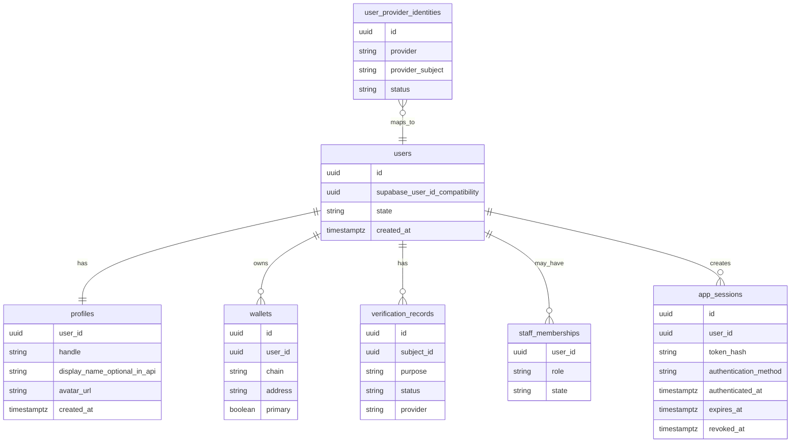
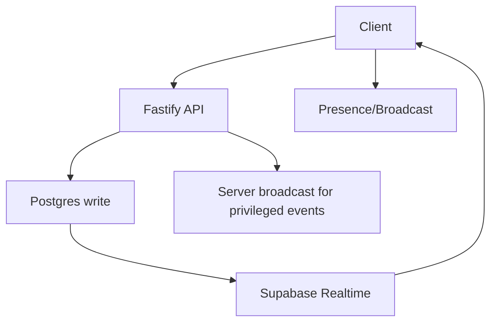

# WeVid V2 Auth, Supabase, And Realtime Architecture

Status: accepted
Scope: auth, DB, realtime
Last updated: 2026-08-15
Source of truth: yes

Owns:
- auth supabase realtime decisions for its named domain

Defers to:
- INDEX.md, route-map.md, OpenAPI, schema blueprint, and ADRs where narrower

Does not own:
- unrelated domains, implementation shortcuts, provider secrets, or hidden source-of-truth rules

Launch scope:
- accepted v2 launch or phased behavior stated in this document

Non-goals:
- historical-context inference, duplicate systems, and unapproved provider/product expansion

## Decision

Use Supabase Auth for optional recovery/account-management sessions and Supabase Postgres for data. Use Supabase Realtime selectively. The Fastify backend remains the business policy layer.

The locked onboarding target has three visible steps: Account + Wallet, Minimal Profile, and Age Verification. A user either connects an external noncustodial Solana wallet or authenticates through Privy and creates/retrieves a noncustodial embedded Solana wallet. Both paths sign the same backend challenge and create the same WeVid application session. Supabase email/social signup is optional recovery linking, not an onboarding step.

## Identity Model



## Auth Flow

1. Account + Wallet: the user chooses a mainstream Privy method or an external wallet, receives/uses a Solana wallet, signs one domain-bound backend challenge, and receives the canonical WeVid session.
2. Minimal Profile: the user claims a unique handle; display name and avatar are optional or safely prefilled. The profile stays provisional, non-discoverable, unable to publish/message/receive money, and excluded from search/feeds until age succeeds.
3. Age Verification: a provider returns normalized over-threshold evidence; protected access then opens. Age does not grant KYC, earning, adult-publisher, performer, KYB, Enterprise, or paid-product capability.
4. Fastify loads the universal profile, primary/linked wallets, age, restrictions, monetisation, and capability state and returns a frontend-safe session projection.

Signup paths and onboarding order:

- Step 1 of 3 combines provider entry, wallet create/retrieve/connect, ownership signature, user bootstrap, and session creation into one continuous action. The Privy target must not stop at “wallet created; continue again.”
- Step 2 of 3 requires only `handle`; `displayName` and avatar are optional. The API normalizes handles to lowercase, rejects reserved names, and relies on the database unique index for concurrency safety.
- Step 3 of 3 completes third-party age assurance and activates eligible protected access.
- Supabase email/social: optional recovery/account-management access. It is never ordinary API authority and can be linked only through a short-lived server-owned intent plus explicit recovery credential exchange.
- External wallet: uses the signed wallet challenge without mandatory email, Privy, password, Supabase, KYC, or payment.
- Returning user: Fastify resolves profile, primary wallet, linked wallets, age/access, restrictions, and monetisation state.

Protected app access requires both age verification and a wallet path. Supabase Auth alone is not enough to enter the app shell.

Implemented boundary:

- Supabase Auth login and magic-link recovery are wired through the official SSR callback pattern: OAuth/PKCE callbacks exchange the returned `code` with `exchangeCodeForSession`, and email magic links verify `token_hash` plus `type` with `verifyOtp`.
- Wallet login creates or restores an app-owned session. The browser receives the opaque token only as an HttpOnly cookie and the database stores only its SHA-256 hash. `GET /v1/session` and token verification are read-only and never bootstrap a user.
- Supabase Auth remains recovery/account-management only. The browser renders email/social recovery providers only when Supabase browser config exists and the matching `NEXT_PUBLIC_SUPABASE_AUTH_*_ENABLED` flag is set for a provider that is also enabled in the Supabase Auth dashboard.
- Recovery callbacks exchange a verified Supabase credential at `POST /v1/auth/recovery/exchange`, receive a new or current-session-replacement HttpOnly application cookie, and then resolve `/v1/session`. A recovery identity without an existing mapping fails closed and never creates a WeVid user.
- `POST /v1/auth/recovery/link-intents` requires a recent application session and sets a 10-minute HttpOnly, SameSite=Lax link-intent cookie so the external recovery callback can return it. Production cookies are Secure and may use the configured shared parent domain. Exchange consumes the intent atomically. `POST /v1/auth/recovery/unlink` also requires recent authentication and rotates the session.
- New logins create independent device/application sessions. Rotation revokes only the exact source session and preserves its authentication freshness and absolute expiry. `POST /v1/auth/wallet/logout` revokes only the current hashed application session; `POST /v1/auth/sessions/logout-all` separately requires recent authentication, revokes every active session, and audits the action. Provider SDK logout and optional Supabase local sign-out remain frontend orchestration steps around this backend authority.
- Recovery linking fails with `409` if that Supabase identity already belongs to a different WeVid account. The API never silently merges two users, profiles, wallets, age records, verification records, payments, or organization memberships.

## Profile Bootstrap

Only successful Step 1 authentication may create a provisional WeVid user. Reads, recovery login, and email equality never create or merge users. `PATCH /v1/profiles/me` requires `handle` and an `Idempotency-Key`; display name and avatar are optional. The profile remains private while its user is provisional. A verified age webhook atomically activates the user and publishes the profile; a failed decision blocks the user and keeps the profile private.

Supabase `user_metadata` is not a Veel profile source. Do not use editable metadata for handle, display name, role, age, wallet, admin, or access decisions.

## Wallet Linking

Wallet linking is not Supabase Auth by itself.

- Backend issues nonce/challenge.
- Wallet signs.
- Backend verifies signature.
- Backend links the wallet to the canonical WeVid user from the application session.
- Wallet link events are audited.
- Landing onboarding and `/app/wallet` coordinate Solana Wallet Adapter signing for the existing `POST /v1/wallets/link-challenges` and `POST /v1/wallets/link` flow. Phantom and Solflare are sent to the backend as their explicit provider enum values; Backpack and other wallet-standard/browser wallets are sent as `wallet_adapter` unless the OpenAPI contract is intentionally expanded. The browser signs exactly the returned challenge text with `signMessage`; it never stores wallet truth, never treats wallet approval as payment proof, and never opens protected access without the backend session/access state.

Embedded wallets are also linked to the Veel profile, but they are not a backend custody account. The selected wallet provider must support a noncustodial/user-controlled model where Veel cannot move funds without user approval.

The web app mounts the Privy embedded-wallet SDK only when its browser-safe app id is configured, `NEXT_PUBLIC_EMBEDDED_WALLET_RUNTIME_ENABLED=true`, and the user chooses the secure embedded-wallet action. The ordinary landing route initializes only the external Solana wallet chooser, so an optional account provider cannot probe injected wallets, delay the primary Connect wallet action, or add a provider step before the user asks for it. The first embedded-wallet click loads Privy and immediately opens its configured account flow without a second WeVid click. Privy uses `NEXT_PUBLIC_PRIVY_APP_ID` and Solana RPC settings, creates or unlocks a Solana embedded wallet through the official Privy React/Solana SDK, selects that Solana wallet explicitly, then signs the backend wallet-auth challenge as `embedded_privy`. The signed wallet is the credential; WeVid does not claim or store a separately verified Privy provider subject. No parallel embedded-wallet runtime is bundled or accepted by the current contract.

Privy's browser bundle contains an optional dynamic Farcaster Solana probe even when Farcaster is not a configured WeVid login method. WeVid does not install or alias that optional provider. The Next.js webpack and Turbopack configurations narrowly ignore only that dependency's expected missing-module diagnostic inside `@privy-io/react-auth`; all other missing-module issues remain visible and build-failing as normal. The Solana peer packages required by Privy's official installation guide are explicit, version-pinned web dependencies compatible with the selected `@solana/kit` major. Privy's CommonJS external workaround is intentionally not applied because the official Next.js recipe limits it to Yarn and production browser proof under pnpm shows that externalizing these client dependencies prevents the wallet runtime from loading.

Wallet capability is mandatory before protected app access because WeVid is wallet-native and every user must be able to receive or approve noncustodial Solana actions. It is one of three onboarding steps, not an instruction to expose provider mechanics.

Wallet readiness means one of:

- embedded noncustodial wallet created or loaded for identity-first users
- native/external Solana wallet linked and set as primary for wallet-first users

Wallet approval is required for wallet actions:

- content unlock
- tip/support
- paid message
- creator subscription
- live pass
- Event Access Pass
- creator earning/tax setup

Wallet is not required for public landing pages, public teaser/deep-link capture, or reading public marketing content. It is required before the protected 18+ app shell opens. Supabase Auth alone is not enough.

## RLS Strategy

Use RLS for tables that clients may subscribe to or read directly. Migration `0017_rls_policy_baseline.sql` enables RLS on current public-schema tables and adds explicit authenticated read policies scoped to owners, participants, creators, active pass holders, or staff.

Migration `0095` narrows the Realtime message/notification projection further: token minting and RLS both require current protected-app readiness, message rows must be visible, and message-request/notification rows are participant/self only. Age expiry or revocation therefore closes both new token minting and already-issued token reads; staff access uses audited backend/admin projections.

The browser Supabase key is read-only for app data. Fastify remains the only mutation surface for money, access, messages, live rooms, wallet records, provider callbacks, and admin state.

Use direct Supabase reads/realtime only for:

- conversations participant rows
- messages visible to participants
- notifications for current user
- live room presence/broadcast authorization
- safe activity projections

Do not expose broad client policies for:

- payment intents
- settlements
- splits
- commissions
- provider payloads
- audit logs
- admin/moderation internals
- age/KYC raw provider references

Payment, settlement, ledger, audit, and provider tables may have staff/self read policies for accountability and operations, but frontend business truth still comes from API resources.

## Realtime Strategy



Use:

- Broadcast for typing, live viewer presence, lightweight room events.
- Presence for online state.
- Postgres Changes for messages, notifications, room status, and activity projections after RLS review.
- Current implementation publishes only `notifications`, `messages`, `conversation_members`, and `direct_message_requests` to `supabase_realtime`; browser code uses these changes to invalidate typed API caches and refresh server-owned projections.
- Realtime authorization derives from the canonical opaque WeVid application session. Fastify mints a five-minute ES256 custom JWT with canonical user `sub`, `role=authenticated`, and the server-only `wevid_session=true` marker. RLS distinguishes this path from optional Supabase recovery identities; recovery remains optional and is never required to make wallet-first Realtime work.
- `REALTIME_JWT_PRIVATE_JWK`, `REALTIME_JWT_KEY_ID`, and `REALTIME_JWT_ISSUER` are server-only imported-signing-key configuration. Missing configuration fails token minting closed without changing application-session authority.
- Do not add money, provider, device-secret, compliance, admin, or raw payload tables to the realtime publication.

Avoid:

- direct realtime for financial internals
- direct realtime for provider payloads
- broad table subscriptions

## Session Security

- Supabase recovery UI uses the browser-safe URL and publishable key only in the explicit Settings recovery flow. Legacy anon keys may be used for provider compatibility only.
- Web SSR uses `@supabase/ssr` only to complete recovery PKCE/OTP callbacks. `/auth/confirm` exchanges the verified Supabase credential through the recovery endpoint and forwards the rotated WeVid application cookie.
- Landing login never starts a Supabase session. Privy or an external wallet creates the application session; backend `/v1/session`, wallet readiness, and age verification remain access truth.
- Landing onboarding exposes minimal profile completion after wallet setup. Profile submission sends `PATCH /v1/profiles/me` with the HttpOnly application cookie and an idempotency key; backend validation, handle uniqueness, and app-access state remain authoritative.
- Landing onboarding and `/app/wallet` expose external Solana wallet handoff through Solana Wallet Adapter using the backend wallet challenge/proof endpoints. Wallet Adapter must provide `signMessage`; backend verification remains the auth truth.
- Landing onboarding keeps age assurance on the story surface: wallet connection is mandatory, profile and Supabase recovery auth are optional, and age assurance is mandatory before protected app access.
- `/age` / landing age assurance starts `POST /v1/age/sessions` with `providerPreference=reusable_first`. The preferred waterfall is reusable age ID first (`Didit`, `Yoti Digital ID`, `EUDI Wallet`, `Scytales`), then free/light age estimation or document proof (`Didit`, `Persona`) when reusable proof is unavailable. The UI may link users to create a reusable ID and return to the age check.
- Sumsub and Veriff are not shown as ordinary viewer onboarding providers. Keep them for Studio/enterprise or creator-compliance escalation before creator publishing, monetized creator workflows, tax, merchant, fraud, or regulated partner handoff.
- Age reverification is not recurring onboarding. Recheck only on provider credential expiry, jurisdiction/rule change, suspicious activity, admin/risk reason, or transition into creator/Studio/enterprise features.
- Provider launch redirects must use only backend-returned provider launch URLs and still wait for signed provider webhook evidence before access changes.
- Protected app pages use a shared server-side route guard before backend reads. The guard resolves the canonical WeVid application session; a Supabase recovery cookie or claim alone does not authorize a protected page.
- Protected app-shell pages additionally call backend `GET /v1/session` and redirect incomplete access states to `/?mode=onboarding`, `/app/wallet`, or `/age` based on `appAccessState.reason`. `/app/wallet`, `/app/settings`, `/`, and `/age` remain reachable as remediation/onboarding surfaces.
- Every guarded page must export `dynamic = "force-dynamic"` so application cookies are evaluated per request instead of during static prerendering.
- Local development and smoke projections may use the explicit E2E harness token; production backend API calls fail closed without the canonical application cookie.
- Public landing, public creator profiles, content/live/event previews, and `/age` stay reachable without a browser session.
- Configure Supabase Auth email templates for server-side flow: set magic-link and confirm-signup links to `{{ .SiteURL }}/auth/confirm?token_hash={{ .TokenHash }}&type=email&next=/`.
- Backend never exposes secret or service-role keys to browser bundles.
- The recovery verifier validates Supabase-issued credentials with Supabase Auth `getClaims()` where possible, falling back to Auth-server verification behavior for shared-secret signing projects. Ordinary route authentication never invokes it.
- JWT verification keys/config must be cached and rotated safely.
- Admin role comes from backend profile/role tables, not client-editable metadata.
- High-risk actions re-check backend profile, age, restrictions, wallet, and role.
- Server-side profile/session state is loaded from Veel tables (`users`, `profiles`, and later wallet/age/access tables), not from client-editable Supabase user metadata.

## Local Supabase Setup

The root `.env.example` is the full monorepo checklist. Local API scripts load the root `.env` with Node's built-in env-file support. `apps/web/.env.example` contains only browser-safe values for the Next app's `.env.local`. `apps/api/.env.example` contains server-only runtime and local tooling values.

In this monorepo, the Next app is built from `apps/web`. Local browser auth therefore needs the public Supabase values in `apps/web/.env.local` or exported into the shell before `next build`. Having `NEXT_PUBLIC_SUPABASE_URL` and `NEXT_PUBLIC_SUPABASE_PUBLISHABLE_KEY` only in the root `.env` is enough for shared local scripts, but it is not a reliable source for the browser bundle. After changing any `NEXT_PUBLIC_*` value, run the web build again because Next inlines public environment values into the client build.

Use these key classes:

- `NEXT_PUBLIC_SUPABASE_URL` and `NEXT_PUBLIC_SUPABASE_PUBLISHABLE_KEY` in the web app.
- `NEXT_PUBLIC_SUPABASE_AUTH_EMAIL_ENABLED`, `NEXT_PUBLIC_SUPABASE_AUTH_GOOGLE_ENABLED`, `NEXT_PUBLIC_SUPABASE_AUTH_GITHUB_ENABLED`, `NEXT_PUBLIC_SUPABASE_AUTH_DISCORD_ENABLED`, and `NEXT_PUBLIC_SUPABASE_AUTH_TWITTER_ENABLED` only for providers enabled in Supabase Auth.
- `SUPABASE_URL`, `SUPABASE_PUBLISHABLE_KEY`, and `DATABASE_URL` in the API.
- `SUPABASE_SECRET_KEY` only for backend-only provider/admin work that explicitly needs it.
- `SUPABASE_SERVICE_ROLE_KEY` only for legacy compatibility or narrowly reviewed backend work.
- `PROFILE_AVATAR_BUCKET=profile-avatars` for server-owned profile avatar uploads. Migrations `0070_profile_avatar_storage_bucket.sql` and `0071_profile_avatar_storage_limit.sql` create or update this public Supabase Storage bucket with a 5 MB limit and JPEG/PNG/WebP MIME allowlist. The browser never receives storage write credentials.
- `SUPABASE_ACCESS_TOKEN` and `SUPABASE_PROJECT_REF` only for local Supabase CLI/MCP tooling.
- `ONRAMP_PROVIDER`, `ONRAMP_PURCHASE_CURRENCY`, `COINBASE_CDP_API_KEY_ID`, `COINBASE_CDP_API_KEY_SECRET`, `COINBASE_CDP_API_BASE_URL`, and `COINBASE_ONRAMP_DESTINATION_NETWORK` only in the API/worker environment for user-wallet funding sessions.

Direct database migration work requires one of:

- Supabase MCP authenticated and project-scoped for development data.
- Supabase CLI authenticated and linked to a development project.
- A server-only `DATABASE_URL` for a development database.

Do not connect AI tooling directly to production data. Use a development project, read-only MCP mode when inspecting real-like data, and manual approval for write tools.

## Age/KYC Separation

- Age gate: required for protected viewing/app access.
- Creator KYC: required only when a user attempts creator capabilities such as uploading media, publishing, monetization, payouts, or creator/studio management actions.
- Organization KYB: required only for Studio, Enterprise, team publishing, allocation wallets, reporting, compliance exports, or business controls.
- Normal viewer access must not require KYC/KYB unless product/legal policy says so.
- Valid checks are reused when provider policy, legal basis, expiry, jurisdiction, and consent allow it. A valid creator KYC that proves over-threshold age can derive/refresh age access; age estimation alone cannot satisfy creator KYC.
- Frontend receives only state/action, never raw provider payload.

## Locked Onboarding Decision

```text
Public teaser / landing / referral capture
  -> identity: email, social, passkey, or external wallet
  -> wallet path: embedded wallet created/loaded or native wallet linked
  -> age verification
  -> protected 18+ app shell
```

Rules:

- No protected app entry without age verification.
- No protected app entry without a wallet path.
- No hard viewer/creator/studio fork during default onboarding. Creator and Studio/Enterprise shortcut intent is contextual and optional.
- No double age verification per media item after the app-level age gate, unless a future jurisdiction/product rule explicitly requires it.
- KYC/KYB remains separate from age verification and is only required for creator, earning, business, tax/compliance, and risk workflows by default.

## Implementation Decisions Required Before Coding

- define account creation and identity-linking flow
- define wallet link challenge and primary-wallet flow
- choose embedded wallet provider and wallet funding path, if any
- define wallet creation timing: signup vs first paid action
- define session refresh and JWT verification behavior
- define user ID mapping between Supabase Auth and app `users`
- define passwordless/passkey support requirements
- define deletion/anonymization behavior
