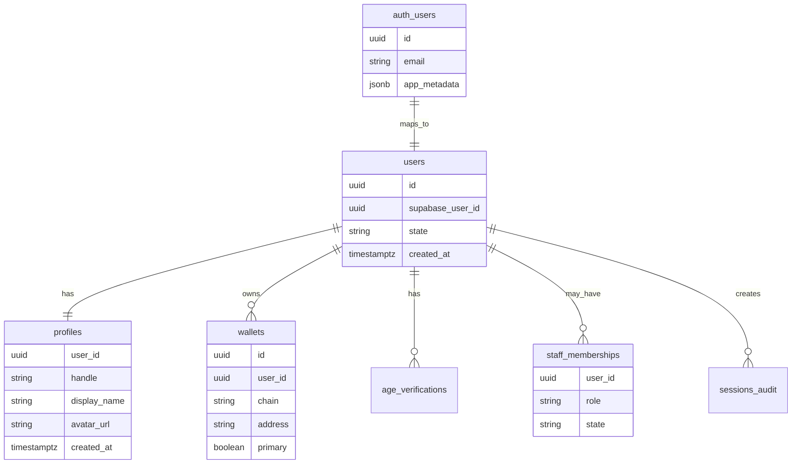
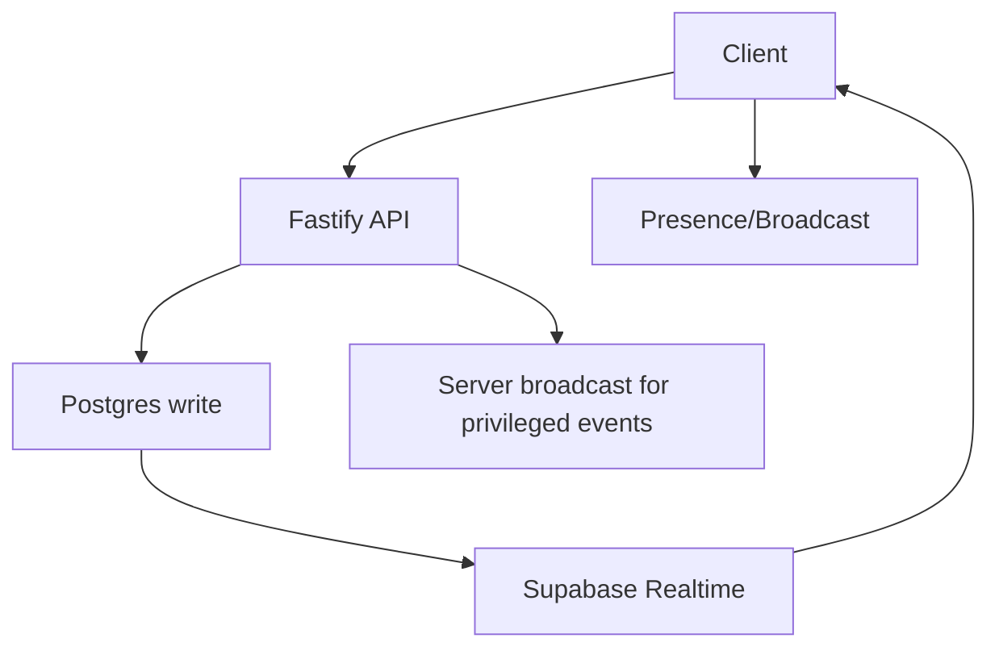

# Veel V2 Auth, Supabase, And Realtime Architecture

Status: accepted
Scope: auth, DB, realtime
Last updated: 2026-06-17
Source of truth: yes

Owns:
- auth supabase realtime decisions for its named domain

Defers to:
- INDEX.md, route-map.md, OpenAPI, schema blueprint, and ADRs where narrower

Does not own:
- unrelated domains, implementation shortcuts, provider secrets, or hidden source-of-truth rules

Launch scope:
- accepted v2 launch or phased behavior stated in this document

Non-goals:
- historical-context inference, duplicate systems, and unapproved provider/product expansion

## Decision

Use Supabase Auth for optional recovery/account-management sessions and Supabase Postgres for data. Use Supabase Realtime selectively. The Fastify backend remains the business policy layer.

V2 onboarding is wallet-first. A user connects an external noncustodial Solana wallet or unlocks a configured noncustodial embedded wallet, sets up the public profile, optionally adds Supabase email/social recovery for profile management, then completes the single age-verification gate before protected app access.

## Identity Model



## Auth Flow

1. User signs a backend-issued wallet challenge through an external Solana wallet or configured embedded wallet provider.
2. Fastify verifies the wallet signature and creates or restores the Veel wallet session.
3. User sets the Veel profile handle/display name through `PATCH /v1/profiles/me`.
4. User may add Supabase email/social recovery for profile management.
5. User completes third-party age verification before protected app access.
6. Fastify loads Veel profile, wallet, age, restrictions, monetisation, and app permissions and returns frontend-safe session payloads.

Signup paths and onboarding order:

- Step 1: user connects an external/native wallet or unlocks a configured embedded wallet.
- Step 2: Fastify verifies the wallet challenge, bootstraps the Veel `users` row, and audits the wallet session/link.
- Step 3: user sets the Veel profile handle/display name through `PATCH /v1/profiles/me`.
- Step 4: user may add Supabase email/social recovery for profile management.
- Step 5: third-party age verification completes the app age gate.
- Supabase email/social/passkey: optional recovery/account-management access for an existing Veel profile; it is not the primary app-access proof.
- External wallet: uses signed wallet challenge and can attach to an existing Supabase-authenticated recovery session or become the primary wallet path.
- Returning user: Fastify resolves profile, primary wallet, linked wallets, age/access, restrictions, and monetisation state.

Protected app access requires both age verification and a wallet path. Supabase Auth alone is not enough to enter the app shell.

## Profile Bootstrap

`GET /v1/session` is allowed to create the backend `users` row for a verified Supabase Auth user. It does not create a public profile without the user's handle/display-name input.

`PATCH /v1/profiles/me` creates or updates the public profile row for the authenticated user. The request must include `handle`, `displayName`, and an `Idempotency-Key` header. The backend owns uniqueness, validation, and profile state; frontend code treats the response as cached UX state only.

Supabase `user_metadata` is not a Veel profile source. Do not use editable metadata for handle, display name, role, age, wallet, admin, or access decisions.

## Wallet Linking

Wallet linking is not Supabase Auth by itself.

- Backend issues nonce/challenge.
- Wallet signs.
- Backend verifies signature.
- Backend links wallet to the authenticated Supabase user profile.
- Wallet link events are audited.
- Landing onboarding and `/app/wallet` coordinate Solana Wallet Adapter signing for the existing `POST /v1/wallets/link-challenges` and `POST /v1/wallets/link` flow. Phantom and Solflare are sent to the backend as their explicit provider enum values; Backpack and other wallet-standard/browser wallets are sent as `wallet_adapter` unless the OpenAPI contract is intentionally expanded. The browser signs exactly the returned challenge text with `signMessage`; it never stores wallet truth, never treats wallet approval as payment proof, and never opens protected access without the backend session/access state.

Embedded wallets are also linked to the Veel profile, but they are not a backend custody account. The selected wallet provider must support a noncustodial/user-controlled model where Veel cannot move funds without user approval.

The web app mounts embedded-wallet SDK providers only when their browser-safe public env is configured and `NEXT_PUBLIC_EMBEDDED_WALLET_RUNTIME_ENABLED=true`. Privy uses `NEXT_PUBLIC_PRIVY_APP_ID` and Solana RPC settings, creates or unlocks a Solana embedded wallet through the official Privy React/Solana SDK, then signs the backend wallet-auth challenge as `embedded_privy`. Turnkey uses `NEXT_PUBLIC_TURNKEY_ORGANIZATION_ID` plus optional auth-proxy settings and must expose a Solana account capable of message signing before Veel can complete backend auth as `embedded_turnkey`. If a Turnkey session authenticates but does not expose Solana `signMessage`, the UI must fail closed and the provider configuration remains a staging blocker.

Wallet path is mandatory before protected app access because Veel is wallet-native and every user must be able to receive or approve noncustodial Solana actions.

Wallet readiness means one of:

- embedded noncustodial wallet created or loaded for identity-first users
- native/external Solana wallet linked and set as primary for wallet-first users

Wallet approval is required for wallet actions:

- content unlock
- tip/support
- paid message
- creator subscription
- live pass
- Event Access Pass
- creator earning/tax setup

Wallet is not required for public landing pages, public teaser/deep-link capture, or reading public marketing content. It is required before the protected 18+ app shell opens. Supabase Auth alone is not enough.

## RLS Strategy

Use RLS for tables that clients may subscribe to or read directly. Migration `0017_rls_policy_baseline.sql` enables RLS on current public-schema tables and adds explicit authenticated read policies scoped to owners, participants, creators, active pass holders, or staff.

The browser Supabase key is read-only for app data. Fastify remains the only mutation surface for money, access, messages, live rooms, wallet records, provider callbacks, and admin state.

Use direct Supabase reads/realtime only for:

- conversations participant rows
- messages visible to participants
- notifications for current user
- live room presence/broadcast authorization
- safe activity projections

Do not expose broad client policies for:

- payment intents
- settlements
- splits
- commissions
- provider payloads
- audit logs
- admin/moderation internals
- age/KYC raw provider references

Payment, settlement, ledger, audit, and provider tables may have staff/self read policies for accountability and operations, but frontend business truth still comes from API resources.

## Realtime Strategy



Use:

- Broadcast for typing, live viewer presence, lightweight room events.
- Presence for online state.
- Postgres Changes for messages, notifications, room status, and activity projections after RLS review.
- Current implementation publishes only `notifications`, `messages`, and `conversation_members` to `supabase_realtime`; browser code uses these changes to invalidate typed API caches and refresh server-owned projections.
- Do not add money, provider, device-secret, compliance, admin, or raw payload tables to the realtime publication.

Avoid:

- direct realtime for financial internals
- direct realtime for provider payloads
- broad table subscriptions

## Session Security

- Frontend uses Supabase URL plus publishable key and user JWT. Legacy anon keys may be used for compatibility only.
- Web SSR uses `@supabase/ssr` cookie clients, `apps/web/proxy.ts` refreshes Supabase auth cookies with `auth.getClaims()`, and `/auth/confirm` exchanges email `token_hash` links for sessions before redirecting back to the app.
- Landing login starts the real browser-side Supabase magic-link flow. It does not grant protected app access by itself; backend `/v1/session`, wallet readiness, and age verification remain the access truth.
- Landing onboarding exposes optional profile completion after wallet setup. Profile submission must send `PATCH /v1/profiles/me` with a browser Supabase bearer token or wallet session and an idempotency key; backend validation, handle uniqueness, and app-access state remain authoritative.
- Landing onboarding and `/app/wallet` expose external Solana wallet handoff through Solana Wallet Adapter using the backend wallet challenge/proof endpoints. Wallet Adapter must provide `signMessage`; backend verification remains the auth truth.
- Landing onboarding keeps age assurance on the story surface: wallet connection is mandatory, profile and Supabase recovery auth are optional, and age assurance is mandatory before protected app access.
- `/age` / landing age assurance starts `POST /v1/age/sessions` with `providerPreference=reusable_first`. The preferred waterfall is reusable age ID first (`Didit`, `Yoti Digital ID`, `EUDI Wallet`, `Scytales`), then free/light age estimation or document proof (`Didit`, `Persona`) when reusable proof is unavailable. The UI may link users to create a reusable ID and return to the age check.
- Sumsub and Veriff are not shown as ordinary viewer onboarding providers. Keep them for Studio/enterprise or creator-compliance escalation before creator publishing, monetized creator workflows, tax, merchant, fraud, or regulated partner handoff.
- Age reverification is not recurring onboarding. Recheck only on provider credential expiry, jurisdiction/rule change, suspicious activity, admin/risk reason, or transition into creator/Studio/enterprise features.
- Provider launch redirects must use only backend-returned provider launch URLs and still wait for signed provider webhook evidence before access changes.
- Protected app pages use a shared server-side route guard before backend reads. When Supabase SSR env is configured and `getClaims()` does not validate a browser session, the guard redirects to `/?mode=login&next=<protected-path>`.
- Protected app-shell pages additionally call backend `GET /v1/session` and redirect incomplete access states to `/?mode=onboarding`, `/app/wallet`, or `/age` based on `appAccessState.reason`. `/app/wallet`, `/app/settings`, `/`, and `/age` remain reachable as remediation/onboarding surfaces.
- Every guarded page must export `dynamic = "force-dynamic"` so auth cookies and refreshed claims are evaluated per request instead of during static prerendering.
- When Supabase SSR env is not configured, local development and smoke projections stay visible; backend API calls still fail closed and remain the access authority.
- Public landing, public creator profiles, content/live/event previews, and `/age` stay reachable without a browser session.
- Configure Supabase Auth email templates for server-side flow: set magic-link and confirm-signup links to `{{ .SiteURL }}/auth/confirm?token_hash={{ .TokenHash }}&type=email&next=/`.
- Backend never exposes secret or service-role keys to browser bundles.
- Backend verifies Supabase-issued access tokens with Supabase Auth `getClaims()` where possible, falling back to Auth-server verification behavior for shared-secret signing projects.
- JWT verification keys/config must be cached and rotated safely.
- Admin role comes from backend profile/role tables, not client-editable metadata.
- High-risk actions re-check backend profile, age, restrictions, wallet, and role.
- Server-side profile/session state is loaded from Veel tables (`users`, `profiles`, and later wallet/age/access tables), not from client-editable Supabase user metadata.

## Local Supabase Setup

The root `.env.example` is the full monorepo checklist. Local API scripts load the root `.env` with Node's built-in env-file support. `apps/web/.env.example` contains only browser-safe values for the Next app's `.env.local`. `apps/api/.env.example` contains server-only runtime and local tooling values.

Use these key classes:

- `NEXT_PUBLIC_SUPABASE_URL` and `NEXT_PUBLIC_SUPABASE_PUBLISHABLE_KEY` in the web app.
- `SUPABASE_URL`, `SUPABASE_PUBLISHABLE_KEY`, and `DATABASE_URL` in the API.
- `SUPABASE_SECRET_KEY` only for backend-only provider/admin work that explicitly needs it.
- `SUPABASE_SERVICE_ROLE_KEY` only for legacy compatibility or narrowly reviewed backend work.
- `SUPABASE_ACCESS_TOKEN` and `SUPABASE_PROJECT_REF` only for local Supabase CLI/MCP tooling.
- `ONRAMP_PROVIDER`, `ONRAMP_PURCHASE_CURRENCY`, `COINBASE_CDP_API_KEY_ID`, `COINBASE_CDP_API_KEY_SECRET`, `COINBASE_CDP_API_BASE_URL`, and `COINBASE_ONRAMP_DESTINATION_NETWORK` only in the API/worker environment for user-wallet funding sessions.

Direct database migration work requires one of:

- Supabase MCP authenticated and project-scoped for development data.
- Supabase CLI authenticated and linked to a development project.
- A server-only `DATABASE_URL` for a development database.

Do not connect AI tooling directly to production data. Use a development project, read-only MCP mode when inspecting real-like data, and manual approval for write tools.

## Age/KYC Separation

- Age gate: required for protected viewing/app access.
- KYC/KYB: required for earning, tax, and compliance flows.
- Normal viewer access should not require KYC unless product/legal policy says so.
- Frontend receives only state/action, never raw provider payload.

## Locked Onboarding Decision

```text
Public teaser / landing / referral capture
  -> identity: email, social, passkey, or external wallet
  -> wallet path: embedded wallet created/loaded or native wallet linked
  -> age verification
  -> protected 18+ app shell
```

Rules:

- No protected app entry without age verification.
- No protected app entry without a wallet path.
- No double age verification per media item after the app-level age gate, unless a future jurisdiction/product rule explicitly requires it.
- KYC/KYB remains separate from age verification and is only required for creator earning, tax/compliance, and risk workflows by default.

## Implementation Decisions Required Before Coding

- define account creation and identity-linking flow
- define wallet link challenge and primary-wallet flow
- choose embedded wallet provider and wallet funding path, if any
- define wallet creation timing: signup vs first paid action
- define session refresh and JWT verification behavior
- define user ID mapping between Supabase Auth and app `users`
- define passwordless/passkey support requirements
- define deletion/anonymization behavior
