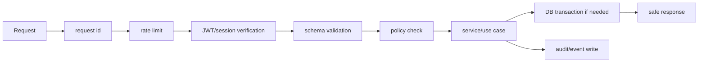

# Veel V2 Fastify Backend Architecture

Status: proposed v2 architecture
Scope: backend
Last updated: 2026-06-01
Source of truth: proposal

## Backend Role

The Fastify backend is the business authority. It owns:

- auth-to-profile resolution
- age/access decisions
- payment intents
- transaction requests
- transaction verification
- entitlements
- referrals/commissions
- media lifecycle
- live room policy
- messages business rules
- moderation/admin/audit
- provider webhooks

## Module Layout

```text
apps/api/src/
  app.ts
  server.ts
  config/
  plugins/
    auth.plugin.ts
    db.plugin.ts
    openapi.plugin.ts
    rate-limit.plugin.ts
    request-id.plugin.ts
  modules/
    auth/
    users/
    profiles/
    content/
    media/
    payments/
    referrals/
    live/
    messages/
    engagement/
    age-kyc/
    safety/
    admin/
    audit/
  workers/
    webhook-worker.ts
    reconciliation-worker.ts
  shared/
    db/
    errors/
    policies/
    schemas/
    idempotency/
    provider/
```

## Module Contract

Each module:

```text
module/
  routes.ts       HTTP route registration only
  schemas.ts      request/response schemas
  service.ts      use-case orchestration
  repository.ts   database reads/writes
  policy.ts       authorization
  events.ts       emitted domain events
  resources.ts    frontend-safe responses
  *.test.ts
```

## Request Pipeline



## Fastify Rules

- Register plugins by domain.
- Use JSON Schema or Zod as the single schema source.
- Generate OpenAPI from route schemas.
- Validate responses for externally consumed APIs where practical.
- Use typed errors mapped to stable API error codes.
- Never put business logic in route handlers.
- Never call provider SDKs directly from route handlers.

## Database Rules

- All money/access/provider mutations use transactions.
- All external callback handlers are idempotent.
- All mutable state transitions use enums/state tables where useful.
- All user-owned reads go through policy/repository functions.
- All admin mutations write audit logs.

## Worker Model

Workers process:

- Helius/Solana webhook reconciliation
- Bunny webhooks/status refresh
- Livepeer webhooks/replay finalization
- age/KYC webhooks
- moderation scans
- notification fanout
- delayed entitlement expiry
- stale upload cleanup

Use BullMQ/Redis if Redis is already required for rate limits and queues. Use pg-boss if reducing infrastructure is more important and Postgres is enough.

## Provider Adapter Pattern

```text
provider/
  solana/
    solana-pay.service.ts
    solana-rpc.service.ts
    helius-indexer.adapter.ts
  bunny/
    bunny-stream.adapter.ts
  livepeer/
    livepeer.adapter.ts
  age/
    yoti.adapter.ts
    sumsub.adapter.ts
```

Adapters expose internal DTOs. They do not leak raw provider payloads to frontend resources.

## Security Baseline

- JWT verification against Supabase project keys.
- Service-role Supabase key only in backend.
- Provider keys only in backend.
- Webhook signature verification.
- Idempotency keys on payments, webhooks, moderation, age/KYC, tickets, messages with payment.
- Request body limits.
- SSRF guard on user-provided URLs.
- Structured logs with redaction.
- Audit records for money, access, provider callbacks, safety, admin, KYC.

## API Examples

```text
POST /v2/payment-intents
GET  /v2/payment-intents/:id/transaction-request
POST /v2/payment-intents/:id/submissions
POST /v2/webhooks/helius
POST /v2/media/upload-intents
POST /v2/webhooks/bunny
POST /v2/live/rooms
GET  /v2/live/rooms/:id/viewer
GET  /v2/live/rooms/:id/host-connection
POST /v2/messages/threads/:id/messages
```

## Backend Acceptance Criteria

- No route handler above 80-120 lines.
- No service above 200 lines without split.
- No provider raw payload in frontend resource.
- No client-trusted money/access.
- OpenAPI generated and committed or published.
- Unit and integration tests cover every money/provider state transition.
