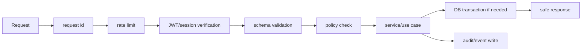

# Veel V2 Fastify Backend Architecture

Status: accepted
Scope: backend
Last updated: 2026-06-12
Source of truth: yes

Owns:
- backend fastify architecture decisions for its named domain

Defers to:
- INDEX.md, route-map.md, OpenAPI, schema blueprint, and ADRs where narrower

Does not own:
- unrelated domains, implementation shortcuts, provider secrets, or hidden source-of-truth rules

Launch scope:
- accepted v2 launch or phased behavior stated in this document

Non-goals:
- historical-context inference, duplicate systems, and unapproved provider/product expansion

## Backend Role

The Fastify backend is the business authority. It owns:

- auth-to-profile resolution
- age/access decisions
- payment intents
- transaction requests
- transaction verification
- entitlements
- referrals/commissions
- media lifecycle
- live room policy
- messages business rules
- moderation/admin/audit
- provider webhooks

## Module Layout

```text
apps/api/src/
  app.ts
  server.ts
  config/
  plugins/
    auth.plugin.ts
    db.plugin.ts
    openapi.plugin.ts
    rate-limit.plugin.ts
    request-id.plugin.ts
  modules/
    auth/
    users/
    profiles/
    content/
    media/
    payments/
    referrals/
    live/
    messages/
    engagement/
    age-kyc/
    safety/
    admin/
    audit/
  workers/
    webhook-worker.ts
    reconciliation-worker.ts
  shared/
    db/
    errors/
    policies/
    schemas/
    idempotency/
    provider/
```

## Module Contract

Each module:

```text
module/
  routes.ts       HTTP route registration only
  schemas.ts      request/response schemas
  service.ts      use-case orchestration
  repository.ts   database reads/writes
  policy.ts       authorization
  events.ts       emitted domain events
  resources.ts    frontend-safe responses
  *.test.ts
```

## Request Pipeline



## Fastify Rules

- Register plugins by domain.
- Use JSON Schema or Zod as the single schema source.
- Generate OpenAPI from route schemas.
- Validate responses for externally consumed APIs where practical.
- Use typed errors mapped to stable API error codes.
- Never put business logic in route handlers.
- Never call provider SDKs directly from route handlers.

## Database Rules

- All money/access/provider mutations use transactions.
- All external callback handlers are idempotent.
- All mutable state transitions use enums/state tables where useful.
- All user-owned reads go through policy/repository functions.
- All admin mutations write audit logs.

## Shared Mutation Boundary

Money, access, safety, age/KYC, wallet, Event Access, Mutuals, messages, and admin mutations must use shared route-boundary helpers instead of hand-rolled request checks:

- `apps/api/src/shared/idempotency.ts` owns `Idempotency-Key` parsing and stable request hashing helpers.
- `apps/api/src/shared/rate-limits.ts` owns route-specific mutation rate-limit presets on top of the global Fastify rate limit.
- Admin reason-required mutations use `requireAdminMutation` so session verification, staff policy, idempotency, body validation, and audit-intent logging are applied consistently before repository work.
- Repository methods still own durable transaction semantics and audit inserts. Route helpers must not become a second business source of truth.

## Worker Model

For Bunny recovery, the worker reads the current provider playback projection and persists its usable playback URL, poster, duration, and state through the direct-sync authority before reporting success. A replayed `ready` flag without usable playback data is not successful recovery.

Solana payment replay binds its settlement write to the exact intent state and submitted signature observed during lookup. If concurrent evidence changes that boundary, replay never overwrites it: an unrelated signature is ignored, while still-relevant changed state is retried through a fresh lookup.

Workers process:

- Helius/Solana webhook reconciliation
- Bunny webhooks/status refresh
- Livepeer webhooks/replay finalization
- age/KYC webhooks
- moderation scans
- notification fanout
- delayed entitlement expiry
- stale upload cleanup

Provider-event recovery leases only sanitized normalized replay payloads from Postgres. Every normalized delivery receives a database-owned monotonic sequence. Bunny and Livepeer reapply those payloads through the same canonical repositories used by live webhook handling only when the replayed delivery is still the newest non-rejected event for that asset or stream; a delivery already classified `ignored_stale` is not authoritative evidence that can suppress another recovery item.

Direct Bunny and Livepeer reads use a Postgres `clock_timestamp()` cutoff captured immediately before the provider request. Both the cutoff and webhook `received_at` therefore share one database clock domain, and the conservative pre-read cutoff makes any provider delivery received during or after the read outrank that direct projection. The cutoff advances monotonically: webhook application does not replace it with a later commit time, an older concurrent sync cannot move it or provider state backward, and a direct sync refuses to write when a non-rejected provider delivery for the same subject arrived after its cutoff. Existing live rooms receive a conservative migration backfill from their latest applied room mutation, so pre-migration sync state cannot be overwritten by older recovery evidence.

Older deliveries are marked ignored instead of moving media state in either direction, closing a current live access window, or replacing the current live replay; deliveries whose side effects already committed return success without repeating handoff or audit effects, whether the retry comes from recovery or an original webhook request resuming after recovery. Helius/Solana preserves the originating provider alias, accepts submitted or confirmed matches only for the exact stored submission signature, prioritizes those signature-bound matches over unrelated pending references, re-runs exact backend settlement verification for unconfirmed work, and uses the existing transactional payment-submission authority. The queue keeps the internal provider-event row ID separate from the external provider delivery ID, uses token-guarded leases, bounded backoff and an attempt ceiling, and preserves the provider's normalized outcome instead of replacing it with a generic replay label. Exhausted work is visible as `dead_letter` with a redacted failure code and replay-request ID in admin operations; audited recovery requeues that exact job only after an operator supplies a reason.

Use `pg-boss` as the launch default to keep infrastructure smaller and queue state close to Postgres. Move selected queues to BullMQ/Redis only after measured queue lag, throughput, or rate-limit requirements justify Redis.

## Provider Adapter Pattern

```text
provider/
  solana/
    solana-pay.service.ts
    solana-rpc.service.ts
    helius-indexer.adapter.ts
  bunny/
    bunny-stream.adapter.ts
  livepeer/
    livepeer.adapter.ts
  age/
    yoti.adapter.ts
    sumsub.adapter.ts
```

Adapters expose internal DTOs. They do not leak raw provider payloads to frontend resources.

## Security Baseline

- JWT verification against Supabase project keys.
- Service-role Supabase key only in backend.
- Provider keys only in backend.
- Webhook signature verification.
- Idempotency keys on payments, webhooks, moderation, age/KYC, Event Access Passes, messages with payment.
- Request body limits.
- SSRF guard on user-provided URLs.
- Structured logs with redaction.
- Audit records for money, access, provider callbacks, safety, admin, KYC.

## API Examples

```text
GET  /v1/session
POST /v1/payments/intents
GET  /v1/payments/intents/:id/transaction-request
POST /v1/webhooks/solana-indexer
POST /v1/media/uploads
POST /v1/webhooks/media/{provider}
POST /v1/live/rooms
GET  /v1/live/rooms/:id
GET  /v1/live/rooms/:id/host-connection
POST /v1/engagement/:contentId/like
POST /v1/events/:eventId/access-passes/intents
```

## Backend Acceptance Criteria

- No route handler above 80-120 lines.
- No service above 200 lines without split.
- No provider raw payload in frontend resource.
- No client-trusted money/access.
- OpenAPI generated and committed or published.
- Unit and integration tests cover every money/provider state transition.
