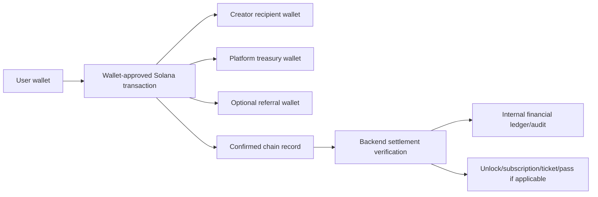
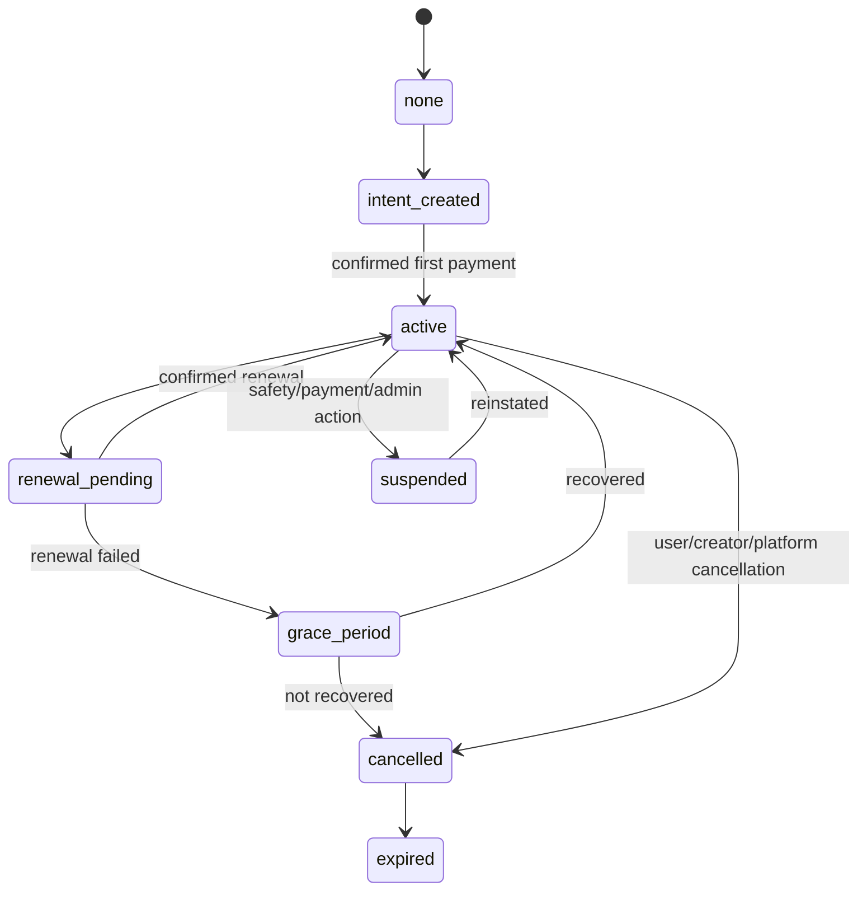
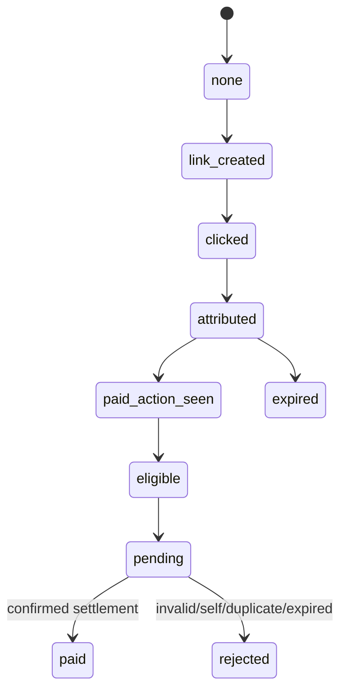

# Veel V2 Business And Monetisation Architecture

Status: accepted
Scope: business model, monetisation, noncustodial money movement
Last updated: 2026-06-03
Source of truth: yes

Owns:
- business monetisation decisions for its named domain

Defers to:
- INDEX.md, route-map.md, OpenAPI, schema blueprint, and ADRs where narrower

Does not own:
- unrelated domains, implementation shortcuts, provider secrets, or hidden source-of-truth rules

Launch scope:
- accepted v2 launch or phased behavior stated in this document

Non-goals:
- historical-context inference, duplicate systems, and unapproved provider/product expansion

This document defines the full Veel v2 monetisation and business model. It extends `payments-and-monetisation.md`, which owns payment verification mechanics, and `noncustodial-money-compliance.md`, which owns the custody and compliance boundary. The rule is unchanged: the frontend can display and request actions, creators choose prices where product policy allows, and the backend enforces admin/env pricing guardrails, splits, settlement, entitlements, commissions, subscriptions, refunds, audit records, and operational reporting.

## Business Model Summary

Veel earns through:

- platform fee on content unlocks, paid messages, live passes, event tickets, tips, and support
- creator subscription platform fee
- optional platform membership/subscription for user-facing platform features
- optional external referral commission sourced from the platform share unless explicitly configured otherwise
- optional wallet-funding referral revenue only if legal/provider review approves it and it is never product checkout revenue

Creators earn through:

- paid clips, premium posts, VOD, and replay content unlocks
- tips and support
- paid messages
- creator subscriptions
- live passes
- event tickets
- referral earnings where product rules allow creator-as-referrer flows

## Noncustodial Split Transfer Model

Veel should prefer noncustodial wallet-approved split transfers wherever product and provider constraints allow.



Backend responsibilities:

- select product type, validated creator price, asset, recipient wallets, split recipients, reference, memo, expiry, and entitlement target
- compose or serve the Solana Pay transaction request
- verify confirmed chain facts before final settlement
- write immutable settlement, split, and audit records
- derive creator earnings, platform revenue, referral commission, and user activity from confirmed settlement

Frontend responsibilities:

- show backend-derived price and recipient summary
- request payment intent and transaction request
- open wallet approval
- show submitted/pending/final states from backend
- never calculate final fee, referral amount, entitlement, or creator earning truth

The direct split model means creator/platform/referral financial records are confirmed settlement projections, not custodial wallet balances held by Veel.

Embedded wallets do not change this model. They reduce onboarding friction by giving mainstream users a user-controlled wallet after social/email/passkey signup, but payment still happens through wallet-approved transactions and backend-verified settlement.

Hard custody rules:

- never route product funds as `user wallet -> Veel wallet -> creator wallet`
- never store credits, internal balances, creator balances, pending payouts, or withdrawal requests
- never implement creator withdrawals; creator recipients receive directly from the buyer transaction where a creator share exists
- never treat funding/onramp completion as product payment proof
- keep records as receipts, entitlements, confirmed earnings/revenue projections, tax/compliance metadata, and immutable audit evidence

## Creator Pricing With Admin Guardrails

Creators own monetisation pricing for creator products:

- content unlocks
- paid messages
- tips/support presets where creator offers presets
- live pass prices and available durations from allowed duration templates
- event tickets
- creator subscriptions

Admin/env owns guardrails:

- minimum price per product type
- maximum price per product type where required for abuse/compliance
- allowed assets/currencies
- platform fee bps
- referral share bps and eligibility
- allowed live pass duration templates
- event capacity/date limits
- refund/revocation policy

Environment variables provide safe launch defaults. Admin configuration can override env defaults and every override is audited. The frontend never calculates final splits or final payable price.

Examples:

- Admin sets minimum paid message price to `0.01 SOL` or USDC equivalent.
- Creator sets a paid message price above that minimum.
- Admin sets live pass duration templates to `30`, `60`, and `180` minutes.
- Creator chooses which durations to offer and sets prices above the minimum.
- Admin sets minimum event ticket price; creator sets actual ticket price and capacity within policy.

## Money Movement Modes

| Mode | Use | Access effect | Required confirmation |
| --- | --- | --- | --- |
| Native SOL split transfer | Devnet testing, low-friction support/tips, possible SOL products | Optional depending product | Signature, reference, payer, lamports, recipients, finality |
| SPL/USDC split transfer | Production stablecoin products if selected | Optional depending product | Signature, reference, payer, mint, token program, token amounts, recipients, finality |
| Solana delegated subscription | Creator and platform recurring plans | Subscription entitlement only after verified authorization and recurring collection | Authority PDA, subscription/delegation PDA, payer token account, mint/program, recipients, amount/period, collection signature, finality |
| Manual Solana Pay recovery | Emergency fallback for failed delegated setup/collection only | Renewal entitlement only after confirmed payment intent | Signature, reference, payer, amount, recipients, finality |
| Wallet funding/onramp | User adds SOL/USDC to their own wallet | No access effect | Funding status only for UX/support |
| Free approval | Free tickets/events/passes | Entitlement only | Backend approval/audit, no wallet settlement |

Onramp sessions are funding flows, not payment settlement flows. A card/onramp provider may help the user add SOL/USDC to their wallet, but Veel product purchases still require the normal payment intent, transaction request or subscription collection, and backend confirmation path. Veel must not use an onramp provider as merchant checkout for content, messages, tickets, passes, tips, or subscriptions.

Native SOL and SPL token modes must share a common intent/split/settlement model. Do not create separate payment systems.

## Product Catalogue

| Product | Buyer pays | Creator earns | Platform earns | Entitlement |
| --- | --- | --- | --- | --- |
| Content unlock | One-time price | Creator share | Platform fee | Content access grant |
| Tip | Preset/custom amount | Creator share | Platform fee if configured | No access grant |
| Support | Preset/custom amount or campaign amount | Creator share | Platform fee | No access grant unless explicitly attached |
| Paid message | Message price | Creator share | Platform fee | Message delivery/open entitlement |
| Creator subscription | Recurring plan price | Creator share | Platform fee | Creator-specific access plan |
| Platform subscription | Recurring platform price | No creator share unless bundled | Platform revenue | Platform feature/member entitlement |
| Live pass | Duration/pass price | Creator share | Platform fee | Live playback/chat access |
| Event ticket | Ticket price | Creator/event owner share | Platform fee | Ticket entitlement/QR |
| External referral commission | From configured share | Referrer earns | Usually platform share reduced | Attribution/commission record |

Launch product type enum:

```text
tip
support
content_unlock
paid_message
live_pass
event_ticket
creator_subscription
platform_subscription
```

Future products such as drops, resale, NFT ticketing, bundles, gifts, or premium-room variants require a separate ADR and must not appear in launch contracts or schema until approved.

## Default Split Policy

Default launch recommendation:

- platform fee: `1000 bps` on eligible paid products
- creator share: gross price minus platform fee and configured taxes/fees where applicable
- referral share: paid from platform fee by default
- creator share is not reduced by referral unless a product configuration explicitly says so
- self-referral is always rejected
- duplicate commission is always rejected

Example for a 1.00 SOL content unlock with 10% platform fee and 20% referral share of platform fee:

```text
Gross:             1.000 SOL
Creator share:     0.900 SOL
Platform gross:    0.100 SOL
Referral share:    0.020 SOL
Platform net:      0.080 SOL
```

The backend stores the exact integer unit amounts used in the transaction request. Display decimals are presentation only.

## Platform Subscription vs Creator Subscription

Platform subscription:

- belongs to Veel, not a specific creator
- can grant platform-level benefits such as membership badge, lower platform fees, advanced discovery, or future app-level features
- must not unlock creator premium content unless a bundled product explicitly says so
- is managed by platform billing policy and admin operations

Recommended platform tiers for first pricing tests:

| Tier | Suggested price | Position |
| --- | --- | --- |
| Free Verified | Free | 18+ verified account, wallet, free Bits/teasers, basic social/media participation, reporting/blocking, and safe discovery controls. |
| Veel Plus | 15 USDC/month equivalent | Heavy viewer tier: higher fair-use watch allowance, better collections/activity tools, better notification/feed controls, profile polish, and priority support. |
| Veel Studio | 29 USDC/month equivalent | Creator/productivity tier: creator dashboard upgrades, scheduling, advanced analytics, pricing presets, event tools, and AI setup assistant where enabled. |
| Enterprise/Partner | Custom | Agency, venue, partner, and operations support tier with manual account review and business support. |

Tier rules:

- platform subscriptions must not hide core safety, basic publishing, normal dating access, or creator discovery behind a paywall
- platform subscriptions must not secretly boost paid content ranking in a way users cannot understand
- creator content purchases still happen separately unless a specific bundle is implemented and documented
- creator-facing productivity value should live in Veel Studio, not in a viewer-only upsell
- dating/event/AI limits can be configured by admin, but the free tier must remain usable enough for real network effects

Pricing, allowance limits, date/match limits, live pass defaults, and platform feature gates must live in backend/admin configuration. Environment variables provide safe defaults; admin configuration can override them without a deploy.

Creator subscription:

- belongs to a creator and plan
- grants creator-specific benefits such as subscriber-only media, premium posts, live access tiers, or message privileges
- can have plan tiers, renewal state, grace period, cancellation, and failed-renewal recovery
- must be auditable per creator, subscriber, plan, billing event, entitlement, and settlement

Both subscription types use the same core state machine but different entitlement scopes.

## Subscription State Machine



Required records:

- subscription plan
- subscriber
- creator or platform owner
- current status
- renewal anchor
- Solana subscription authority, delegation/subscription PDA, token account, collection schedule, and collection signature references
- entitlement scope
- audit events for every transition

Recurring subscription policy:

- Target provider path is Solana Subscriptions and Allowances through the official Subscription Delegation Program.
- Subscription products are modeled as auto-renewing delegated subscriptions until the user cancels in Veel and/or revokes the delegation in wallet/provider UX.
- The delegated subscription production switch remains gated until devnet/staging authority setup, revoke, collection, wallet UX, event, and reconciliation fixtures pass.
- Manual Solana Pay renewal is recovery fallback only; do not use merchant checkout, card billing, custodial subscription balances, or provider-operated product subscriptions.
- Users must be able to cancel in Veel and revoke delegated allowance in wallet/provider UX.
- Backend subscription status mirrors verified payment/collection evidence and internal entitlement policy; it is not a stored debt or receivable.

## Referral And Commission Lifecycle



Rules:

- external referral links can create attribution
- internal Veel DM share does not create commission by default
- attribution can survive signup, login, wallet link, and payment
- commission links to referrer, referred user, content/product, payment intent, settlement signature, and product type
- replayed chain events cannot create duplicate commission
- client-supplied recipient or financial-truth payloads are rejected

## Creator Earnings, Tax Records, And Financial Risk

Even with direct split transfers, Veel still needs backend-derived earning records for:

- creator dashboard reporting
- tax/compliance exports where required
- KYC/KYB earning eligibility where required
- dispute/refund/revocation decisions
- admin and support investigation

Earning-record rules:

- KYC/KYB is required for creator earning features where required by legal/provider policy
- age gate is separate from creator earning KYC/KYB
- creator earnings visible in dashboard must be based on confirmed settlement
- `creator_monetisation_settings` stores readiness/product configuration only; it does not create balances, custody, payout queues, escrow, or receivables
- creator earnings are records and tax/compliance inputs, not a withdrawable Veel balance
- no pending payout or creator withdrawal queue exists in the launch model
- pending wallet submissions are not revenue
- failed, expired, rejected, or mismatched transactions are not revenue

## Refunds, Revocation, And Disputes

Launch policy can defer automated refunds, but the data model must support:

- refund request
- admin review
- revoked entitlement
- replacement entitlement
- creator content versioning after purchase
- dispute audit trail
- settlement reversal or compensating transaction if noncustodial refund is executed

Do not remove buyer access to already purchased content without a documented policy and audit reason.

## Admin And Business Reporting Requirements

The admin dashboard must expose safe, role-gated views for:

- gross merchandise volume
- platform revenue
- creator earnings
- referral commission
- subscription MRR/ARR/churn
- content unlock conversion rate
- payment failure reasons
- webhook lag/failure rate
- top creators/products
- refunds/disputes/revocations
- KYC/KYB earning readiness
- event ticket sales and check-ins

Financial dashboards must link to immutable settlement records and audit events, not frontend counters.

## Config Shape

Each monetised product should resolve through a backend config object:

```text
product_type
price_min_minor
price_max_minor
asset_mode: native_sol | spl_token | subscription_allowance | free
currency_symbol
mint_address
token_program
platform_fee_bps
creator_share_bps
referral_share_bps
max_referral_bps
recipient_policy
eligibility_rule
entitlement_scope
access_duration
renewal_rule
refund_rule
earning_compliance_requirement
audit_required
```

## Tests Required Before V2 Launch

- native SOL split payment
- SPL/USDC split payment
- wrong payer/amount/recipient/mint/program rejection
- duplicate signature rejection
- tip settlement without access grant
- content unlock settlement with access grant
- paid message settlement with message entitlement
- live pass settlement with room access
- event ticket settlement with ticket entitlement
- creator subscription create/renew/cancel/fail/recover
- platform subscription create/renew/cancel/fail/recover
- referral attribution and commission
- self-referral rejection
- duplicate commission rejection
- refund/revocation audit state
