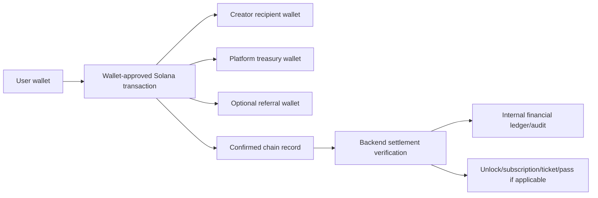
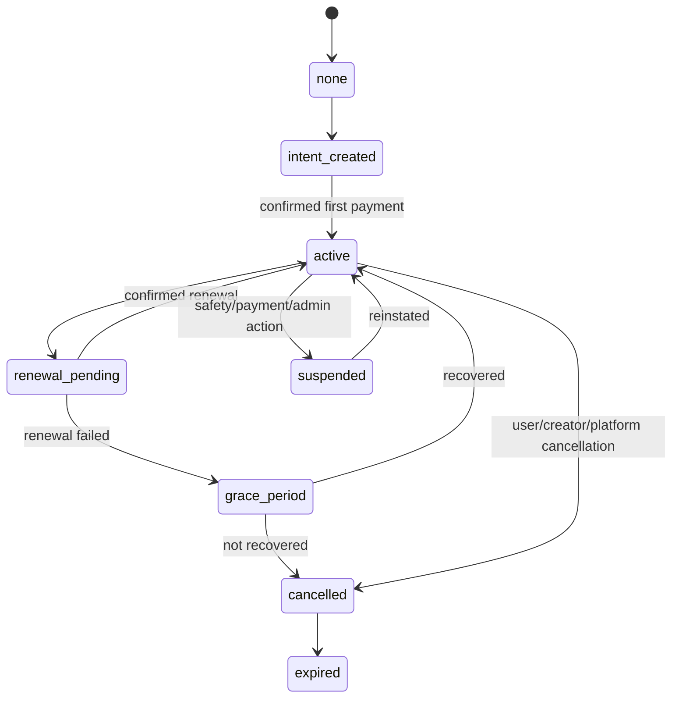
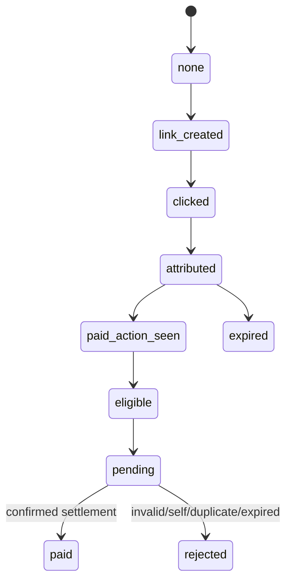

# Veel V2 Business And Monetisation Architecture

Status: proposed v2 architecture
Scope: business model, monetisation, noncustodial money movement
Last updated: 2026-06-03
Source of truth: proposal

This document defines the full Veel v2 monetisation and business model. It extends `payments-and-monetisation.md`, which owns payment verification mechanics. The rule is unchanged: the frontend can display and request actions, creators choose prices where product policy allows, and the backend enforces admin/env pricing guardrails, splits, settlement, entitlements, commissions, subscriptions, refunds, audit records, and operational reporting.

## Business Model Summary

Veel earns through:

- platform fee on paid unlocks, paid messages, live passes, premium live rooms, event tickets, tips, and support
- creator subscription platform fee
- optional platform membership/subscription for user-facing platform features
- optional external referral commission sourced from the platform share unless explicitly configured otherwise
- optional on-ramp/partner revenue when providers are added

Creators earn through:

- paid clips, premium posts, VOD, and replay unlocks
- tips and support
- paid messages
- creator subscriptions
- premium live rooms and live passes
- event tickets
- referral earnings where product rules allow creator-as-referrer flows

## Noncustodial Split Transfer Model

Veel should prefer noncustodial wallet-approved split transfers wherever product and provider constraints allow.



Backend responsibilities:

- select product type, validated creator price, asset, recipient wallets, split recipients, reference, memo, expiry, and entitlement target
- compose or serve the Solana Pay transaction request
- verify confirmed chain facts before final settlement
- write immutable settlement, split, and audit records
- derive creator earnings, platform revenue, referral commission, and user activity from confirmed settlement

Frontend responsibilities:

- show backend-derived price and recipient summary
- request payment intent and transaction request
- open wallet approval
- show submitted/pending/final states from backend
- never calculate final fee, referral amount, entitlement, or creator payout

The direct split model means creator/platform/referral balances are primarily accounting projections from confirmed chain settlement, not custodial wallet balances held by Veel.

Embedded wallets do not change this model. They reduce onboarding friction by giving mainstream users a user-controlled wallet after social/email/passkey signup, but payment still happens through wallet-approved transactions and backend-verified settlement.

## Creator Pricing With Admin Guardrails

Creators own monetisation pricing for creator products:

- media unlocks
- paid messages
- tips/support presets where creator offers presets
- live pass prices and available durations from allowed duration templates
- event tickets
- creator subscriptions

Admin/env owns guardrails:

- minimum price per product type
- maximum price per product type where required for abuse/compliance
- allowed assets/currencies
- platform fee bps
- referral share bps and eligibility
- allowed live pass duration templates
- event capacity/date limits
- refund/revocation policy

Environment variables provide safe launch defaults. Admin configuration can override env defaults and every override is audited. The frontend never calculates final splits or final payable price.

Examples:

- Admin sets minimum paid message price to `0.01 SOL` or USDC equivalent.
- Creator sets a paid message price above that minimum.
- Admin sets live pass duration templates to `30`, `60`, and `180` minutes.
- Creator chooses which durations to offer and sets prices above the minimum.
- Admin sets minimum event ticket price; creator sets actual ticket price and capacity within policy.

## Money Movement Modes

| Mode | Use | Access effect | Required confirmation |
| --- | --- | --- | --- |
| Native SOL split transfer | Devnet testing, low-friction support/tips, possible SOL products | Optional depending product | Signature, reference, payer, lamports, recipients, finality |
| SPL/USDC split transfer | Production stablecoin products if selected | Optional depending product | Signature, reference, payer, mint, token program, token amounts, recipients, finality |
| Provider checkout | Helio/MoonPay/on-ramp/subscription providers | Provider-dependent | Authenticated webhook + internal reconciliation |

Onramp sessions are funding flows, not payment settlement flows. A card/onramp provider may help the user add SOL/USDC to their wallet, but Veel product purchases still require the normal payment intent, transaction request, and backend confirmation path.
| Free approval | Free tickets/events/passes | Entitlement only | Backend approval/audit, no wallet settlement |

Native SOL and SPL token modes must share a common intent/split/settlement model. Do not create separate payment systems.

## Product Catalogue

| Product | Buyer pays | Creator earns | Platform earns | Entitlement |
| --- | --- | --- | --- | --- |
| Paid clip/post/VOD/replay unlock | One-time price | Creator share | Platform fee | Content access grant |
| Tip | Preset/custom amount | Creator share | Platform fee if configured | No access grant |
| Support | Preset/custom amount or campaign amount | Creator share | Platform fee | No access grant unless explicitly attached |
| Paid message | Message price | Creator share | Platform fee | Message delivery/open entitlement |
| Creator subscription | Recurring plan price | Creator share | Platform fee | Creator-specific access plan |
| Platform subscription | Recurring platform price | No creator share unless bundled | Platform revenue | Platform feature/member entitlement |
| Live pass | Duration/pass price | Creator share | Platform fee | Live playback/chat access |
| Premium live room | Room access price | Creator share | Platform fee | Room access |
| Event ticket | Ticket price | Creator/event owner share | Platform fee | Ticket entitlement/QR |
| Drop | Drop price | Creator share | Platform fee | Drop entitlement/fulfilment state |
| External referral commission | From configured share | Referrer earns | Usually platform share reduced | Attribution/commission record |

## Default Split Policy

Default launch recommendation:

- platform fee: `1000 bps` on eligible paid products
- creator share: gross price minus platform fee and configured taxes/fees where applicable
- referral share: paid from platform fee by default
- creator share is not reduced by referral unless a product configuration explicitly says so
- self-referral is always rejected
- duplicate commission is always rejected

Example for a 1.00 SOL unlock with 10% platform fee and 20% referral share of platform fee:

```text
Gross:             1.000 SOL
Creator share:     0.900 SOL
Platform gross:    0.100 SOL
Referral share:    0.020 SOL
Platform net:      0.080 SOL
```

The backend stores the exact integer unit amounts used in the transaction request. Display decimals are presentation only.

## Platform Subscription vs Creator Subscription

Platform subscription:

- belongs to Veel, not a specific creator
- can grant platform-level benefits such as membership badge, lower platform fees, advanced discovery, or future app-level features
- must not unlock creator premium content unless a bundled product explicitly says so
- is managed by platform billing policy and admin operations

Recommended platform tiers for first pricing tests:

| Tier | Suggested price | Position |
| --- | --- | --- |
| Peek | Free | 18+ verified account, limited teaser/free-watch allowance, basic social/media participation. |
| Veel Plus | 15 USDC/month equivalent | Heavy viewer tier: higher watch/bandwidth allowance, smoother media/message experience, better activity/profile tools. |
| Veel Max | 29 USDC/month equivalent | Premium power-user tier: advanced dating/events/AI profile features, stronger discovery/profile tools, optional fee/limit benefits if business model allows. |
| Studio/Enterprise | Custom | Creator/team/business/admin support tier, not the default viewer upsell. |

Pricing, allowance limits, date/match limits, live pass defaults, and platform feature gates must live in backend/admin configuration. Environment variables provide safe defaults; admin configuration can override them without a deploy.

Creator subscription:

- belongs to a creator and plan
- grants creator-specific benefits such as subscriber-only media, premium posts, live access tiers, or message privileges
- can have plan tiers, renewal state, grace period, cancellation, and failed-renewal recovery
- must be auditable per creator, subscriber, plan, billing event, entitlement, and settlement

Both subscription types use the same core state machine but different entitlement scopes.

## Subscription State Machine



Required records:

- subscription plan
- subscriber
- creator or platform owner
- current status
- renewal anchor
- provider/payment intent references
- entitlement scope
- audit events for every transition

## Referral And Commission Lifecycle



Rules:

- external referral links can create attribution
- internal Veel DM share does not create commission by default
- attribution can survive signup, login, wallet link, and payment
- commission links to referrer, referred user, content/product, payment intent, settlement signature, and product type
- replayed chain events cannot create duplicate commission
- client-supplied payout payloads are rejected

## Creator Earnings And Payout Readiness

Even with direct split transfers, Veel still needs backend-derived earning records for:

- creator dashboard reporting
- tax/compliance exports where required
- KYC/KYB payout eligibility
- dispute/refund/revocation decisions
- admin and support investigation

Payout readiness rules:

- KYC/KYB is required for creator earning/withdrawal features where required by provider/legal policy
- age gate is separate from creator payout/KYC
- creator earnings visible in dashboard must be based on confirmed settlement
- pending wallet submissions are not revenue
- failed, expired, rejected, or mismatched transactions are not revenue

## Refunds, Revocation, And Disputes

Launch policy can defer automated refunds, but the data model must support:

- refund request
- admin review
- revoked entitlement
- replacement entitlement
- creator content versioning after purchase
- dispute audit trail
- settlement reversal or compensating transaction if noncustodial refund is executed

Do not remove buyer access to already purchased content without a documented policy and audit reason.

## Admin And Business Reporting Requirements

The admin dashboard must expose safe, role-gated views for:

- gross merchandise volume
- platform revenue
- creator earnings
- referral commission
- subscription MRR/ARR/churn
- unlock conversion rate
- payment failure reasons
- webhook lag/failure rate
- top creators/products
- refunds/disputes/revocations
- KYC/KYB earning readiness
- event ticket sales and check-ins

Financial dashboards must link to immutable settlement records and audit events, not frontend counters.

## Config Shape

Each monetised product should resolve through a backend config object:

```text
product_type
price_min_minor
price_max_minor
asset_mode: native_sol | spl_token | provider_checkout
currency_symbol
mint_address
token_program
platform_fee_bps
creator_share_bps
referral_share_bps
max_referral_bps
recipient_policy
eligibility_rule
entitlement_scope
access_duration
renewal_rule
refund_rule
payout_requirement
audit_required
```

## Tests Required Before V2 Launch

- native SOL split payment
- SPL/USDC split payment
- wrong payer/amount/recipient/mint/program rejection
- duplicate signature rejection
- tip settlement without access grant
- unlock settlement with access grant
- paid message settlement with message entitlement
- live pass settlement with room access
- event ticket settlement with ticket entitlement
- creator subscription create/renew/cancel/fail/recover
- platform subscription create/renew/cancel/fail/recover
- referral attribution and commission
- self-referral rejection
- duplicate commission rejection
- refund/revocation audit state
