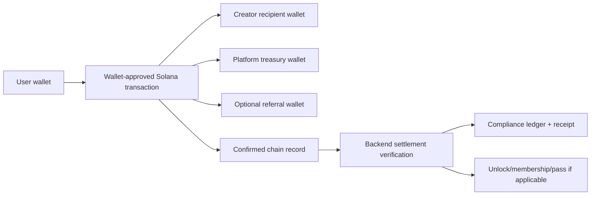
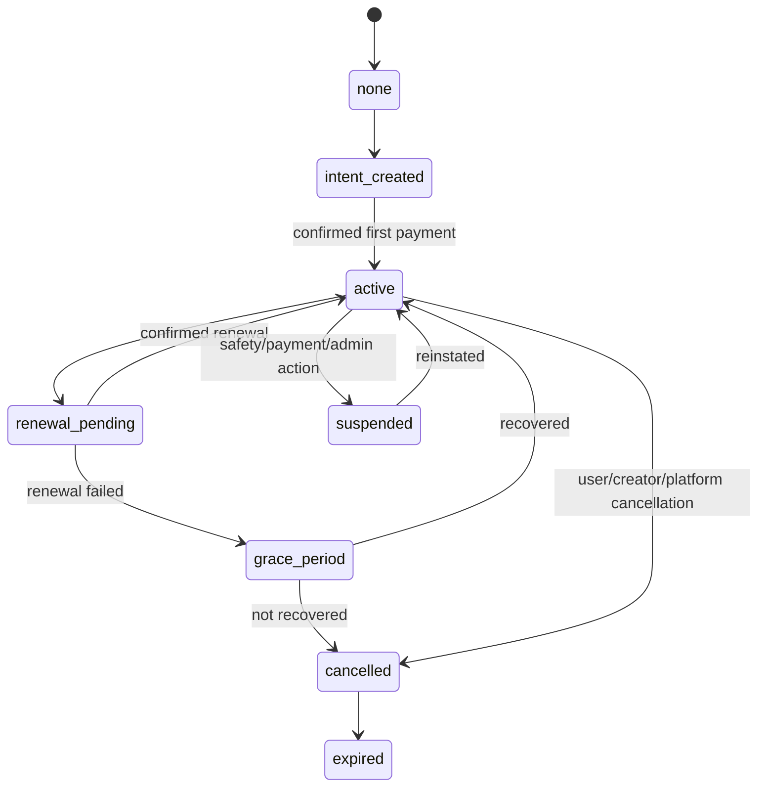
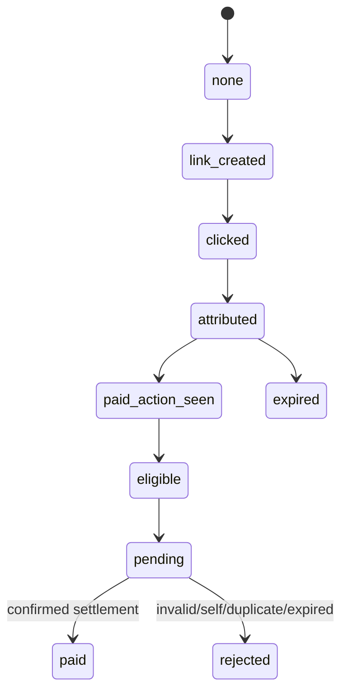

# Veel V2 Business And Monetisation Architecture

Status: accepted
Scope: business model, monetisation, noncustodial money movement
Last updated: 2026-06-05
Source of truth: yes

Owns:
- business monetisation decisions for its named domain

Defers to:
- INDEX.md, route-map.md, OpenAPI, schema blueprint, and ADRs where narrower

Does not own:
- unrelated domains, implementation shortcuts, provider secrets, or hidden source-of-truth rules

Launch scope:
- accepted v2 launch or phased behavior stated in this document

Non-goals:
- historical-context inference, duplicate systems, and unapproved provider/product expansion

This document defines the full Veel v2 monetisation and business model. It extends `payments-and-monetisation.md`, which owns payment verification mechanics, `noncustodial-money-compliance.md`, which owns the custody boundary, and `compliance/dac7-dac8-vat-system.md`, which owns DAC7/DAC8/VAT readiness. The rule is unchanged: the frontend can display and request actions, creators choose prices where product policy allows, and the backend enforces admin/env pricing guardrails, splits, settlement, compliance ledger writes, receipts, entitlements, commissions, memberships, refunds, audit records, and operational reporting.

## Hard Social-Money Rule

```text
Money can buy access to content, events, memberships, and live streams.
Money can never buy access to people, visibility, matches, recommendations, or preferential social treatment.
```

This is a hard architectural rule. It applies to Mutuals/Connections, creator monetisation, platform tiers, referrals, notifications, ranking, messaging, AI tools, and admin policy. Any slice that touches money, recommendations, Mutuals, profiles, messaging, notifications, or platform tiers must preserve this rule in contracts, backend policy, tests, and user-facing copy.

## Source-Of-Truth Ownership Rule

```text
The blockchain is the source of payment truth.
The entitlement system is the source of access truth.
The compliance ledger is the source of reporting truth.
The accounting integration is the source of bookkeeping truth.
The platform must never create a second competing source of truth for the same responsibility.
```

Operational tables, caches, notifications, admin projections, receipts, exports, and dashboard aggregates must derive from those systems of record. They can improve supportability and UX, but they must not override settlement evidence, entitlement state, compliance-ledger entries, or accounting-system books.

## Business Model Summary

Veel earns through:

- platform fee on content unlocks, paid messages, live passes, Event Access Passes, and support
- Creator Membership platform fee
- platform plans: Free Verified, Veel Plus, Veel Studio, and Enterprise
- optional referral commission sourced only from Veel platform commission net of refunds and tax
- optional wallet-funding referral revenue only if legal/provider review approves it and it is never product checkout revenue

Creators earn through:

- paid clips, premium posts, VOD, and replay content unlocks
- support
- paid messages
- Creator Memberships
- live passes
- Event Access Passes
- referral earnings where product rules allow creator-as-referrer flows

## Noncustodial Split Transfer Model

Veel should prefer noncustodial wallet-approved split transfers wherever product and provider constraints allow.



Backend responsibilities:

- select product type, validated creator price, asset, recipient wallets, split recipients, reference, memo, expiry, and entitlement target
- compose or serve the Solana Pay transaction request
- verify confirmed chain facts before final settlement
- write immutable settlement, compliance ledger, receipt/invoice, split, and audit records
- derive creator earnings, platform revenue, referral commission, and user activity from confirmed settlement

Frontend responsibilities:

- show backend-derived price and recipient summary
- request payment intent and transaction request
- open wallet approval
- show submitted/pending/final states from backend
- never calculate final fee, referral amount, entitlement, or creator earning truth

The direct split model means creator/platform/referral financial records are confirmed settlement projections, not custodial wallet balances held by Veel.

Embedded wallets do not change this model. They reduce onboarding friction by giving mainstream users a user-controlled wallet after social/email/passkey signup, but payment still happens through wallet-approved transactions and backend-verified settlement.

Hard custody rules:

- never route product funds as `user wallet -> Veel wallet -> creator wallet`
- never store credits, internal balances, creator balances, pending payouts, or withdrawal requests
- never implement creator withdrawals or a platform-controlled payout queue; creator recipients receive directly from the buyer transaction where a creator share exists
- never treat funding/onramp completion as product payment proof
- keep records as receipts, invoices/statements, entitlements, confirmed earnings/revenue projections, tax/compliance metadata, and immutable audit evidence

## Creator Pricing With Admin Guardrails

Creators own monetisation pricing for creator products:

- content unlocks
- paid messages
- support presets where creator offers presets
- live pass prices and available durations from allowed duration templates
- Event Access Passes
- Creator Memberships

Admin/env owns guardrails:

- minimum price per product type
- maximum price per product type where required for abuse/compliance
- allowed assets/currencies
- platform fee bps
- referral share bps and eligibility
- allowed live pass duration templates
- event capacity/date limits
- refund/revocation policy

Environment variables provide safe launch defaults. Admin configuration can override env defaults and every override is audited. The frontend never calculates final splits or final payable price.

Examples:

- Admin sets minimum paid message price to `0.01 SOL` or USDC equivalent.
- Creator sets a paid message price above that minimum.
- Admin sets live pass duration templates to `30`, `60`, and `180` minutes.
- Creator chooses which durations to offer and sets prices above the minimum.
- Admin sets minimum Event Access price; creator sets actual pass price and capacity within policy.

## Money Movement Modes

| Mode | Use | Access effect | Required confirmation |
| --- | --- | --- | --- |
| Native SOL split transfer | Devnet testing, low-friction support/tips, possible SOL products | Optional depending product | Signature, reference, payer, lamports, recipients, finality |
| SPL/USDC split transfer | Production stablecoin products if selected | Optional depending product | Signature, reference, payer, mint, token program, token amounts, recipients, finality |
| Solana delegated subscription | Creator Memberships and platform recurring plans | Membership/platform entitlement only after verified authorization and recurring collection | Authority PDA, subscription/delegation PDA, payer token account, mint/program, recipients, amount/period, collection signature, finality |
| Manual Solana Pay recovery | Emergency fallback for failed delegated setup/collection only | Renewal entitlement only after confirmed payment intent | Signature, reference, payer, amount, recipients, finality |
| Wallet funding/onramp | User adds SOL/USDC to their own wallet | No access effect | Funding status only for UX/support |
| Free approval | Free Event Access/Passes | Entitlement only | Backend approval/audit, no wallet settlement |

Onramp sessions are funding flows, not payment settlement flows. A card/onramp provider may help the user add SOL/USDC to their wallet, but Veel product purchases still require the normal payment intent, transaction request or subscription collection, and backend confirmation path. Veel must not use an onramp provider as merchant checkout for content, messages, Event Access, support, or memberships.

Implemented wallet funding boundary:

- `POST /v1/wallets/onramp-sessions` creates a provider funding session only for a wallet owned by the authenticated user.
- The provider launch URL may be returned to the user, but no access, entitlement, paid-message delivery, ticket, subscription, commission, or revenue state changes from that response.
- Coinbase CDP is the current provider boundary when configured. It is used only for destination-wallet funding; Solana Pay/payment-intent settlement remains the product payment path.

Native SOL and SPL token modes must share a common intent/split/settlement model. Do not create separate payment systems.

## Product Catalogue

| Product | Buyer pays | Creator earns | Platform earns | Entitlement |
| --- | --- | --- | --- | --- |
| Content unlock | One-time price | Creator share | Platform fee | Content access grant |
| Support | Preset/custom amount or campaign amount | Creator share | Platform fee | No access grant unless explicitly attached |
| Paid message | Message price | Creator share | Platform fee | Message delivery/open entitlement |
| Creator Membership | Recurring plan price | Creator share | Platform fee | Creator-specific access plan |
| Veel Plus | 8.99 USDC/month or 89 USDC/year | No creator share unless bundled | Platform revenue | Heavy-user platform entitlement |
| Veel Studio | 29 USDC/month or 290 USDC/year | No creator share unless bundled | Platform revenue | Creator business/tool entitlement |
| Enterprise | Custom, from 199 USDC/month equivalent | No creator share unless contracted | Platform revenue | Organization/agency/venue entitlement |
| Live pass | Duration/pass price | Creator share | Platform fee | Live playback/chat access |
| Event Access Pass | Pass price | Creator/event owner share | Platform fee | Access entitlement/QR |
| Referral commission | From Veel platform commission net of refunds/tax | Referrer/partner earns | Platform share reduced | Attribution/commission record |

Launch product type enum:

```text
tip
support
content_unlock
paid_message
live_pass
event_access_pass
creator_subscription
platform_subscription
```

Future products such as drops, resale, NFT pass/ticketing, bundles, gifts, or premium-room variants require a separate ADR and must not appear in launch contracts or schema until approved.

Target product language for new docs/UI:

```text
support
unlock
paid_message
live_pass
event_access_pass
membership
platform_plus
platform_studio
enterprise
platform_fee
referral_commission
```

OpenAPI and new payment intents use `event_access_pass` for Event Access. Deprecated `event_ticket` database rows are normalized by the `0050_event_access_payment_product_type` migration and remain readable only as a legacy settlement compatibility value. Frontend copy must use the target product language.

## Default Split Policy

Default launch recommendation:

- platform fee: `1000 bps` on eligible paid products
- creator share: gross price minus platform fee and configured taxes/fees where applicable
- referral share: paid only from Veel platform commission net of refunds and tax
- creator share is never reduced by referral
- self-referral is always rejected
- duplicate commission is always rejected

Example for a 1.00 SOL content unlock with 10% platform fee and 20% referral share of platform fee:

```text
Gross:             1.000 SOL
Creator share:     0.900 SOL
Platform gross:    0.100 SOL
Referral share:    0.020 SOL
Platform net:      0.080 SOL
```

The backend stores the exact integer unit amounts used in the transaction request. Display decimals are presentation only.

## Platform Plans vs Creator Membership

Platform plans:

- belongs to Veel, not a specific creator
- can grant platform-level benefits such as membership badge, higher fair-use watch allowance, creator business tooling, organization tooling, or future app-level features
- must not unlock creator premium content unless a bundled product explicitly says so
- is managed by platform billing policy and admin operations
- must not grant paid access to people, visibility, matches, recommendations, message priority, social ranking, or preferential social treatment

Recommended platform tiers for first pricing tests:

| Tier | Suggested price | Position |
| --- | --- | --- |
| Free Verified | Free | 18+ verified account, wallet, weekly free watch time up to 60 minutes or 1.5 GB transfer, previews, basic social/media participation, reporting/blocking, and safe discovery controls. |
| Veel Plus | 8.99 USDC/month or 89 USDC/year | Heavy viewer tier: higher fair-use watch allowance, better collections/activity tools, better notification/feed controls, profile polish, and priority support. No feed/Mutuals boost. |
| Veel Studio | 29 USDC/month or 290 USDC/year | Creator business tier: creator dashboard upgrades, scheduling, advanced analytics, pricing presets, Event Access tools, KYC/KYB/wallet/tax setup, and AI setup assistant where enabled. |
| Enterprise | Custom, from 199 USDC/month equivalent | Organization, agency, venue, and partner tier with KYB, RBAC, consolidated reporting, business support, and contract review. |

Tier rules:

- platform plans must not hide core safety, basic publishing, Mutuals access, or creator discovery behind a paywall
- platform plans must not boost paid content ranking, Mutuals ranking, or message priority
- creator content purchases still happen separately unless a specific bundle is implemented and documented
- creator-facing productivity value should live in Veel Studio, not in a viewer-only upsell
- Mutuals/Event Access/AI limits can be configured by admin, but the free tier must remain usable enough for real network effects

Pricing, allowance limits, Mutual/Event Access limits, live pass defaults, and platform feature gates must live in backend/admin configuration. Environment variables provide safe defaults; admin configuration can override them without a deploy.

Creator Membership:

- belongs to a creator and plan
- grants creator-specific benefits such as subscriber-only media, premium posts, live access tiers, or message privileges
- can have plan tiers, renewal state, grace period, cancellation, and failed-renewal recovery
- must be auditable per creator, subscriber, plan, billing event, entitlement, and settlement

Platform plans and Creator Memberships use the same recurring authorization/collection state machine but different entitlement scopes.

## Subscription State Machine



Required records:

- subscription plan
- subscriber
- creator or platform owner
- current status
- renewal anchor
- Solana subscription authority, delegation/subscription PDA, token account, collection schedule, and collection signature references
- entitlement scope
- audit events for every transition

Recurring subscription policy:

- Target provider path is Solana Subscriptions and Allowances through the official Subscription Delegation Program.
- Subscription products are modeled as auto-renewing delegated subscriptions until the user cancels in Veel and/or revokes the delegation in wallet/provider UX.
- The delegated subscription production switch remains gated until devnet/staging authority setup, revoke, collection, wallet UX, event, and reconciliation fixtures pass.
- Manual Solana Pay renewal is recovery fallback only; do not use merchant checkout, card billing, custodial subscription balances, or provider-operated product subscriptions.
- Users must be able to cancel in Veel and revoke delegated allowance in wallet/provider UX.
- Backend subscription status mirrors verified payment/collection evidence and internal entitlement policy; it is not a stored debt or receivable.
- Renewal checkout and settings must disclose amount, period, token/mint, cancellation path, delegated authority, and that cancellation stops future collection rather than automatically refunding the current started period unless law or platform/provider failure requires it.
- EU/EEA platform subscription checkout must collect immediate digital service consent and withdrawal-loss acknowledgement before the first access period starts, then send durable confirmation with plan, wallet, authorization/delegation evidence, terms version, and cancellation path.

## Referral And Commission Lifecycle



Rules:

- external referral links can create attribution
- internal Veel DM share does not create commission by default
- attribution can survive signup, login, wallet link, and payment
- commission links to referrer, referred user, content/product, payment intent, settlement signature, and product type
- replayed chain events cannot create duplicate commission
- client-supplied recipient or financial-truth payloads are rejected

## Creator Earnings, Tax Records, And Financial Risk

Even with direct split transfers, Veel still needs backend-derived earning records for:

- creator dashboard reporting
- tax/compliance exports where required
- KYC/KYB earning eligibility where required
- dispute/refund/revocation decisions
- admin and support investigation

Earning-record rules:

- KYC/KYB is required for creator earning features where required by legal/provider policy
- age gate is separate from creator earning KYC/KYB
- creator earnings visible in dashboard must be based on confirmed settlement
- `creator_monetisation_settings` stores readiness/product configuration only; it does not create balances, custody, payout queues, escrow, or receivables
- creator earnings are records and tax/compliance inputs, not a withdrawable Veel balance
- no pending payout or creator withdrawal queue exists in the launch model
- pending wallet submissions are not revenue
- failed, expired, rejected, or mismatched transactions are not revenue

## Refunds, Revocation, And Disputes

Launch policy can defer automated refunds, but the data model must support:

- refund request
- admin review
- revoked entitlement
- replacement entitlement
- creator content versioning after purchase
- dispute audit trail
- settlement reversal or compensating transaction if noncustodial refund is executed

Do not remove buyer access to already purchased content without a documented policy and audit reason.

Commercial default:

- Creator-sold products are final once immediate access is delivered, except mandatory legal rights, duplicate settlement, fraud/unauthorized access, misdescription, provider/platform failure, or seller non-delivery.
- Veel-sold platform plans are final once the current access period starts, except mandatory legal rights, duplicate collection, fraud/unauthorized access, platform failure, or failure to provide the software feature.
- Creator-sold refunds should be seller-funded noncustodial transactions. Veel must not promise to absorb creator refund exposure from platform treasury unless counsel approves a goodwill or platform-fault exception.
- Referral commissions come only from Veel platform commission net of refunds and tax; approved refunds/reversals must correct commission eligibility through backend records.
- If a creator-sold refund is approved, creator share refund responsibility remains with the seller where legally supportable. Veel only refunds/reverses its commission when required by law, policy, or Veel fault, and referral commissions must be clawed back or marked ineligible from backend records rather than by creating a negative user balance.
- Payment/refund review records must preserve `payment_confirmed`, `access_granted_at`, `withdrawal_waiver_accepted_at`, `withdrawal_waiver_version`, `terms_version`, `refund_eligible_reason`, `refund_status`, `refund_wallet`, and `refund_value_basis` either directly or through linked payment, entitlement, refund/dispute, receipt, and audit rows.
- Confirmed settlement must also preserve durable confirmation evidence through backend receipt, compliance-ledger, notification, and confirmation-delivery rows. In-app delivery may be marked sent when the backend notification exists; email delivery is leased by the worker and must stay queued/provider-not-configured/failed until a launch-approved transactional email provider confirms delivery.
- If transactional email is not enabled, the in-app confirmation remains the user-visible fallback and support evidence, but launch compliance should not rely on in-app-only waiver confirmation for EU/EEA distance-sale flows unless counsel approves that durable-medium interpretation for the exact user interface and retention model.

## Admin And Business Reporting Requirements

The admin dashboard must expose safe, role-gated views for:

- gross merchandise volume
- platform revenue
- creator earnings
- referral commission
- subscription MRR/ARR/churn
- content unlock conversion rate
- payment failure reasons
- webhook lag/failure rate
- top creators/products
- refunds/disputes/revocations
- KYC/KYB earning readiness
- Event Access Pass sales and check-ins

Financial dashboards must link to immutable settlement records and audit events, not frontend counters.

## Config Shape

Each monetised product should resolve through a backend config object:

```text
product_type
price_min_minor
price_max_minor
asset_mode: native_sol | spl_token | subscription_allowance | free
currency_symbol
mint_address
token_program
platform_fee_bps
creator_share_bps
referral_share_bps
max_referral_bps
recipient_policy
eligibility_rule
entitlement_scope
access_duration
renewal_rule
refund_rule
earning_compliance_requirement
audit_required
```

## Tests Required Before V2 Launch

- native SOL split payment
- SPL/USDC split payment
- wrong payer/amount/recipient/mint/program rejection
- duplicate signature rejection
- tip settlement without access grant
- content unlock settlement with access grant
- paid message settlement with message entitlement
- live pass settlement with room access
- Event Access Pass settlement with backend Access Pass entitlement
- creator subscription create/renew/cancel/fail/recover
- platform subscription create/renew/cancel/fail/recover
- referral attribution and commission
- self-referral rejection
- duplicate commission rejection
- refund/revocation audit state
