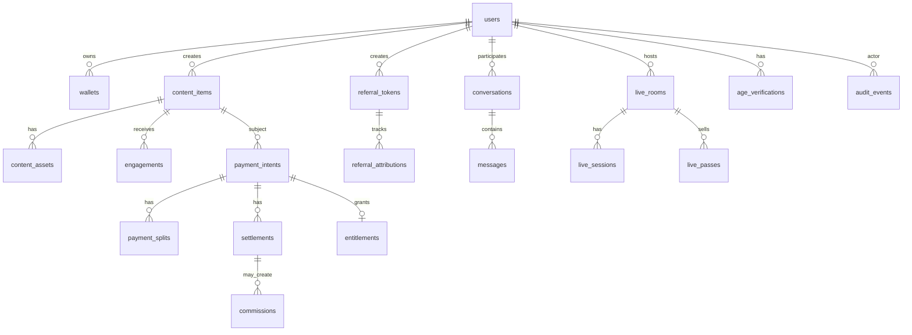

# Veel V2 Data Model

Status: accepted
Scope: database
Last updated: 2026-06-01
Source of truth: yes

Owns:
- data model decisions for its named domain

Defers to:
- INDEX.md, route-map.md, OpenAPI, schema blueprint, and ADRs where narrower

Does not own:
- unrelated domains, implementation shortcuts, provider secrets, or hidden source-of-truth rules

Launch scope:
- accepted v2 launch or phased behavior stated in this document

Non-goals:
- historical-context inference, duplicate systems, and unapproved provider/product expansion

This is the conceptual Postgres model for v2. It is not a migration file.

## Domain Tables



## Core State Machines

Payment intent:

```text
draft -> pending -> submitted -> confirmed
                       |            |
                       v            v
                     failed       settled
                       |
                       v
                    expired
```

Entitlement:

```text
active -> revoked
active -> expired
```

Media asset:

```text
draft -> upload_intent_created -> uploading -> processing -> ready
                                               |             |
                                               v             v
                                             failed       archived
```

Referral commission:

```text
none -> link_created -> clicked -> attributed -> paid_action_seen -> eligible -> pending -> paid
                                                                       |
                                                                       v
                                                                    rejected
```

Live room:

```text
scheduled -> waiting_for_host -> live -> ending -> ended -> replay_ready
                             |                  |
                             v                  v
                          cancelled          replay_failed
```

## Constraints

Required unique constraints:

- wallet chain + address
- payment intent idempotency per payer
- settlement transaction signature
- entitlement per payment intent
- referral commission per eligible payment event
- content asset provider id per provider
- webhook event dedupe key per provider
- conversation participant pair where direct thread

## Audit Tables

Audit every:

- auth/wallet link
- payment intent
- transaction request
- settlement confirmation/failure
- entitlement grant/revoke
- referral attribution/commission
- provider webhook
- content publish/delete/moderation
- live host credential issue
- age/KYC result
- admin mutation
- report/block

Audit records must be append-only.

## Provider Payload Policy

Store raw provider payload only when needed for reconciliation/debugging, and keep it:

- server-only
- redacted where possible
- not returned through normal API resources
- retention-limited where sensitive

For frontend resources, use normalized fields only.
