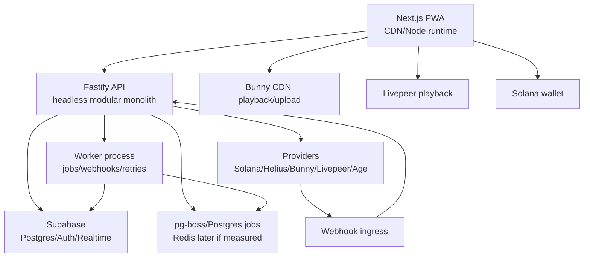
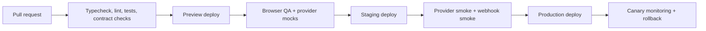

# Veel V2 Deployment Topology

Status: accepted
Scope: server topology, cost, environments, scaling
Last updated: 2026-06-03
Source of truth: yes

Owns:
- deployment topology decisions for its named domain

Defers to:
- INDEX.md, route-map.md, OpenAPI, schema blueprint, and ADRs where narrower

Does not own:
- unrelated domains, implementation shortcuts, provider secrets, or hidden source-of-truth rules

Launch scope:
- accepted v2 launch or phased behavior stated in this document

Non-goals:
- historical-context inference, duplicate systems, and unapproved provider/product expansion

This document defines a cost-effective and scalable v2 deployment model. The recommendation is a headless modular monolith backend at launch, with managed provider infrastructure for database, auth, realtime, media, and payment evidence. Do not start with microservices or full serverless unless a measured bottleneck requires it.

## Recommended Launch Topology

## Server Style

Use a headless modular monolith:

- one Fastify API service
- one worker service using the same domain modules
- one contracts package
- one shared database
- strict module boundaries in code
- no cross-module direct writes outside service/actions

This is cheaper and easier to operate than microservices while still allowing future extraction.

## Why Not Microservices At Launch

Money, access, referrals, subscriptions, tickets, media status, and safety all need consistent transactions and audit trails. Splitting them into services too early creates:

- distributed transaction problems
- duplicate auth/policy logic
- harder local development
- higher hosting and observability cost
- slower product iteration

Extract later only when a module has a measured scaling boundary and a stable contract.

## Hybrid Boundary

Use managed provider infrastructure where it clearly removes custom code:

- Supabase Auth for identity/session issuer
- Supabase Postgres for relational source of truth
- Supabase Realtime for selected authorized events
- Bunny for VOD, CDN, TUS/upload, thumbnails/playback
- Livepeer for live streams and replay assets
- Helius for confirmed payment/access evidence
- third-party age/KYC providers for verification

Use optional edge/serverless functions only for:

- public referral/link redirect
- static/cacheable public metadata
- webhook prefilter if provider latency or DDoS requires it
- landing page form ingestion if isolated from core auth/money state

Do not put payment settlement, entitlement grants, creator payout logic, admin actions, age/KYC decisions, or provider secrets in edge functions.

## Environments

Local:

- Docker Compose for API, worker, database/redis if not using cloud dev
- Supabase local or a dedicated dev Supabase project
- Solana devnet
- provider sandbox/dev credentials

Staging:

- separate Supabase project
- Solana devnet or provider staging network
- staging provider accounts
- public HTTPS URLs for webhooks
- production-like observability and audit logging

Production:

- production Supabase project with backups/PITR
- dedicated Solana RPC/indexer provider
- least-privilege provider keys
- separate treasury/recipient wallets
- monitored worker queues
- deployment rollback path

## Cost-Efficient Launch Plan

Phase 1:

- one small API instance
- one small worker instance
- managed Supabase
- managed Redis only if pg-boss is not enough
- Bunny/Livepeer on usage-based tiers
- Helius scoped to relevant payment/treasury addresses

Phase 2:

- scale API horizontally
- scale workers by queue type
- add read replicas only if query pressure requires
- split long media/provider jobs from payment/webhook jobs

Phase 3:

- extract high-volume feed/recommendation/search worker if measured
- add edge redirect/tracking for public referral links
- add dedicated analytics pipeline

## Scaling Triggers

Scale API when:

- p95 latency exceeds target under normal load
- CPU/memory saturation is sustained
- connection pool saturation occurs

Scale workers when:

- webhook queue lag exceeds payment/access SLA
- media processing retries accumulate
- moderation/age callbacks lag

Split services only when:

- module traffic is independently high
- ownership and contracts are stable
- extraction reduces operational risk instead of increasing it

## Observability

Required from day one:

- structured request logs with request IDs
- OpenTelemetry traces for API, workers, provider calls
- payment intent/settlement audit logs
- webhook receipt and processing logs
- provider health metrics
- queue lag metrics
- frontend web vitals
- admin ops dashboard links
- alerting for payment/webhook failures

Never log secrets, raw PII, private provider payloads, signed media URLs, stream keys, or private wallet material.

## Deployment Pipeline

## Data And Backup Requirements

- Supabase automated backups and point-in-time recovery for production.
- Daily export or backup validation.
- Migration rollback plan for every schema change.
- Append-only audit tables for money, access, safety, admin, provider callbacks, and AI tool calls.
- Retention policy for sensitive provider references and logs.

## Security Boundary

- API and worker run with server-only provider keys.
- Web receives only public/safe env values.
- Supabase service role key never reaches browser.
- RLS protects realtime reads, but backend policy remains authoritative.
- Admin API is separate and role-gated.
- Webhooks verify signatures and replay windows.
- Secrets are stored in deployment secret manager, not repo env files.

## Production Readiness Gates

- deploy rollback tested
- webhook replay tested
- payment settlement tested
- provider outage behavior tested
- backup restore tested
- admin break-glass access tested
- rate limits configured
- CSP and security headers configured
- staging provider smoke passes
