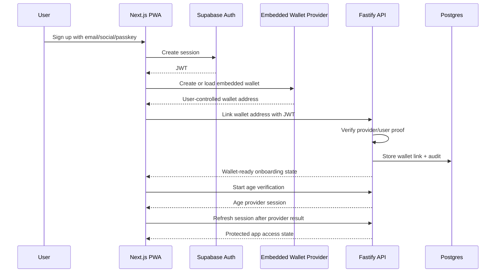
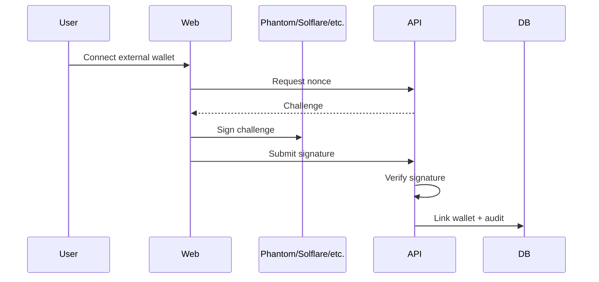
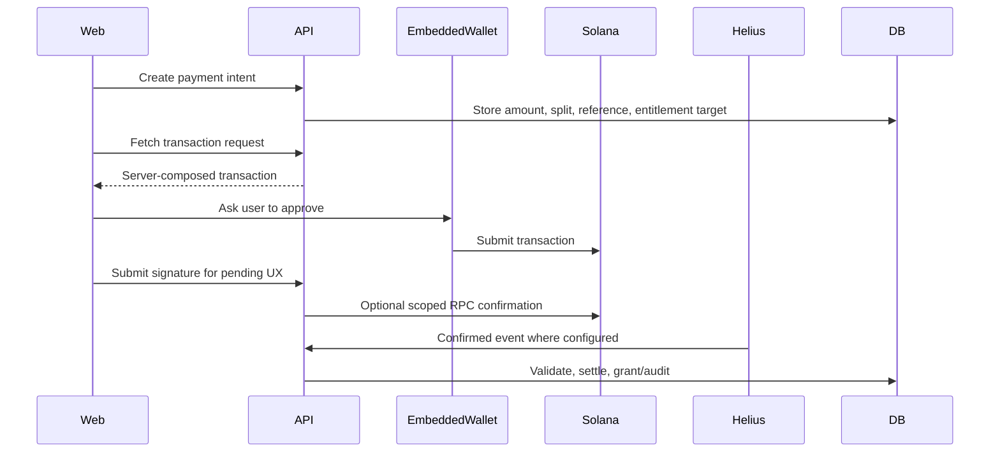
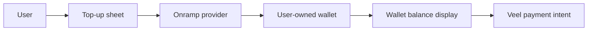

# Veel V2 Embedded Wallet Onboarding

Status: proposed v2 architecture
Scope: auth, wallets, onboarding, onramp, conversion
Last updated: 2026-06-03
Source of truth: proposal

This document defines the recommended v2 wallet onboarding model. The goal is to reduce signup and payment churn without making Veel custodial or moving payment truth to the frontend.

## Decision

V2 should support two wallet paths:

1. External wallet connect for web3-native users.
2. Social/email/passkey signup with a noncustodial embedded Solana wallet for mainstream users.

Wallet ownership remains user-controlled. Veel never holds private keys, never signs payment transactions without explicit user authorization, and never grants access from client-side wallet state.

Protected app access rule:

- Veel is an 18+ platform.
- Onboarding has two required stages before protected app access:
  1. identity + wallet path
  2. age verification
- The recommended launch default is embedded-wallet-first for mainstream users: email/social/passkey creates or loads a noncustodial embedded wallet.
- External/native wallet connect remains first-class for web3-native users.
- One wallet path is mandatory; the other path can be added, changed, or selected as primary later in profile/settings.
- No user enters the protected app shell until age verification is complete.
- Wallet existence is required for wallet-native identity/payment readiness, but it is not payment proof.

## Why This Changes The Product Funnel

Wallet-mandatory onboarding creates a conversion cliff for mainstream users. A creator/fan platform should let users:

- open the app
- sign up with email, social, or passkey
- receive or create a user-owned embedded wallet
- top up that wallet by card/onramp when they need to pay
- participate in unlocks, tips, support, messages, live passes, and tickets without installing a browser extension first

External wallets remain first-class for crypto-native users.

## Provider-First Options

Use a wallet infrastructure provider instead of building key management.

Provider options to evaluate:

- Privy embedded wallets: supports self-custodial embedded wallets and Solana.
- Dynamic embedded wallets: supports noncustodial embedded wallets and Solana/EdDSA.
- Turnkey embedded wallets: supports noncustodial embedded wallet architectures with email/OAuth/passkey style authentication and programmable policies.
- Coinbase Onramp or another onramp provider: fund the user-owned wallet, not a Veel custodial account.

Selection criteria:

- Solana support
- noncustodial/user-controlled mode
- key export/recovery policy
- passkey/social/email support
- transaction approval UX
- onramp compatibility
- webhook/audit capability
- regional availability
- security certifications and incident history
- cost at signup and transaction volume
- ability to avoid app-controlled spending for Veel payment flows

## Custody Boundary

Allowed:

- provider-managed noncustodial embedded wallet
- user-controlled signing through passkey/social/email authenticator
- wallet export/recovery where provider supports it
- external wallet linking and primary wallet selection
- card/onramp funding into the user wallet

Not allowed:

- Veel holding user private keys
- app-controlled payment signing for tips, unlocks, subscriptions, tickets, paid messages, or live passes
- frontend deciding payment success
- provider wallet state granting access without backend settlement verification
- custodial internal balance as launch default

## Auth And Wallet Flow

External wallet flow remains available:

## Payment Flow With Embedded Wallet

Embedded wallet payments use the same backend-owned payment architecture as external wallets.

No separate payment system is created for embedded wallets.

## Top-Up / Onramp Flow

Rules:

- onramp funds the user wallet directly
- onramp provider handles fiat/KYC requirements where applicable
- Veel records safe onramp session references for UX/support only
- Veel does not credit internal custodial balance as payment proof
- paid actions still require backend payment intent and confirmed transaction validation

## When To Create The Embedded Wallet

Recommended launch behavior:

- create on signup if provider cost is acceptable and it improves UX
- otherwise create before age verification and protected app entry, not after the user is already inside the app
- always allow user to link an external wallet and set primary wallet

Wallet-required actions:

- unlock paid content
- tip/support
- paid message
- creator subscription
- live pass
- event ticket
- creator payout/earning setup

Non-wallet actions:

- browsing allowed content
- follow/like/save/comment where access policy allows
- profile setup
- age gate

## UX Requirements

- Do not show crypto jargon during signup.
- Explain wallet only when needed: "Your Veel wallet lets you unlock, support creators, and receive purchases."
- Payment sheets show amount, asset, creator, platform/referral summary where useful, and confirmation.
- Top-up is an action inside the same payment sheet when balance is insufficient.
- Users can choose embedded wallet or external wallet.
- Users can view wallet address, copy address, and export/recover according to provider policy.

## Security Requirements

- Embedded wallet provider keys are server-only where applicable.
- Browser receives only provider publishable keys and safe config.
- Backend stores wallet address and provider wallet reference, not raw keys.
- Wallet link events are audited.
- High-risk wallet changes require re-authentication.
- Payment transactions require explicit user approval.
- Backend settlement remains mandatory for access/commission/creator earning truth.

## Open Provider Decision

Before coding v2, choose one primary embedded wallet provider and one onramp provider.

Recommended decision record:

- ADR: embedded wallet provider choice
- ADR: onramp provider choice
- threat model
- regional/compliance review
- export/recovery policy
- cost model
- fallback if provider is down

## Tests Required

- email/social/passkey signup creates or loads wallet
- external wallet link remains supported
- wallet switch updates primary wallet safely
- embedded wallet payment uses same payment intent path
- insufficient balance opens top-up flow
- onramp session does not mark payment complete
- backend rejects payment signed by wrong wallet
- backend rejects frontend-supplied settlement/access state
- wallet provider outage gives recoverable UX
