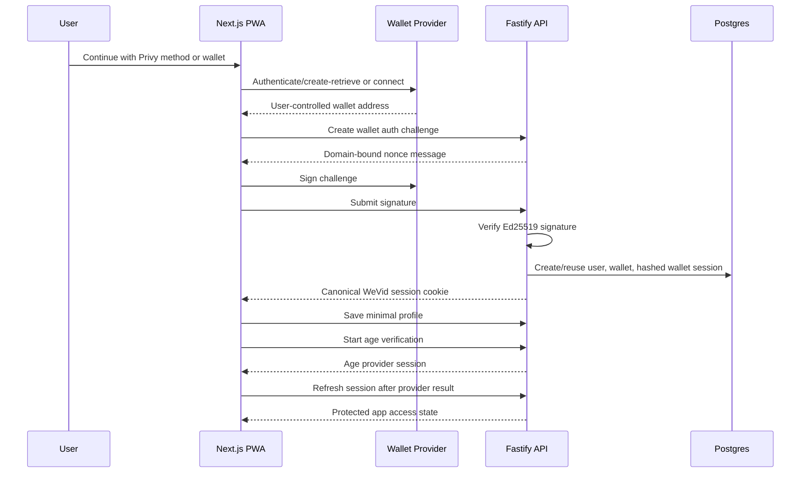
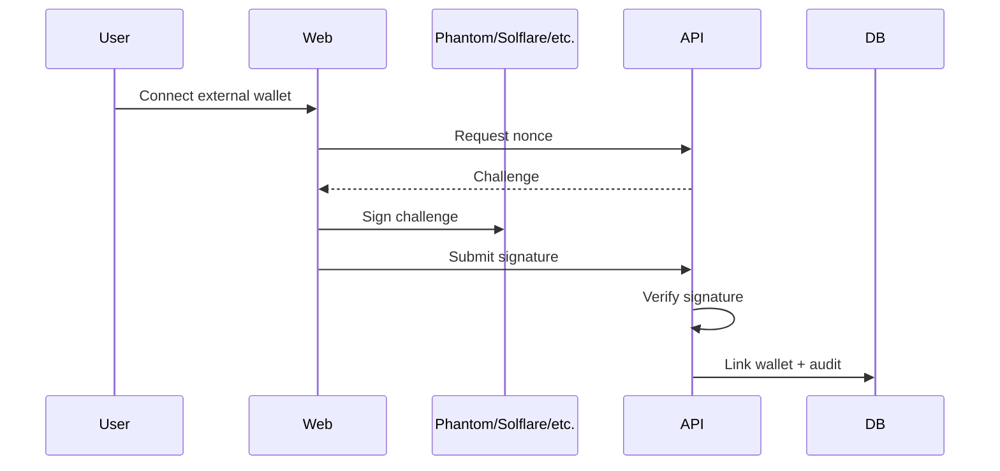
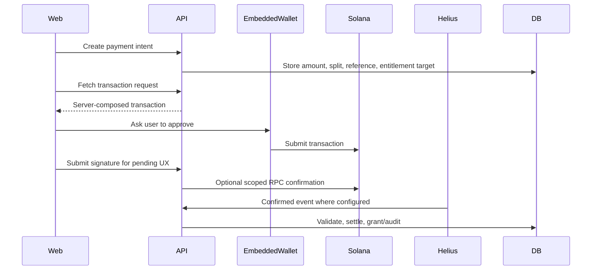
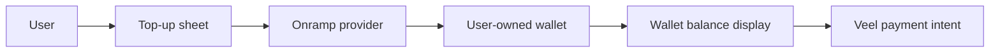

# WeVid V2 Embedded Wallet Onboarding

Status: accepted
Scope: auth, wallets, onboarding, onramp, conversion
Last updated: 2026-08-23
Source of truth: yes

Owns:
- embedded wallet onboarding decisions for its named domain

Defers to:
- INDEX.md, route-map.md, OpenAPI, schema blueprint, and ADRs where narrower

Does not own:
- unrelated domains, implementation shortcuts, provider secrets, or hidden source-of-truth rules

Launch scope:
- accepted v2 launch or phased behavior stated in this document

Non-goals:
- historical-context inference, duplicate systems, and unapproved provider/product expansion

This document defines the locked three-step wallet-native onboarding target. The goal is to reduce signup and payment churn without making WeVid custodial or moving payment truth to the frontend.

## Decision

The public entry is one `Continue to WeVid` path. It starts in server-enforced `login` purpose. A known wallet resumes the existing account; an unknown wallet or Privy identity returns `account_not_found` and the UI offers an explicit `Start onboarding` transition before any provisional user or embedded wallet may be created.

V2 supports one Account + Wallet step with two entry paths:

1. External wallet connect for web3-native users.
2. A quiet secure-wallet action that opens the configured provider's official email/social/passkey surface and creates a noncustodial embedded Solana wallet.

Privy's official React configuration was re-verified on 2026-08-23. Login config uses `embeddedWallets.solana.createOnLogin="off"` and retrieves an existing Solana wallet through `useWallets`; it never calls `createWallet()`. Onboarding alone uses `createOnLogin="users-without-wallets"` and may call the official Solana `useCreateWallet` hook when no wallet exists. Both paths still sign the normal WeVid purpose-bound ownership challenge. Privy authentication is evidence for obtaining the user-controlled wallet, not WeVid account truth.

Wallet ownership remains user-controlled. Veel never holds private keys, never signs payment transactions without explicit user authorization, and never grants access from client-side wallet state. Supabase email auth is optional account recovery/profile management, not a required onboarding prerequisite.

Protected app access rule:

- Veel is an 18+ platform.
- Onboarding has three backend-gated stages before protected app access:
  1. wallet session from embedded or external noncustodial wallet
  2. profile setup
  3. age verification
- Configured sign-in methods appear together in one provider grid. Detected Phantom, Backpack, Solflare, and other Wallet Standard wallets are direct one-click cards; a wallet-list fallback remains for mobile, installation, and less common adapters.
- `Privy` is a peer card when configured. Its official surface owns email, Google, passkey, and other approved identity choices after that one WeVid click; WeVid does not duplicate those provider controls.
- One wallet path is mandatory; the other path can be added, changed, or selected as primary later in profile/settings.
- Wallet capability must be ready before age verification starts, but provider authentication, wallet provisioning, challenge signing, and session creation remain one continuous Step 1 flow.
- No user enters the protected app shell until age verification is complete.
- Wallet existence is required for wallet-native identity/payment readiness, but it is not payment proof.

## Why This Changes The Product Funnel

Wallet-mandatory onboarding creates a conversion cliff for mainstream users. A creator/fan platform should let users:

- open the app
- sign up with email, social, or passkey
- receive or create a user-owned embedded wallet
- top up that wallet by card/onramp when they need to pay
- participate in unlocks, support, messages, live passes, Event Access, and memberships without installing a browser extension first

External wallets remain first-class for crypto-native users.

## Provider-First Options

Use a wallet infrastructure provider instead of building key management.

Provider docs checked for this implementation slice on 2026-06-14, with login, direct Wallet Adapter selection, signing, and session teardown behavior rechecked on 2026-08-26:

- Privy docs: React setup uses a `PrivyProvider` with `appId`; Solana support is exposed through Privy wallet APIs and must be configured with the project app id before embedded-wallet buttons are enabled.
- WeVid does not use Privy's modal as the external-wallet chooser. Its official email/social/passkey surface appears after the visible `Privy` card; external wallet discovery, direct selection, connection, and ownership signing remain handled by Solana Wallet Adapter plus the backend challenge flow.
- Solana Wallet Adapter docs: browser wallet connection should use wallet adapter/injected-wallet support for desktop and Android-compatible browsers, with backend nonce signing for authentication.
- Solana Mobile Wallet Adapter docs: Android Chrome supports mobile wallet adapter flows through wallet adapter; iOS mobile wallet adapter support is not currently available, so iOS web must use wallet-specific universal/deep links or embedded providers.
- Dynamic docs: embedded wallets support noncustodial MPC, Solana via EdDSA/FROST, and can remain an evaluated fallback.
- Coinbase Developer Platform Onramp docs: hosted onramp sessions return a single-use funding URL to the configured destination wallet, support Solana as a destination network, and require server-side CDP JWT authentication generated from a secret API key.

External wallet docs checked for the browser wallet-link handoff on 2026-06-07:

- Phantom Solana signing docs: `signMessage` signs UTF-8 bytes, returns an Ed25519 signature, does not move funds, and can be verified with tweetnacl. Veel uses this only for wallet ownership proof against a backend-issued challenge.
- Phantom Wallet Standard docs: injected wallets expose standardized app/wallet registration and wallet-adapter-compatible APIs. Veel keeps the launch browser handoff minimal and uses the existing backend challenge contract rather than introducing a second auth or payment source of truth.

Runtime/session behavior:

- Landing preloads one canonical wallet runtime when the login/onboarding frame opens. Installed Wallet Standard providers are rendered immediately and selected directly; `More wallets` opens the adapter chooser only as a fallback. Configured Privy is visible in the same grid, lazy-loads its official React runtime on selection, and immediately opens its account flow. Both routes sign the same backend challenge.
- The authenticated app mounts the same provider boundary so profile logout can terminate active provider state with supported SDK methods. Logout calls Privy `logout` and Solana Wallet Adapter `disconnect`, revokes the canonical WeVid application session, clears the optional local Supabase recovery state, and expires server cookies before redirecting to `/`.
- Provider SDK storage keys are not guessed or deleted by application code. Provider teardown errors are isolated so one unavailable SDK cannot prevent other sessions from closing or block the landing redirect.

Provider decision:

- Privy is the sole embedded-wallet launch runtime, still fail-closed until staging confirms Solana creation/retrieval, challenge signing, recovery/export, mobile PWA behavior, adult-platform account acceptance, and the required noncustodial/user-controlled posture.
- Do not introduce Dynamic or another embedded-wallet runtime without a new provider decision that replaces the canonical owner and removes obsolete overlap.
- Wallet funding should be provided through the selected embedded-wallet or funding path and must fund the user-owned wallet, not a Veel custodial account or product checkout balance.

Selection criteria:

- Solana support
- noncustodial/user-controlled mode
- key export/recovery policy
- passkey/social/email support
- transaction approval UX
- onramp compatibility
- webhook/audit capability
- regional availability
- security certifications and incident history
- cost at signup and transaction volume
- ability to avoid app-controlled spending for Veel payment flows

## Custody Boundary

Allowed:

- provider-managed noncustodial embedded wallet
- user-controlled signing through passkey/social/email authenticator
- wallet export/recovery where provider supports it
- external wallet linking and primary wallet selection
- card/onramp funding into the user wallet

Not allowed:

- Veel holding user private keys
- app-controlled payment signing for support, unlocks, memberships, Event Access, creator media offers, accepted structured requests, or live passes
- frontend deciding payment success
- provider wallet state granting access without backend settlement verification
- custodial internal balance as launch default

## Auth And Wallet Flow

External wallet flow remains available for adding or changing wallets after an existing session:

Implementation contract:

- `POST /v1/auth/wallet/challenges` creates a short-lived server-owned challenge for a wallet-first login attempt. It does not require Supabase email auth.
- `POST /v1/auth/wallet/sessions` verifies the Solana message signature, creates or reuses the user/wallet row, stores only a hashed session token, and sets the raw token only in an HttpOnly, SameSite cookie. Browser JavaScript receives wallet display metadata but never the bearer token.
- Locked Privy orchestration target: one invocation authenticates the Privy identity, creates or retrieves its Solana wallet, requests and signs the normal WeVid challenge, creates/reuses the same universal user/session as external wallets, and advances automatically to Step 2. A signature approval may be explicit, but it is ownership-only and must not become a second “continue” stage.
- Wallet auth session tokens authenticate the account session only. They are not payment proof, allowance proof, or entitlement proof.
- `POST /v1/wallets/link-challenges` creates a short-lived server-owned challenge for one authenticated user, wallet address, provider, and chain.
- The challenge message must be signed exactly as returned by the API.
- `POST /v1/wallets/link` verifies the Ed25519 Solana message signature server-side before inserting the wallet.
- A verified link challenge is consumed and cannot be replayed.
- The first linked wallet becomes primary by default.
- `PATCH /v1/wallets/{walletId}/primary` changes only the authenticated user's primary wallet, requires idempotency, and audits the change.
- Wallet link completion is an audit event, not payment proof.
- Current supported external provider values are `phantom`, `solflare`, and `wallet_adapter`.
- The active contract and runtime support `embedded_privy` only for embedded wallets. Historical migrations are immutable, but the current API does not accept the former fallback enum. Privy is enabled only when `NEXT_PUBLIC_EMBEDDED_WALLET_RUNTIME_ENABLED=true`, the app id is configured, and the provider ADR is staging/launch approved.
- The current PWA handoff detects injected Solana wallets on landing onboarding and `/app/wallet`, asks the wallet to connect, signs the returned backend challenge using `signMessage`, base64-encodes the signature, and submits it back to the API. The UI must present the signature as ownership-only and must not imply payment, subscription, entitlement, or protected-access completion.
- The Privy adapter preserves the provisioned wallet if signing is interrupted and retries the ownership-signature stage without restarting provider authentication. Real target-domain staging proof of the continuous flow remains blocked without approved credentials.

## Minimal Profile And Age Steps

- Step 2 target requires only a unique `@handle`; display name and avatar are optional or safely prefilled. Bio, interests, categories, creator/viewer choice, gender, exact location, tax, KYC/KYB, earnings, pricing, adult intent, performer, and Enterprise fields stay out of onboarding.
- Browser wallet completion must verify the newly issued canonical application session before the UI advances to Profile. Local preview requests normalize only `localhost`, `127.0.0.1`, and `::1` API hosts to the page loopback hostname so an HttpOnly `SameSite=Lax` session cannot be lost across two names for the same machine. Deployed origins are never rewritten.
- Profile details are persisted before the optional avatar upload. This prevents an unavailable or conflicting handle from creating an unnecessary Storage object; a successful avatar upload is then attached through the same canonical profile mutation.
- Until Step 3 succeeds, the profile is provisional, non-discoverable, excluded from feeds/search, and unable to publish publicly, message others, or receive money. Redirects and recoverable errors preserve safe progress; abandoned/failed profiles follow the approved retention policy.
- Step 3 says “Confirm you’re 18+ to enter WeVid,” uses the configured provider-neutral waterfall, and stores only normalized threshold/method/provider-reference/jurisdiction/time/expiry/policy evidence. It fails closed and never implies KYC or another capability.
- Ordinary onboarding asks for wallet ownership once and age once. Higher-assurance evidence appears only for risk/policy, earnings, adult publishing, performer, or legal-entity purposes; purpose records remain separate even where evidence may lawfully be reused.

## Optional Supabase Recovery

Supabase signup is not a fourth step. Privy users already have their provider-supported recovery path and are not prompted to repeat it. Settings offers “Add account recovery.” Linking requires a recently authenticated WeVid session, a short-lived one-use backend intent, Supabase subject proof, collision rejection, an audit event, and session rotation. Recovery exchange resolves an existing subject mapping only; it creates no user, profile, or wallet, does not match on email, and does not repeat age. Real provider return-login proof remains blocked until approved Supabase staging configuration is available.

## Device Behavior

- Desktop: prefer injected Solana wallets and wallet-adapter-compatible providers.
- Android web: use Solana Mobile Wallet Adapter through wallet-adapter where a compatible wallet/browser is present.
- iOS web: use embedded wallet provider flows or wallet-specific universal/deep links because Solana Mobile Wallet Adapter is not available on iOS web today.
- All devices: the backend challenge/session flow is identical; device-specific wallet UX never becomes auth truth until the API verifies the signed challenge.

## Payment Flow With Embedded Wallet

Embedded wallet payments use the same backend-owned payment architecture as external wallets.

No separate payment system is created for embedded wallets.

## Top-Up / Onramp Flow

Rules:

- onramp funds the user wallet directly
- funding provider handles fiat/KYC requirements where applicable
- Veel records safe onramp session references for UX/support only
- Veel does not credit internal custodial balance as payment proof
- onramp completion is not content, Event Access, pass, message, support, or membership checkout
- Veel does not use wallet funding providers as merchant-of-record product billing
- paid actions still require backend payment intent and confirmed transaction validation
- `POST /v1/wallets/onramp-sessions` is implemented as a wallet-funding boundary. The default provider is disabled; when `ONRAMP_PROVIDER=coinbase` and CDP API key envs are present, the API creates a Coinbase hosted onramp session for the selected Veel wallet address and stores a hashed provider reference plus the user-visible launch URL for support/accountability.
- The onramp table is RLS-protected and owner/staff-readable. It does not link to entitlements, passes, creator-request delivery, subscriptions, unlocks, commissions, or payment settlement.

## When To Create The Embedded Wallet

Recommended launch behavior:

- create on signup if provider cost is acceptable and it improves UX
- otherwise create before age verification and protected app entry, not after the user is already inside the app
- always allow user to link an external wallet and set primary wallet

Wallet-required actions:

- unlock paid content
- support
- approved media offer or accepted structured creator request
- Profile Membership
- live pass
- Event Access Pass
- creator earning/tax setup

Non-wallet actions:

- browsing allowed content
- follow/like/save/comment where access policy allows
- profile setup
- age gate

## UX Requirements

- Do not show crypto jargon during signup.
- The flow should feel like one step with progressive checks, not a long form.
- Viewer flow: teaser, Connect wallet, backend challenge, minimal profile, age assurance before adult/protected access, first feed value moment. A configured secure embedded wallet remains an explicit secondary choice.
- Explain wallet only when needed: "Your WeVid wallet lets you unlock, support creators, and pay from your wallet."
- Preferred landing CTA: `Connect wallet`. Configured secondary CTA: `Create secure WeVid wallet`. Provider-owned email/social/passkey labels stay inside the provider surface; payment surfaces may say `Pay from wallet`.
- Monetisation-readiness CTA: `Enable Earnings`.
- Creator onboarding uses hosted verification for age, identity, liveness, country, wallet ownership, and tax basics.
- Payment sheets show amount, asset, creator, platform/referral summary where useful, and confirmation.
- Top-up is an action inside the same payment sheet when balance is insufficient.
- Users can choose embedded wallet or external wallet.
- Users can view wallet address, copy address, and export/recover according to provider policy.

## Security Requirements

- Embedded wallet provider keys are server-only where applicable.
- Browser receives only provider publishable keys and safe config.
- Backend stores wallet address and provider wallet reference, not raw keys.
- Backend stores wallet readiness separately from payment proof.
- Wallet link events are audited.
- High-risk wallet changes require re-authentication.
- Payment transactions require explicit user approval.
- Backend settlement remains mandatory for access/commission/creator earning truth.

## Provider Launch Gate

Privy is the sole launch runtime, but remains disabled until staging proves the required UX, security, account acceptance, recovery/export, signing, and device behavior. Replacing it would require a new explicit ADR and removal of the obsolete runtime; parallel embedded-wallet runtimes are not allowed.

Current implementation state:

- Session access, age status/session creation, wallet list/link/primary/onramp mutations, profile access, and Enable Earnings resolve the canonical `users.id` from the opaque application session. Migration `0107` permits the transitional `users.supabase_user_id` value to be null and prevents it from containing a provider subject or a different user identifier; provider recovery identity remains exclusively in `user_provider_identities`.
- Wallet table and backend wallet-readiness gate exist.
- `GET /v1/wallets` returns normalized wallet resources for the authenticated user.
- `PATCH /v1/wallets/{walletId}/primary` safely switches the user's primary wallet and writes an audit event.
- `POST /v1/wallets/onramp-sessions` creates an idempotent user-wallet funding session when the provider is configured, otherwise returns service unavailable without fabricating a checkout URL.
- `/wallet` reads linked wallets and backend-observed wallet transactions through the typed web API helper. It does not render fixture wallets or fabricated funding provider URLs.
- The Privy browser adapter is implemented behind an explicit runtime gate. It is not launch-approved until staging credentials, provider account acceptance, recovery/export behavior, mobile flow, and exact signing behavior are confirmed.
- Coinbase funding is a server-side provider boundary only. It funds user-owned wallets and is not product billing or payment proof.

Recommended decision record:

- ADR: embedded wallet provider choice
- ADR: wallet funding path, if any
- threat model
- regional/compliance review
- export/recovery policy
- cost model
- fallback if provider is down

## Tests Required

- primary external Connect wallet opens directly without a second WeVid click
- secure-wallet choice opens the provider surface and email/social/passkey creates or loads the embedded wallet
- external wallet link remains supported
- wallet switch updates primary wallet safely
- embedded wallet payment uses same payment intent path
- insufficient balance opens top-up flow
- onramp session does not mark payment complete
- backend rejects payment signed by wrong wallet
- backend rejects frontend-supplied settlement/access state
- wallet provider outage gives recoverable UX
