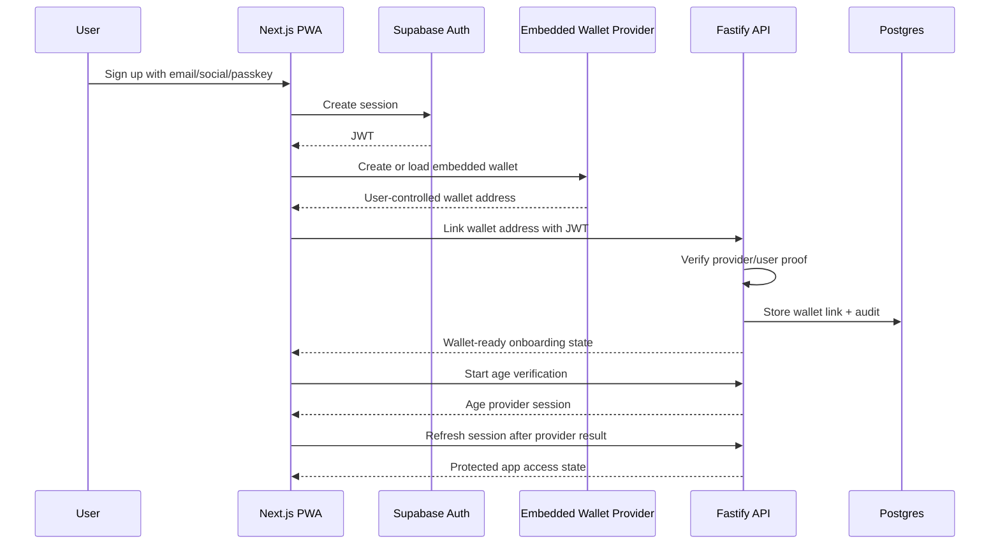
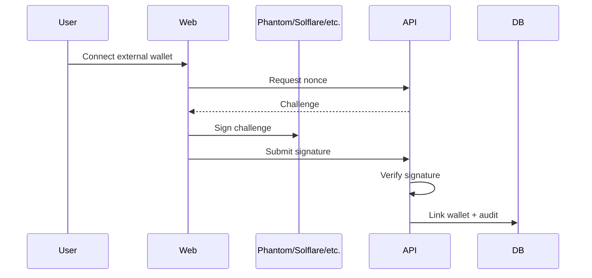
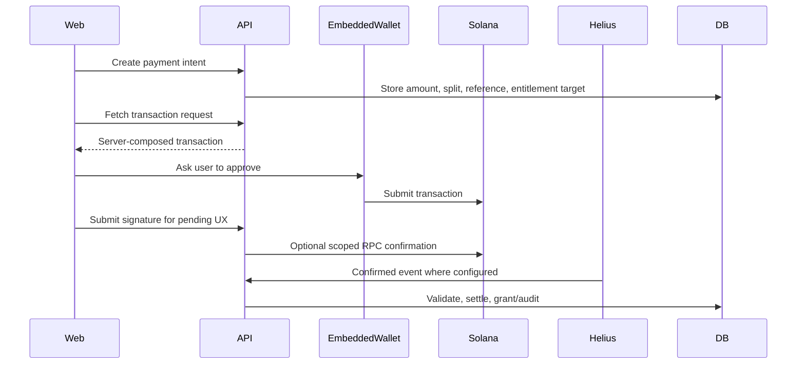
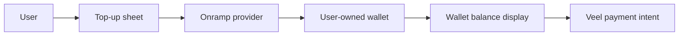

# Veel V2 Embedded Wallet Onboarding

Status: accepted
Scope: auth, wallets, onboarding, onramp, conversion
Last updated: 2026-06-05
Source of truth: yes

Owns:
- embedded wallet onboarding decisions for its named domain

Defers to:
- INDEX.md, route-map.md, OpenAPI, schema blueprint, and ADRs where narrower

Does not own:
- unrelated domains, implementation shortcuts, provider secrets, or hidden source-of-truth rules

Launch scope:
- accepted v2 launch or phased behavior stated in this document

Non-goals:
- historical-context inference, duplicate systems, and unapproved provider/product expansion

This document defines the recommended v2 wallet onboarding model. The goal is to reduce signup and payment churn without making Veel custodial or moving payment truth to the frontend.

## Decision

V2 should support two wallet paths:

1. External wallet connect for web3-native users.
2. Social/email/passkey signup with a noncustodial embedded Solana wallet for mainstream users.

Wallet ownership remains user-controlled. Veel never holds private keys, never signs payment transactions without explicit user authorization, and never grants access from client-side wallet state.

Protected app access rule:

- Veel is an 18+ platform.
- Onboarding has two required stages before protected app access:
  1. identity + wallet path
  2. age verification
- The recommended launch default is embedded-wallet-first for mainstream users: email/social/passkey creates or loads a noncustodial embedded wallet.
- External/native wallet connect remains first-class for web3-native users.
- One wallet path is mandatory; the other path can be added, changed, or selected as primary later in profile/settings.
- Wallet path must be ready before age verification starts: embedded wallet for identity-first users, native wallet link for wallet-first users.
- No user enters the protected app shell until age verification is complete.
- Wallet existence is required for wallet-native identity/payment readiness, but it is not payment proof.

## Why This Changes The Product Funnel

Wallet-mandatory onboarding creates a conversion cliff for mainstream users. A creator/fan platform should let users:

- open the app
- sign up with email, social, or passkey
- receive or create a user-owned embedded wallet
- top up that wallet by card/onramp when they need to pay
- participate in unlocks, support, messages, live passes, Event Access, and memberships without installing a browser extension first

External wallets remain first-class for crypto-native users.

## Provider-First Options

Use a wallet infrastructure provider instead of building key management.

Provider docs checked for this implementation slice on 2026-06-03:

- Privy docs: embedded Solana wallet creation and funding support remain the launch-default path to verify in staging.
- Turnkey docs: embedded wallets support noncustodial user-controlled mode, Solana account creation, import/export, and stronger policy/sub-organization controls.
- Dynamic docs: embedded wallets support noncustodial MPC, Solana via EdDSA/FROST, and can remain an evaluated fallback.

Provider decision:

- Privy is the recommended launch provider for Veel if staging confirms Solana wallet creation, funding, export/recovery, external-wallet linking, and noncustodial user approval. It is the fastest default for mainstream email/social/passkey conversion.
- Turnkey is the advanced policy fallback if Privy cannot satisfy required Solana, audit, key-recovery/export, cost, or policy-control needs. It remains the preferred option for deeper sub-organization controls or future admin/AI guarded-wallet policies.
- Dynamic remains an alternative to evaluate if Turnkey/Privy do not meet regional, cost, or UX needs.
- Wallet funding should be provided through the selected embedded-wallet or funding path and must fund the user-owned wallet, not a Veel custodial account or product checkout balance.

Selection criteria:

- Solana support
- noncustodial/user-controlled mode
- key export/recovery policy
- passkey/social/email support
- transaction approval UX
- onramp compatibility
- webhook/audit capability
- regional availability
- security certifications and incident history
- cost at signup and transaction volume
- ability to avoid app-controlled spending for Veel payment flows

## Custody Boundary

Allowed:

- provider-managed noncustodial embedded wallet
- user-controlled signing through passkey/social/email authenticator
- wallet export/recovery where provider supports it
- external wallet linking and primary wallet selection
- card/onramp funding into the user wallet

Not allowed:

- Veel holding user private keys
- app-controlled payment signing for support, unlocks, memberships, Event Access, paid messages, or live passes
- frontend deciding payment success
- provider wallet state granting access without backend settlement verification
- custodial internal balance as launch default

## Auth And Wallet Flow

External wallet flow remains available:

Implementation contract:

- `POST /v1/wallets/link-challenges` creates a short-lived server-owned challenge for one authenticated user, wallet address, provider, and chain.
- The challenge message must be signed exactly as returned by the API.
- `POST /v1/wallets/link` verifies the Ed25519 Solana message signature server-side before inserting the wallet.
- A verified link challenge is consumed and cannot be replayed.
- The first linked wallet becomes primary by default.
- Wallet link completion is an audit event, not payment proof.
- Current supported external provider values are `phantom`, `solflare`, and `wallet_adapter`.

## Payment Flow With Embedded Wallet

Embedded wallet payments use the same backend-owned payment architecture as external wallets.

No separate payment system is created for embedded wallets.

## Top-Up / Onramp Flow

Rules:

- onramp funds the user wallet directly
- funding provider handles fiat/KYC requirements where applicable
- Veel records safe onramp session references for UX/support only
- Veel does not credit internal custodial balance as payment proof
- onramp completion is not content, Event Access, pass, message, support, or membership checkout
- Veel does not use wallet funding providers as merchant-of-record product billing
- paid actions still require backend payment intent and confirmed transaction validation

## When To Create The Embedded Wallet

Recommended launch behavior:

- create on signup if provider cost is acceptable and it improves UX
- otherwise create before age verification and protected app entry, not after the user is already inside the app
- always allow user to link an external wallet and set primary wallet

Wallet-required actions:

- unlock paid content
- support
- paid message
- Creator Membership
- live pass
- Event Access Pass
- creator earning/tax setup

Non-wallet actions:

- browsing allowed content
- follow/like/save/comment where access policy allows
- profile setup
- age gate

## UX Requirements

- Do not show crypto jargon during signup.
- The flow should feel like one step with progressive checks, not a long form.
- Viewer flow: teaser, Continue, auth, embedded wallet silently created/loaded, optional native wallet connect, age assurance before adult/protected access, first feed value moment, wallet funding/connect only at payment or allowance need.
- Explain wallet only when needed: "Your Veel wallet lets you unlock, support creators, and pay from your wallet."
- Preferred wallet CTAs: `Use Veel wallet`, `Connect my wallet`, `Pay from wallet`.
- Creator onboarding CTA: `Start Earning` or `Become Creator`.
- Creator onboarding uses hosted verification for age, identity, liveness, country, wallet ownership, and tax basics.
- Payment sheets show amount, asset, creator, platform/referral summary where useful, and confirmation.
- Top-up is an action inside the same payment sheet when balance is insufficient.
- Users can choose embedded wallet or external wallet.
- Users can view wallet address, copy address, and export/recover according to provider policy.

## Security Requirements

- Embedded wallet provider keys are server-only where applicable.
- Browser receives only provider publishable keys and safe config.
- Backend stores wallet address and provider wallet reference, not raw keys.
- Backend stores wallet readiness separately from payment proof.
- Wallet link events are audited.
- High-risk wallet changes require re-authentication.
- Payment transactions require explicit user approval.
- Backend settlement remains mandatory for access/commission/creator earning truth.

## Open Provider Decision

Before coding v2, confirm Privy staging UX or explicitly switch the ADR to Turnkey.

Current implementation state:

- Wallet table and backend wallet-readiness gate exist.
- `GET /v1/wallets` returns normalized wallet resources for the authenticated user.
- Embedded wallet provider code is an adapter interface only. No Privy, Turnkey, or Dynamic SDK calls are implemented until staging credentials, provider account acceptance, and exact SDK behavior are confirmed.

Recommended decision record:

- ADR: embedded wallet provider choice
- ADR: wallet funding path, if any
- threat model
- regional/compliance review
- export/recovery policy
- cost model
- fallback if provider is down

## Tests Required

- email/social/passkey signup creates or loads wallet
- external wallet link remains supported
- wallet switch updates primary wallet safely
- embedded wallet payment uses same payment intent path
- insufficient balance opens top-up flow
- onramp session does not mark payment complete
- backend rejects payment signed by wrong wallet
- backend rejects frontend-supplied settlement/access state
- wallet provider outage gives recoverable UX
