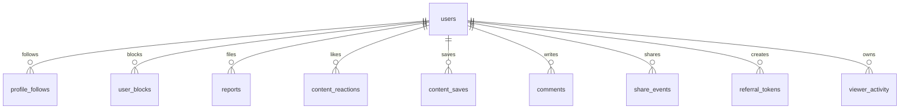
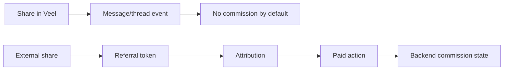

# Veel V2 Engagement Strategy

Status: proposed v2 architecture
Scope: engagement, social graph, activity
Last updated: 2026-06-03
Source of truth: proposal

This document defines how Veel v2 handles social engagement without turning frontend counters into business truth.

## Engagement Principles

- Engagement actions are real backend records, not local-only counters.
- Frontend may optimistically update visible counts, but must reconcile from backend.
- Every action has a clear owner, state, idempotency rule, and abuse/rate-limit rule.
- Monetised engagement is separate from lightweight engagement.
- Internal sharing and external referral sharing are different products.
- Product metrics must not optimize only for addictive time-on-feed. Track creator earnings, successful purchases, healthy replies, completed tickets/events, safety reports resolved, and user satisfaction alongside watch time.

## Humane Engagement And Legal-Risk Guard

Veel should feel media-native without copying dark patterns that create regulatory or trust risk.

Rules:

- show break states in long vertical feeds
- avoid infinite autoplay loops without user control
- keep report/block/access controls visible
- do not hide payment or subscription terms behind engagement UI
- do not use misleading scarcity or manipulative countdowns
- keep dating notifications low-pressure
- give users control over push notifications and dating mode
- track safety and wellbeing metrics, not only watch time
- age-gate before adult/protected/dating/payment areas

## Engagement Map

| Action | Backend record | Optimistic UI | Realtime | Monetisation impact | Notes |
| --- | --- | --- | --- | --- | --- |
| Like | `content_reactions` | Yes | Optional count projection | None | Toggle idempotent per user/content. |
| Save | `content_saves` | Yes | No | None | Private user library. |
| Comment | `comments` | After server write | Yes | None by default | Moderation and block graph apply. |
| Share in Veel | `share_events`, optional message row | After server write | Yes for recipient | No referral by default | Internal DM share does not create commission. |
| External referral share | `referral_tokens`, `share_events` | After server token/link creation | Optional | Can create attribution and commission | External links can earn commission from platform share after eligible paid settlement. |
| Admin partner referral | `partner_referral_campaigns`, `referrals` | After admin-created campaign | No | Yes if configured | Used for ambassadors, creator acquisition, or event promotion. |
| Repost/Mirror | `content_reposts` | Yes | Optional | None unless product changes | Product-facing name should stay consistent. |
| Follow | `profile_follows` | Yes | Optional | Feed ranking, creator audience | Creator-isolated follow/unfollow. |
| Block | `user_blocks` | No fake optimistic if destructive | Immediate local hide then reconcile | Safety | Blocks search/messages/feed visibility. |
| Report | `reports` | Server success state | Admin queue | Safety | Requires audit and moderation queue. |
| Tip/Support | `payment_intents`, `settlements`, `activity` | Submitted only | User payment event | Financial | Confirmed backend settlement for balances. |
| Unlock | `payment_intents`, `entitlements` | Pending only | User payment/access event | Access | Backend-confirmed entitlement only. |
| Paid message | `payment_intents`, `messages` | Pending only | Message after confirm | Financial/message delivery | Message visible after confirmed payment. |
| Live pass | `payment_intents`, `live_access_grants` | Pending only | Room access update | Access | Pass controls playback/chat. |
| Event interest | `event_interests` | Yes | Optional | None | Purchase still explicit. |
| Ticket purchase | `payment_intents`, `ticket_entitlements` | Pending only | Ticket event | Access/ticket | Backend QR/receipt after confirm. |
| Dating yes/no | `dating_swipes` | Yes | Match only after backend state | Match | Only inside Dating Mode. |

## Social Graph



## Follow Strategy

Follow is a first-class social graph edge.

Rules:

- Follow/unfollow is idempotent per viewer/creator.
- Follow state is returned in feed cards, public profile, search results, and creator suggestions.
- Following a creator affects Home ranking and activity rails.
- Block removes or suppresses follow edges where policy requires.
- Creator profile APIs must return viewer-specific relationship state.

## Like, Save, Comment

Like:

- toggle endpoint: `POST /v1/engagement/:contentId/like`
- unique key: `(viewer_id, content_id, reaction_type)`

Save:

- toggle endpoint: `POST /v1/engagement/:contentId/save`
- private to viewer
- appears in Activity/Saved surfaces

Comment:

- create endpoint: `POST /v1/engagement/:contentId/comments`
- list endpoint: `GET /v1/engagement/:contentId/comments`
- supports deletion/moderation
- never bypasses block/report/safety rules

## Share Strategy

Internal Veel share:

- sends to a user/thread inside Messages
- can also repost/mirror inside Veel if that product action is enabled
- creates share activity
- does not create referral commission by default

External share:

- creates a referral/share token
- can survive signup/login/wallet/payment
- can become commission-eligible only after backend payment settlement
- opens a professional share tab/sheet with Copy link, WhatsApp, Telegram, Instagram, TikTok, X, LinkedIn, and system share where supported
- each external channel uses the same backend-created referral URL; the frontend never creates commission state locally

Share UI rule:

- tab 1: `Send in Veel` for messages/repost/internal share, no referral commission by default
- tab 2: `Share link` for external/referral-capable links
- copy always uses a backend-created URL so attribution and abuse limits are server-owned
- unavailable networks are hidden or shown as disabled with clear copy; do not fake unsupported platform APIs



## Activity Strategy

Activity is a backend-derived projection:

- liked
- saved
- commented
- shared
- unlocked/purchased
- tipped/supported
- subscribed
- live passes
- tickets
- referral shares
- commissions
- wallet transactions

No fake activity counters. No frontend-calculated commission.

## Ranking Inputs

Allowed ranking signals:

- follows
- creator freshness
- media completion
- likes/comments/saves
- paid access conversion
- blocks/reports negative signals
- age/access/legal constraints
- content availability

Do not rank from:

- raw provider payloads
- frontend-only counters
- unconfirmed payments
- unmoderated unsafe signals

## Abuse Controls

- rate limits per action/user/IP/device
- block graph enforcement
- report queue
- spam thresholds for follows/comments/shares
- paid action throttles
- suspicious referral attribution review
- admin audit for moderation outcomes

## API Surface

```text
POST   /v1/follows/:userId
POST   /v1/engagement/:contentId/like
POST   /v1/engagement/:contentId/save
POST   /v1/engagement/:contentId/comments
GET    /v1/engagement/:contentId/comments
POST   /v1/shares
POST   /v1/referrals/tokens
POST   /v1/reports
POST   /v1/blocks/:userId
GET    /v1/activity
```

## Tests

- follow/unfollow idempotent
- follow affects Home feed
- like/save/comment persistence
- comment blocked by block graph
- share internal creates message/share event
- external share creates referral token
- self-referral blocked
- duplicate paid event does not duplicate commission
- activity projection is backend-derived
