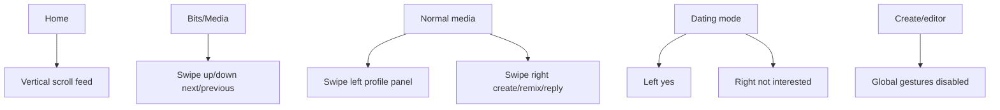

# Veel V2 Frontend Architecture

Status: proposed v2 architecture
Scope: frontend
Last updated: 2026-06-01
Source of truth: proposal

## Recommendation

Keep Next.js PWA and rebuild the frontend architecture cleanly around:

- route-owned surfaces
- small product components
- generated API client
- TanStack Query for server state
- Zustand/local state for UI state
- Tailwind v4 tokens and component-owned styles
- Playwright visual and flow tests

## Frontend Boundary

Frontend owns:

- route identity
- source context
- selected media/profile/live/message IDs
- UI sheets/panels/modals
- draft text/forms
- playback controls
- optimistic pending indicators

Frontend does not own:

- payment success
- entitlement/access
- referral commission
- creator payout
- provider state
- age/KYC result
- moderation/admin truth

## Route Architecture

```text
apps/web/app/
  (public)/
    page.tsx
    enter/page.tsx
    legal/[slug]/page.tsx
  (app)/
    app/home/page.tsx
    app/bits/page.tsx
    app/discover/page.tsx
    app/create/page.tsx
    app/messages/page.tsx
    app/profile/page.tsx
    app/profile/[handle]/page.tsx
    app/media/[id]/page.tsx
    app/stream/[id]/page.tsx
```

Routes parse URL state only and pass it into feature surfaces.

## Feature Structure

```text
features/
  api/
    client.ts
    generated/
    payments-api.ts
    media-api.ts
  app-shell/
    app-shell.tsx
    navigation/
    top-actions/
  home/
    home-surface.tsx
    home-feed.tsx
    home-card.tsx
    activity-rail.tsx
  media-viewer/
    media-viewer-route.tsx
    media-stage.tsx
    action-rail.tsx
    comments-panel.tsx
    share-sheet.tsx
    unlock-sheet.tsx
  create/
  live/
  messages/
  profile/
  shared/
    avatar.tsx
    button.tsx
    sheet.tsx
    media-poster.tsx
```

## Desktop/Mobile Layout Model

Desktop:

- fixed left rail
- content viewport with route-owned layout
- media viewer locks viewport
- quick chat desktop-only

Mobile:

- bottom nav with five main items
- top actions where needed
- one media card per Home row
- full-screen media viewer
- sheets for comments/share/details/payment
- no desktop dock

## Gesture Model



Gestures must have visible button alternatives.

## UI State Rules

- Server state: TanStack Query.
- UI state: local component state or Zustand only.
- Wallet state: wallet adapter/provider state.
- Supabase session state: auth provider.
- Do not duplicate backend state into Zustand.

## API Client Rules

- No raw `fetch` in UI components.
- All API calls go through generated client or typed domain API module.
- Runtime public env is validated once.
- `NEXT_PUBLIC_*` only for browser-safe values.

## Visual System

- media-first
- dark premium base
- Solana green for active/success/action
- Solana purple for live/moment energy
- no yellow dependency for warning semantics
- icons from one system
- no `!important` growth
- component-owned styles

## Testing

Required v2 tests:

- route/auth gate smoke
- Home desktop/mobile visual
- media viewer desktop/mobile visual
- Create viewport
- payment/unlock browser flow
- live host/viewer boundary
- messages realtime
- sourceContext navigation
- no horizontal overflow
- architecture guard
