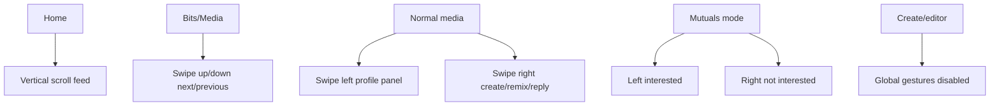

# Veel V2 Frontend Architecture

Status: accepted
Scope: frontend
Last updated: 2026-06-12
Source of truth: yes

Owns:
- frontend architecture decisions for its named domain

Defers to:
- INDEX.md, route-map.md, OpenAPI, schema blueprint, and ADRs where narrower

Does not own:
- unrelated domains, implementation shortcuts, provider secrets, or hidden source-of-truth rules

Launch scope:
- accepted v2 launch or phased behavior stated in this document

Non-goals:
- historical-context inference, duplicate systems, and unapproved provider/product expansion

## Recommendation

Keep Next.js PWA and build the frontend architecture cleanly around:

- route-owned surfaces
- small product components
- generated API client
- TanStack Query for server state
- Zustand/local state for UI state
- Tailwind v4 tokens and component-owned styles
- Playwright visual and flow tests

## Frontend Boundary

Frontend owns:

- route identity
- source context
- selected media/profile/live/message IDs
- UI sheets/panels/modals
- draft text/forms
- playback controls
- optimistic pending indicators

Frontend does not own:

- payment success
- entitlement/access
- referral commission
- creator earning/tax truth
- provider state
- age/KYC result
- moderation/admin truth

## Route Architecture

```text
apps/web/app/
  (public)/
    page.tsx
    enter/page.tsx
    legal/[slug]/page.tsx
  (app)/
    app/home/page.tsx
    app/bits/page.tsx
    app/discover/page.tsx
    app/create/page.tsx
    app/messages/page.tsx
    app/profile/page.tsx
    app/profile/[handle]/page.tsx
    app/media/[id]/page.tsx
    app/stream/[id]/page.tsx
```

Routes parse URL state only and pass it into feature surfaces.

## Feature Structure

```text
features/
  api/
    client.ts
    generated/
    payments-api.ts
    media-api.ts
  app-shell/
    app-shell.tsx
    navigation/
    top-actions/
  home/
    home-surface.tsx
    home-feed.tsx
    home-card.tsx
    activity-rail.tsx
  media-viewer/
    media-viewer-route.tsx
    media-stage.tsx
    action-rail.tsx
    comments-panel.tsx
    share-sheet.tsx
    unlock-sheet.tsx
  create/
  live/
  messages/
  profile/
  shared/
    avatar.tsx
    button.tsx
    sheet.tsx
    media-poster.tsx
```

## Desktop/Mobile Layout Model

Desktop:

- fixed left rail
- content viewport with route-owned layout
- media viewer locks viewport
- quick chat desktop-only

Mobile:

- bottom nav with five main items
- top actions where needed
- one media card per Home row
- full-screen media viewer
- sheets for comments/share/details/payment
- no desktop dock

## Gesture Model



Gestures must have visible button alternatives.

## UI State Rules

- Server state: TanStack Query.
- UI state: local component state or Zustand only.
- Wallet state: wallet adapter/provider state.
- Supabase session state: auth provider.
- Do not duplicate backend state into Zustand.

## API Client Rules

- No raw `fetch` in UI components.
- All API calls go through generated client or typed domain API module.
- Runtime public env is validated once.
- `NEXT_PUBLIC_*` only for browser-safe values.

## Visual System

- media-first
- dark premium base
- Solana green for active/success/action
- Solana purple for live/moment energy
- no yellow dependency for warning semantics
- icons from one system
- no `!important` growth
- component-owned styles

## Testing

Required v2 tests:

- route/auth gate smoke
- Home desktop/mobile visual
- media viewer desktop/mobile visual
- Create viewport
- payment/content-unlock browser flow
- live host/viewer boundary
- messages realtime
- sourceContext navigation
- no horizontal overflow
- architecture guard

Current implementation state:

- `pnpm smoke` runs Playwright against the Next.js app shell and Home media card.
- The smoke suite runs desktop Chromium and mobile Chromium projects from `tests/smoke`.
- CI installs Chromium and runs the smoke suite after lint, typecheck, and unit tests.
- Smoke runs are serialized because the authenticated happy-path spec owns a
  temporary local API server on the shared smoke API port.
- `/`, `/age`, `/content/[contentId]`, `/live/[liveRoomId]`, `/profile`, `/profile/[handle]`, `/activity`, `/messages`, `/wallet`, `/subscriptions`, `/studio`, `/discover`, `/event-access/[eventId]`, `/passes`, `/mutuals/feed`, `/mutuals`, `/admin`, and `/settings` read backend projections through the typed web API helper instead of local business-data fixtures.
- Settings reads session, age, wallet, feed preference, and notification preference projections from the API; feed/notification preference mutation remains backend-owned through explicit control actions.
- Browser Supabase Realtime subscribes only to approved user-owned projection tables and invalidates typed API caches/server component projections. It must not use realtime payloads as payment, access, notification, messaging, or social truth.
- Home/age/detail/profile/activity/messages/wallet/subscriptions/studio/discover/Event Access/Mutuals/admin/settings screens attach the current Supabase access token when present and render a fail-closed unavailable state on API/auth/provider errors.
- Protected app-shell pages use a backend session access guard after Supabase SSR auth. The guard honors `GET /v1/session.appAccessState` and redirects identity, wallet, or age gaps to their remediation routes; it is inert in local projection mode when Supabase browser auth is intentionally unconfigured.
- Content detail now renders only backend-issued playback resources: Bunny embed resources use an iframe, direct/HLS resources use the browser media element, and blocked/teaser/not-ready states show access/readiness copy without local entitlement decisions. The unlock panel uses `POST /v1/content/{contentId}/unlock-intents` and `GET /v1/payments/intents/{paymentIntentId}/transaction-request`; the browser displays the backend-built wallet request only and entitlement remains backend-settlement-owned.
- Create now calls `POST /v1/content`, `PATCH /v1/content/{contentId}`, `POST /v1/media/uploads`, `POST /v1/media/assets/{mediaAssetId}/sync`, `GET /v1/content/{contentId}`, and `POST /v1/content/{contentId}/publish` around `tus-js-client` Bunny uploads. Browser state is UX/cache only: metadata save, preview controls, upload completion, provider-sync pending state, and submit-for-review do not approve moderation or create access.
- Current smoke coverage keeps broad projection routes fail-closed when the API
  is unavailable and adds authenticated browser happy-path coverage with a local
  mock API for `enter -> profile -> wallet -> age -> home -> create -> unlock`.
  The happy path verifies bearer-token attachment and Idempotency-Key behavior
  for create and unlock mutations. Provider staging smoke is still separate and
  required before production readiness.
- `/create` is a mutation-safe launch surface: it describes backend-owned
  draft/upload boundaries without calling mutation APIs on page load or
  rendering fixture record IDs, provider upload URLs, or draft payloads.
- `/assistant` reads `GET /v1/ai/capabilities` and does not create AI sessions,
  execute tools, render AI session IDs, or expose tool-call result payloads on
  page load.
