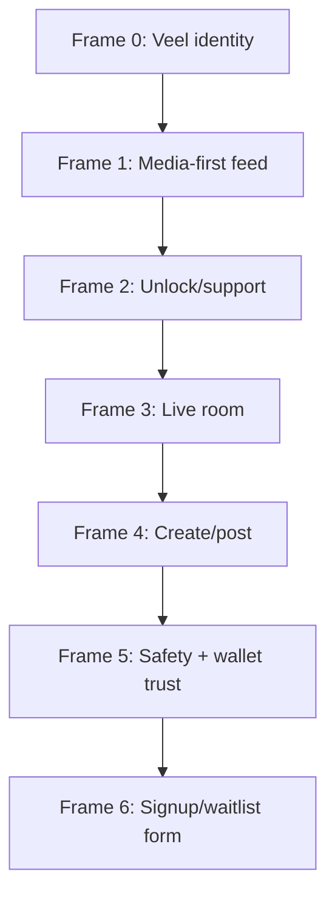
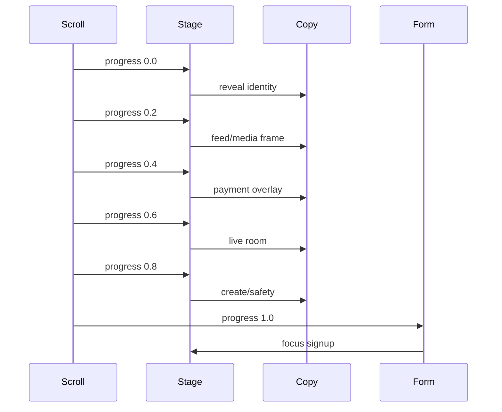

# Veel V2 Landing Page And GSAP Animation Blueprint

Status: proposed v2 architecture
Scope: landing page, marketing entry, animation
Last updated: 2026-06-01
Source of truth: proposal

This document defines a premium one-screen landing page concept for v2. It is a proposal, not current implementation.

## Goal

Create a cinematic, high-conversion landing page that feels like a premium social-video PWA/dApp:

- one viewport-led experience
- GSAP ScrollTrigger frame/timeline animation
- text and form overlays
- real product UI/media signals
- no generic crypto landing-page aesthetic
- no dashboard screenshots dumped in cards

## Technical Direction

Use:

- Next.js App Router
- Server Component page for static/SEO content
- isolated Client Component for GSAP animation
- GSAP ScrollTrigger
- dynamic import or client-only wrapper
- CSS/Canvas/video sequence depending asset budget

Do not:

- load GSAP into the authenticated app shell
- block first paint with animation code
- animate wallet/payment forms in a way that harms trust
- rely on animation for required content
- ignore reduced motion

Official references:

- GSAP ScrollTrigger docs: `https://gsap.com/docs/v3/Plugins/ScrollTrigger/`
- Next.js Client Components guidance: `https://nextjs.org/docs/app`
- Next.js third-party/script optimization guidance: `https://nextjs.org/docs/app`

## Landing Structure

One pinned scrolling stage:



## Frame Storyboard

### Frame 0: Identity

Visual:

- full-bleed dark cinematic media texture
- Veel logo/wordmark
- subtle Solana green/purple light

Copy:

```text
Veel
Premium social video for creators and fans.
```

CTA:

- Enter Veel
- Join creator waitlist

### Frame 1: Media Feed

Visual:

- Home/Bits cards move in parallax
- one mobile frame and one desktop frame ghosted behind it
- live/moment rings animate subtly

Copy:

```text
Watch, follow, save, comment, and share without leaving the flow.
```

### Frame 2: Unlock And Support

Visual:

- payment sheet slides over media
- wallet approval state shown as explicit secure step
- no fake “instant paid” animation

Copy:

```text
Unlock premium clips, send support, and keep access tied to verified payment.
```

### Frame 3: Live

Visual:

- live stage enters
- chat and pass sheet appear
- stream key never shown

Copy:

```text
Live rooms, passes, chat, and replays built for creator control.
```

### Frame 4: Create

Visual:

- upload/capture flow
- teaser range
- thumbnail selection
- visibility/monetisation controls

Copy:

```text
Create fast. Choose the teaser. Decide who gets full access.
```

### Frame 5: Safety And Trust

Visual:

- age/access state
- report/block controls
- provider-safe badges

Copy:

```text
Age-aware, wallet-aware, provider-backed, and audit-ready.
```

### Frame 6: Form Overlay

Form:

- email
- creator/fan/admin interest
- wallet optional later, not required on landing
- consent checkbox

Copy:

```text
Get early access.
```

## Animation Model



## Implementation Shape

```text
features/landing-v2/
  landing-page.tsx              Server Component
  landing-gsap-stage.tsx        Client Component
  landing-copy.ts
  landing-frame-assets.ts
  landing-form.tsx
  landing-reduced-motion.tsx
```

The GSAP component:

- registers ScrollTrigger client-side only
- scopes animations with GSAP context
- kills triggers on unmount
- refreshes after media loads
- respects reduced motion
- lazy loads non-critical assets

## Performance Rules

- First frame must render without JS.
- Animation bundle loads after initial content.
- Use compressed videos/images or CSS transforms.
- Avoid huge image sequences unless optimized.
- Avoid scroll smoothing that breaks native browser/PWA behavior.
- No animation on authenticated app routes unless required.

## Accessibility

- All copy exists in DOM.
- Form usable without animation.
- `prefers-reduced-motion` shows static frame stack.
- CTA buttons are keyboard reachable.
- ScrollTrigger cannot trap the user.
- No flashing or aggressive motion.

## Conversion Events

Track only privacy-safe events:

- landing viewed
- CTA clicked
- form submitted
- creator interest selected
- enter app clicked

Do not track:

- wallet addresses before explicit connect
- raw age/KYC data
- private browsing behavior

## Acceptance Criteria

- one-screen pinned cinematic landing works on desktop
- mobile falls back to smooth native vertical sections if pinned scroll is too fragile
- reduced motion works
- form submits through backend/CRM endpoint
- no GSAP in protected app bundle
- no layout shift on first paint

