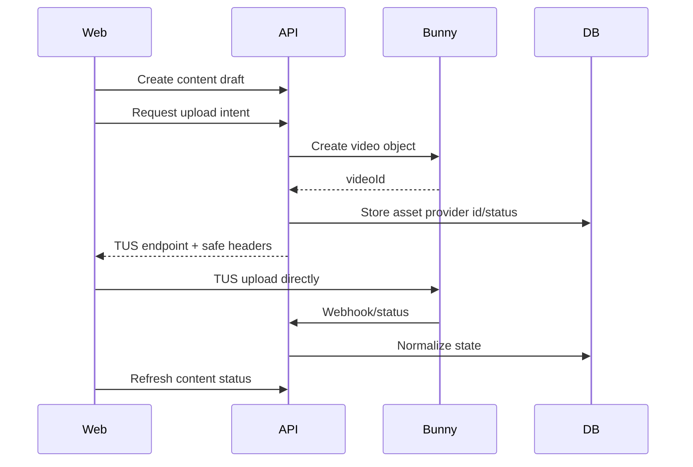
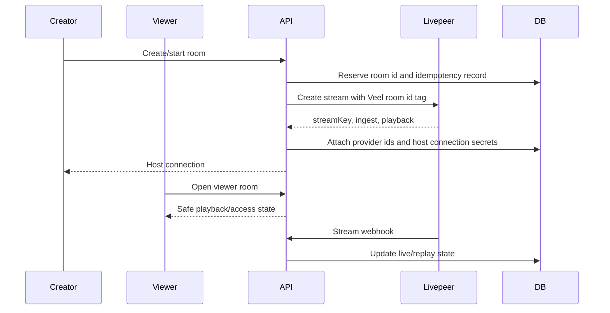

# WeVid V2 Media And Live Provider Architecture

Status: accepted
Scope: Bunny, Livepeer, media, live
Last updated: 2026-08-14
Source of truth: yes

Owns:
- media live providers decisions for its named domain

Defers to:
- INDEX.md, route-map.md, OpenAPI, schema blueprint, and ADRs where narrower

Does not own:
- unrelated domains, implementation shortcuts, provider secrets, or hidden source-of-truth rules

Launch scope:
- accepted v2 launch or phased behavior stated in this document

Non-goals:
- historical-context inference, duplicate systems, and unapproved provider/product expansion

Current implementation state:

- `POST /v1/content` creates a server-owned content draft for app-ready users.
- Adult/explicit draft creation requires a first-party representation declaration and explicit policy acceptance. `self_only` reuses the creator's valid Didit-backed adult-publisher identity and records one scoped consent; MCP cannot accept this declaration for the creator.
- `POST /v1/content` enforces a backend-owned draft quota before inserting content. The default policy is 20 drafts per rolling 24 hours, and an active `safety.content_creation_abuse_policy` admin software-policy flag can tighten or relax the draft count/window without giving the browser, money, tiers, Mutuals, recommendations, messages, or moderation priority any control.
- `POST /v1/media/uploads` creates a Bunny Stream upload session for an owned content draft, persists the corresponding backend `media_assets` record, returns its frontend-safe `mediaAssetId`, and enforces a backend-owned upload-session quota before touching Bunny. The default policy is 30 upload sessions per rolling 24 hours, with the same active admin safety policy controlling launch operations.
- `/create` now uses those backend endpoints for explicit draft creation, metadata/preview updates, upload-session creation, provider-status sync, and content projection refresh, then uploads bytes through `tus-js-client` using the server-issued Bunny TUS endpoint and headers. The browser displays progress, pause/resume state, safe upload headers, expiry, persisted media asset id, and frontend-safe content access/playback projection; it does not receive the Bunny API key, mutate moderation state, or publish content locally.
- `PATCH /v1/content/{contentId}` is creator-owned and idempotency-header gated. It updates caption, visibility, NSFW label, teaser start/end, thumbnail frame controls, and draft Event Access metadata/pass types for the same owned content item. It does not publish content, publish the event, approve moderation, grant access, or update provider playback truth.
- `POST /v1/content/{contentId}/publish` is creator-owned and idempotency-header gated. It requires explicit `submit_for_review` confirmation and provider-ready media before moving `publish_state` to `submitted_for_review` or `published` if moderation was already approved. It does not approve moderation, grant access, or create paid visibility.
- Browser upload completion is still provider-transfer completion only. Provider-ready playback, moderation approval, publish state, and public/discovery access remain backend-owned follow-up states.
- Upload persistence creates a durable `media_moderation_jobs` record. Jobs lease only after the provider asset is playable. The default adapter routes to review because automated provider coverage is not launch-approved.
- Migration `0088` makes `media_safety_cases` canonical, guards approved content at the database boundary, stores minimized provider scan evidence, and adds performer consent, appeal, and reporting workflow records with RLS. Migration `0092` adds only the uploader-safe decision message, scoped appeal idempotency, and owner publication-list index; it does not introduce a second moderation authority.
- The Bunny adapter follows the current Bunny Stream TUS flow: create video object, generate server-side SHA256 upload signature, return `https://video.bunnycdn.com/tusupload` plus safe upload headers.
- `BUNNY_STREAM_API_KEY` and `BUNNY_STREAM_LIBRARY_ID` are server-only config values; the Stream API key is never returned to the browser.
- Upload state is stored in `media_assets` as normalized provider/provider asset/provider state only.
- `GET /v1/content/{contentId}` returns a frontend-safe media viewer projection backed by `content_access_rules`, creator profile data, and the first media poster.
- `/content/[contentId]` consumes that projection through the web API helper and renders backend access/playback state only. Full backend-issued Bunny embed resources render in an iframe, direct/HLS resources render in the browser media element, and blocked/teaser/not-ready states stay gated; it does not create local payment or playback fixtures.
- Access projection is conservative: free/teaser/pass/locked states are exposed, entitlement grants remain backend-settlement-owned, and provider management URLs are never exposed to the browser.
- `GET /v1/content/{contentId}` fails full Bunny playback closed unless backend access is already `free`, `unlocked`, or `subscribed` and a short-lived Bunny embed token can be generated server-side.
- `POST /v1/webhooks/media/{provider}` accepts Bunny Stream signed webhooks for the `bunny` provider and Livepeer signed stream webhooks for the `livepeer` provider, verifies raw-body HMAC signatures, records idempotent provider receipts, and applies normalized media/live processing state.
- Bunny playback token issuing is backend-owned through embed-view token authentication; moderation state transitions and broader locked playback policy surfaces are deferred to their owning media/access slices.

Official references checked:

- Bunny Stream API reference: https://docs.bunny.net/api-reference/stream
- Bunny TUS resumable uploads: https://docs.bunny.net/stream/tus-resumable-uploads
- Bunny Stream webhooks and HMAC validation: https://docs.bunny.net/stream/webhooks
- Bunny Stream security and token authentication: https://docs.bunny.net/stream/security
- Bunny Stream embed view token authentication: https://docs.bunny.net/stream/token-authentication
- Livepeer webhook setup and signatures: https://docs.livepeer.org/developers/guides/setup-and-listen-to-webhooks
- Livepeer stream event webhooks: https://docs.livepeer.org/developers/guides/listen-to-stream-events
- Livepeer JWT access control: https://docs.livepeer.org/developers/guides/access-control-jwt
- Livepeer asset upload reference: https://docs.livepeer.org/api-reference/asset/upload

## Provider Split

- Bunny Stream owns VOD upload/resumability, storage, encoding, delivery, and provider playback. Bunny Shield is used only on upload paths with staging-proven coverage.
- Livepeer owns live ingest, transcoding, recording, and provider playback.
- WeVid backend owns drafts/quarantine, performer and consent requirements, moderation/release, room/access/monetisation policy, entitlement/playback authorization, report and suspend/end orchestration, and replay release.
- Frontend uses official provider player/component boundaries wrapped in WeVid layout primitives.
- Custom encoders, CDNs, or live-stream infrastructure are prohibited. Adult live remains disabled until its separate proof gate.

## Bunny VOD Flow



Rules:

- Bunny video object is created by backend before TUS upload.
- Bunny API key never reaches frontend.
- Frontend receives only upload target/headers needed for TUS.
- Bunny status webhooks require `X-BunnyStream-Signature-Version: v1`, `X-BunnyStream-Signature-Algorithm: hmac-sha256`, and `X-BunnyStream-Signature`; the backend verifies the exact raw request body with `BUNNY_STREAM_WEBHOOK_READONLY_KEY`.
- Bunny webhook `VideoGuid` and `Status` are normalized into provider event state; raw provider payloads are not returned to frontend resources.
- Provider payload is sanitized before frontend response.
- Paid full playback requires backend access state and backend-issued signed/tokenized Bunny playback.
- Full locked Bunny playback is never exposed as an unsigned long-lived URL.
- Bunny embed playback resources require `BUNNY_STREAM_EMBED_TOKEN_KEY` and use short-lived `token` and `expires` query parameters generated server-side from the provider video id. The frontend receives only the signed embed URL and expiry metadata.

## Livepeer Live Flow



Rules:

- Live room creation is DB-first: the API reserves a durable room id and idempotency record before creating a Livepeer stream, then attaches provider ids and host connection fields. Retrying the same idempotency key reuses the same Veel room id instead of creating unrelated provider resources.
- Current v2 API exposes a masked creator host connection only. A reveal/control workflow must add explicit break-glass UX, auditing, and staging provider validation before exposing full host credentials to a browser surface.
- Viewer never receives stream key or ingest URL.
- Replay state is separate from live state.
- Paid playback access uses Livepeer JWT provider access from day one.
- Use Livepeer React/player primitives where they fit the UX, especially for live/replay playback.
- Use provider-supported JWT access for paid/pass-gated streams and paid replay assets.
- Livepeer JWT signing keys stay backend-only.
- Livepeer access JWTs are signed with the pinned official `@livepeer/core/crypto` `signAccessJwt` helper using P-256 keys. The API does not maintain a parallel JWT implementation.
- Livepeer API calls honor `LIVEPEER_API_BASE_URL` and the bounded `LIVEPEER_HTTP_TIMEOUT_MS`. Configuration, authentication, not-found, rate-limit, timeout, and provider failures are typed; only provider 404 permits playback lookup fallback, while all other failures remain visible and fail closed.
- Livepeer stream webhooks require `Livepeer-Signature` with `t=` and `v1=` values; the backend verifies the exact raw request body with `LIVEPEER_WEBHOOK_SECRET` and a five-minute replay window.
- Livepeer `stream.started`, `stream.idle`, `recording.waiting`, and `recording.ready` events are normalized into live room provider state by provider stream id. Provider payloads and host credentials are not exposed to viewer resources.
- `recording.ready` handoff links a private, moderation-pending `live_replay` content item and Livepeer media asset to the room. Generic content playback for Livepeer replay rows fails closed until the dedicated signed replay playback slice is implemented.

## Live Monetisation Model

Every verified account can create a public live. The host selects exactly one primary mode:

1. `public`: everyone can watch; chat may optionally require an active profile membership.
2. `profile_members`: active members of the host profile can watch and chat.
3. `paid_event`: one event price includes the live and a disclosed replay window; active profile members may optionally be included.

Rules:

- Backend validates the selected mode and paid-event price, then owns membership, event entitlement, replay expiry, and chat access.
- Timed 30/60/180-minute live passes are removed from contracts and user interfaces.
- Wallet approval is not access proof; paid-event access begins only after backend-confirmed payment.
- Livepeer JWT is issued only when the backend access projection is `allowed`.
- Public/member/event countdown, metadata, thumbnail, and policy-safe preview remain discoverable without exposing protected playback.
- Viewer never receives stream key or ingest URL.
- Live replays are content items: they can have a free Bit/teaser segment and then follow normal replay/VOD monetisation chosen by the creator.

Current implementation slice:

- `POST /v1/live/rooms` creates a Livepeer stream with JWT playback policy through the backend provider adapter.
- `GET /v1/live/rooms/:id` returns viewer-safe mode, playback, membership/event access, chat, and replay projection.
- `/live/[liveRoomId]` consumes that live-room projection through the web API helper and renders fail-closed unavailable state when the API or authorization path cannot return a viewer-safe resource.
- Allowed Livepeer playback is signed server-side and returned as a short-lived HLS resource with a JWT query parameter. If JWT signing keys are unavailable, full playback fails closed as `blocked` even when backend access is active.
- `GET /v1/live/rooms/:id/host-connection` returns masked host connection details only.
- `POST /v1/live/rooms/:id/sync` refreshes provider state and replay projection.
- `POST /v1/live/rooms/:id/event-access-intents` creates the room's one server-priced paid-event intent.
- Confirmed payment settlement creates active event access server-side and closes its replay window from the backend room end time.
- `GET/POST /v1/live/rooms/:id/messages` gates chat on backend access and optional members-only-chat policy.
- Livepeer remains launch-gated until staging keys, JWT policy, and real provider smoke are validated.

## Media Access Resource

Frontend receives:

- media type
- poster/thumbnail
- teaser playback
- full playback only when authorized
- provider label/status
- normalized processing state

Frontend does not receive:

- provider API keys
- raw provider payloads
- Bunny management URLs
- Livepeer stream key
- ingest URL for viewers
- signed full playback when locked

## Playback And Player Strategy

- Use official provider players/components before custom playback code.
- Use Bunny player or provider-supported Stream playback URLs where they reduce custom player work.
- Use Bunny Stream token authentication / signed or tokenized playback for all full locked playback.
- Use Livepeer JWT access control for paid streams/assets.
- Use Bunny Storage/CDN only for ancillary static assets when Stream does not own the asset class; do not build a custom VOD storage/transcoding stack beside Bunny Stream.
- Teaser playback can be public or short-lived signed, depending content risk and cost.
- Full locked playback requires backend entitlement before issuing safe playback resource.
- Veel UI wraps provider players for layout, gestures, action rails, sheets, and accessibility.

Token policy:

- defaults are env-configured
- admin policy can override env defaults
- short-lived playback tokens are preferred
- playback token endpoints are rate-limited and audited
- signed/tokenized playback resources are never logged

## Moderation Pipeline

```text
private upload -> provider playable -> durable scan reconciliation -> staff review -> canonical approval -> publish allowed
```

Direct Bunny Stream TUS coverage by Bunny Shield is unproven and must not be inferred from Shield's generic upload-scanning documentation. Livepeer multistream moderation and server-side suspension are supported provider primitives but remain candidate until real staging evidence is recorded in ADR 0003. Adult live remains disabled by default.

Moderation can block:

- publish
- discovery
- monetisation
- playback
- live room continuation

## Test Matrix

- Bunny TUS credentials safe
- Bunny duplicate webhook idempotent
- Bunny provider payload sanitized
- Bunny player/playback resource contains no management secrets
- locked full media not exposed
- unlocked viewer receives full playback
- Livepeer viewer no host credentials
- Livepeer creator host connection authorized
- Livepeer JWT/protected playback path works for paid streams
- replay resource safe
- public, profile-member, and paid-event access controls playback/chat
- protected live preview expires into membership-required or event-access-required state
