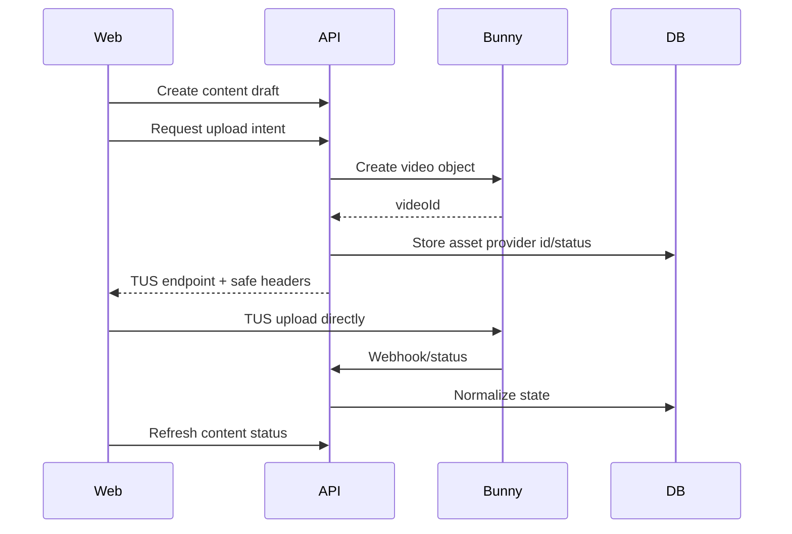
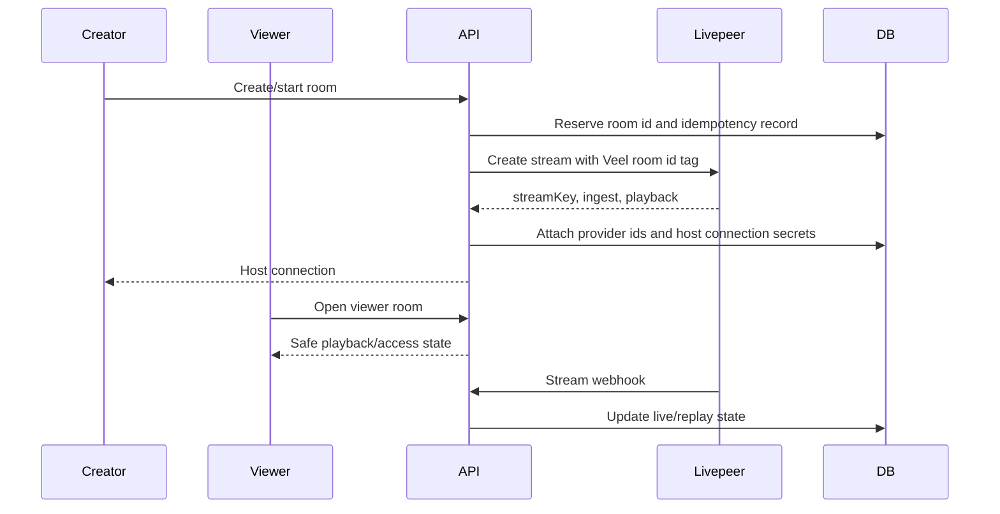

# Veel V2 Media And Live Provider Architecture

Status: accepted
Scope: Bunny, Livepeer, media, live
Last updated: 2026-06-06
Source of truth: yes

Owns:
- media live providers decisions for its named domain

Defers to:
- INDEX.md, route-map.md, OpenAPI, schema blueprint, and ADRs where narrower

Does not own:
- unrelated domains, implementation shortcuts, provider secrets, or hidden source-of-truth rules

Launch scope:
- accepted v2 launch or phased behavior stated in this document

Non-goals:
- historical-context inference, duplicate systems, and unapproved provider/product expansion

Current implementation state:

- `POST /v1/content` creates a server-owned content draft for app-ready users.
- `POST /v1/media/uploads` creates a Bunny Stream upload session for an owned content draft.
- `/create` now uses those backend endpoints for explicit draft creation, metadata/preview updates, and upload-session creation, then uploads bytes through `tus-js-client` using the server-issued Bunny TUS endpoint and headers. The browser displays progress, pause/resume state, safe upload headers, expiry, and frontend-safe content access/playback projection; it does not receive the Bunny API key, mutate moderation state, or publish content locally.
- `PATCH /v1/content/{contentId}` is creator-owned and idempotency-header gated. It updates caption, visibility, NSFW label, teaser start/end, and thumbnail frame controls only; it does not publish, approve moderation, grant access, or update provider playback truth. `eventDraft` is rejected until the dedicated Event Access publish slice owns that workflow end to end.
- `POST /v1/content/{contentId}/publish` is creator-owned and idempotency-header gated. It requires explicit `submit_for_review` confirmation and provider-ready media before moving `publish_state` to `submitted_for_review` or `published` if moderation was already approved. It does not approve moderation, grant access, or create paid visibility.
- Browser upload completion is still provider-transfer completion only. Provider-ready playback, moderation approval, publish state, and public/discovery access remain backend-owned follow-up states.
- The Bunny adapter follows the current Bunny Stream TUS flow: create video object, generate server-side SHA256 upload signature, return `https://video.bunnycdn.com/tusupload` plus safe upload headers.
- `BUNNY_STREAM_API_KEY` and `BUNNY_STREAM_LIBRARY_ID` are server-only config values; the Stream API key is never returned to the browser.
- Upload state is stored in `media_assets` as normalized provider/provider asset/provider state only.
- `GET /v1/content/{contentId}` returns a frontend-safe media viewer projection backed by `content_access_rules`, creator profile data, and the first media poster.
- `/content/[contentId]` consumes that projection through the web API helper and renders backend access/playback state only; it does not create local payment or playback fixtures.
- Access projection is conservative: free/teaser/pass/locked states are exposed, but no entitlement grant, signed playback URL, tokenized playback URL, or provider management URL is exposed by this slice.
- `GET /v1/content/{contentId}` fails full Bunny playback closed unless backend access is already `free`, `unlocked`, or `subscribed` and a short-lived Bunny embed token can be generated server-side.
- `POST /v1/webhooks/media/{provider}` accepts Bunny Stream signed webhooks for the `bunny` provider and Livepeer signed stream webhooks for the `livepeer` provider, verifies raw-body HMAC signatures, records idempotent provider receipts, and applies normalized media/live processing state.
- Bunny playback token issuing is backend-owned through embed-view token authentication; moderation state transitions and broader locked playback policy surfaces are deferred to their owning media/access slices.

Official references checked:

- Bunny Stream API reference: https://docs.bunny.net/api-reference/stream
- Bunny TUS resumable uploads: https://docs.bunny.net/stream/tus-resumable-uploads
- Bunny Stream webhooks and HMAC validation: https://docs.bunny.net/stream/webhooks
- Bunny Stream security and token authentication: https://docs.bunny.net/stream/security
- Bunny Stream embed view token authentication: https://docs.bunny.net/stream/token-authentication
- Livepeer webhook setup and signatures: https://docs.livepeer.org/developers/guides/setup-and-listen-to-webhooks
- Livepeer stream event webhooks: https://docs.livepeer.org/developers/guides/listen-to-stream-events
- Livepeer JWT access control: https://docs.livepeer.org/developers/guides/access-control-jwt
- Livepeer asset upload reference: https://docs.livepeer.org/api-reference/asset/upload

## Provider Split

- Bunny Stream: VOD upload, transcoding, thumbnails, CDN playback.
- Livepeer: live room creation, stream key/ingest, live playback, replay handoff where useful.
- Veel backend: content state, access, moderation, provider mapping, frontend-safe resources.
- Frontend: official provider player/component integration wrapped in Veel layout primitives.

## Bunny VOD Flow



Rules:

- Bunny video object is created by backend before TUS upload.
- Bunny API key never reaches frontend.
- Frontend receives only upload target/headers needed for TUS.
- Bunny status webhooks require `X-BunnyStream-Signature-Version: v1`, `X-BunnyStream-Signature-Algorithm: hmac-sha256`, and `X-BunnyStream-Signature`; the backend verifies the exact raw request body with `BUNNY_STREAM_WEBHOOK_READONLY_KEY`.
- Bunny webhook `VideoGuid` and `Status` are normalized into provider event state; raw provider payloads are not returned to frontend resources.
- Provider payload is sanitized before frontend response.
- Paid full playback requires backend access state and backend-issued signed/tokenized Bunny playback.
- Full locked Bunny playback is never exposed as an unsigned long-lived URL.
- Bunny embed playback resources require `BUNNY_STREAM_EMBED_TOKEN_KEY` and use short-lived `token` and `expires` query parameters generated server-side from the provider video id. The frontend receives only the signed embed URL and expiry metadata.

## Livepeer Live Flow



Rules:

- Live room creation is DB-first: the API reserves a durable room id and idempotency record before creating a Livepeer stream, then attaches provider ids and host connection fields. Retrying the same idempotency key reuses the same Veel room id instead of creating unrelated provider resources.
- Current v2 API exposes a masked creator host connection only. A reveal/control workflow must add explicit break-glass UX, auditing, and staging provider validation before exposing full host credentials to a browser surface.
- Viewer never receives stream key or ingest URL.
- Replay state is separate from live state.
- Paid playback access uses Livepeer JWT provider access from day one.
- Use Livepeer React/player primitives where they fit the UX, especially for live/replay playback.
- Use provider-supported JWT access for paid/pass-gated streams and paid replay assets.
- Livepeer JWT signing keys stay backend-only.
- Livepeer stream webhooks require `Livepeer-Signature` with `t=` and `v1=` values; the backend verifies the exact raw request body with `LIVEPEER_WEBHOOK_SECRET` and a five-minute replay window.
- Livepeer `stream.started`, `stream.idle`, `recording.waiting`, and `recording.ready` events are normalized into live room provider state by provider stream id. Provider payloads and host credentials are not exposed to viewer resources.
- `recording.ready` handoff links a private, moderation-pending `live_replay` content item and Livepeer media asset to the room. Generic content playback for Livepeer replay rows fails closed until the dedicated signed replay playback slice is implemented.

## Live Monetisation Model

Live streams are paid products by default.

Viewer experience:

1. User opens live room.
2. First minute is a free teaser preview where the creator/product policy allows it.
3. After the teaser, playback and chat require a creator live pass.
4. Pass duration templates default to:
   - 30 minutes
   - 1 hour
   - 3 hours
5. Creator chooses which allowed durations to offer and sets pass prices above admin/env minimums.
6. Pass duration templates, minimum prices, teaser seconds, and chat access policy are configurable by environment and admin settings.
7. Admin policy can override environment defaults; environment remains the fallback.

Rules:

- Backend validates creator-selected pass price/duration against policy and owns entitlement, expiry, and chat access.
- Wallet approval is not access proof; pass entitlement begins only after backend-confirmed payment.
- Livepeer JWT is issued only for the active entitlement window.
- Chat access follows live pass state unless a product-specific override is configured.
- Viewer never receives stream key or ingest URL.
- Live replays are content items: they can have a free Bit/teaser segment and then follow normal replay/VOD monetisation chosen by the creator.

Current implementation slice:

- `POST /v1/live/rooms` creates a Livepeer stream with JWT playback policy through the backend provider adapter.
- `GET /v1/live/rooms/:id` returns viewer-safe room, playback, pass, chat, and replay projection.
- `/live/[liveRoomId]` consumes that live-room projection through the web API helper and renders fail-closed unavailable state when the API or authorization path cannot return a viewer-safe resource.
- Active-pass Livepeer playback is signed server-side and returned as a short-lived HLS resource with a JWT query parameter. If JWT signing keys are unavailable, full playback fails closed as `blocked` even when the database pass projection is active.
- `GET /v1/live/rooms/:id/host-connection` returns masked host connection details only.
- `POST /v1/live/rooms/:id/sync` refreshes provider state and replay projection.
- `POST /v1/live/rooms/:id/pass-intents` creates a server-priced `live_pass` payment intent.
- Confirmed payment settlement creates active live pass access server-side.
- `GET/POST /v1/live/rooms/:id/messages` gates chat on backend pass state.
- Livepeer remains launch-gated until staging keys, JWT policy, and real provider smoke are validated.

## Media Access Resource

Frontend receives:

- media type
- poster/thumbnail
- teaser playback
- full playback only when authorized
- provider label/status
- normalized processing state

Frontend does not receive:

- provider API keys
- raw provider payloads
- Bunny management URLs
- Livepeer stream key
- ingest URL for viewers
- signed full playback when locked

## Playback And Player Strategy

- Use official provider players/components before custom playback code.
- Use Bunny player or provider-supported Stream playback URLs where they reduce custom player work.
- Use Bunny Stream token authentication / signed or tokenized playback for all full locked playback.
- Use Livepeer JWT access control for paid streams/assets.
- Use Bunny Storage/CDN only for ancillary static assets when Stream does not own the asset class; do not build a custom VOD storage/transcoding stack beside Bunny Stream.
- Teaser playback can be public or short-lived signed, depending content risk and cost.
- Full locked playback requires backend entitlement before issuing safe playback resource.
- Veel UI wraps provider players for layout, gestures, action rails, sheets, and accessibility.

Token policy:

- defaults are env-configured
- admin policy can override env defaults
- short-lived playback tokens are preferred
- playback token endpoints are rate-limited and audited
- signed/tokenized playback resources are never logged

## Moderation Pipeline

```text
upload ready -> creator submit_for_review -> automated scan -> policy review if needed -> publish allowed
```

Moderation can block:

- publish
- discovery
- monetisation
- playback
- live room continuation

## Test Matrix

- Bunny TUS credentials safe
- Bunny duplicate webhook idempotent
- Bunny provider payload sanitized
- Bunny player/playback resource contains no management secrets
- locked full media not exposed
- unlocked viewer receives full playback
- Livepeer viewer no host credentials
- Livepeer creator host connection authorized
- Livepeer JWT/protected playback path works for paid streams
- replay resource safe
- live pass access controls playback/chat
- first-minute live teaser expires into pass-required state
