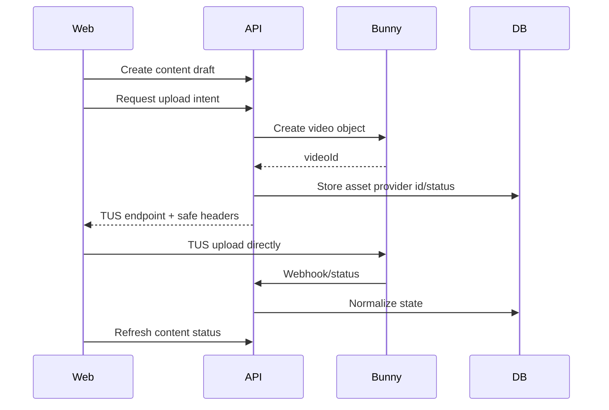
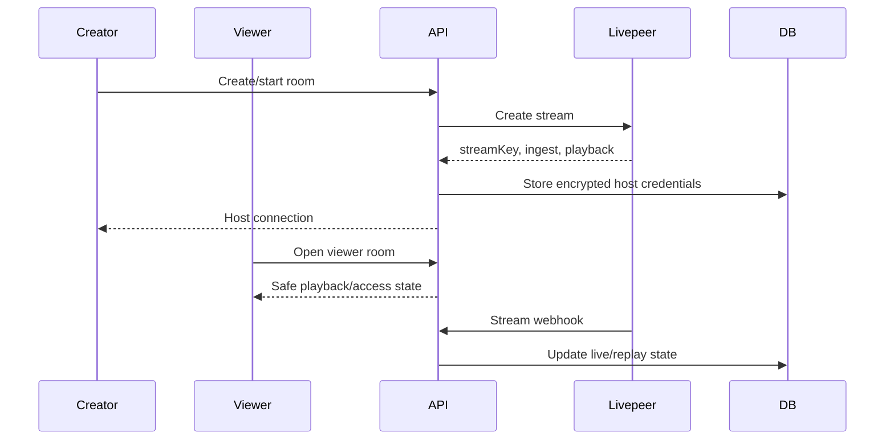

# Veel V2 Media And Live Provider Architecture

Status: proposed v2 architecture
Scope: Bunny, Livepeer, media, live
Last updated: 2026-06-01
Source of truth: proposal

## Provider Split

- Bunny Stream: VOD upload, transcoding, thumbnails, CDN playback.
- Livepeer: live room creation, stream key/ingest, live playback, replay handoff where useful.
- Veel backend: content state, access, moderation, provider mapping, frontend-safe resources.

## Bunny VOD Flow



Rules:

- Bunny video object is created by backend before TUS upload.
- Bunny API key never reaches frontend.
- Frontend receives only upload target/headers needed for TUS.
- Provider payload is sanitized before frontend response.
- Paid full playback requires backend access state.

## Livepeer Live Flow



Rules:

- Creator-only host endpoint exposes masked/revealed stream key only after authorization.
- Viewer never receives stream key or ingest URL.
- Replay state is separate from live state.
- Playback access can use Livepeer JWT/webhook if protected playback needs provider-enforced access.

## Media Access Resource

Frontend receives:

- media type
- poster/thumbnail
- teaser playback
- full playback only when authorized
- provider label/status
- normalized processing state

Frontend does not receive:

- provider API keys
- raw provider payloads
- Bunny management URLs
- Livepeer stream key
- ingest URL for viewers
- signed full playback when locked

## Moderation Pipeline

```text
upload ready -> automated scan -> policy review if needed -> publish allowed
```

Moderation can block:

- publish
- discovery
- monetisation
- playback
- live room continuation

## Test Matrix

- Bunny TUS credentials safe
- Bunny duplicate webhook idempotent
- Bunny provider payload sanitized
- locked full media not exposed
- unlocked viewer receives full playback
- Livepeer viewer no host credentials
- Livepeer creator host connection authorized
- replay resource safe
- live pass access controls playback/chat

