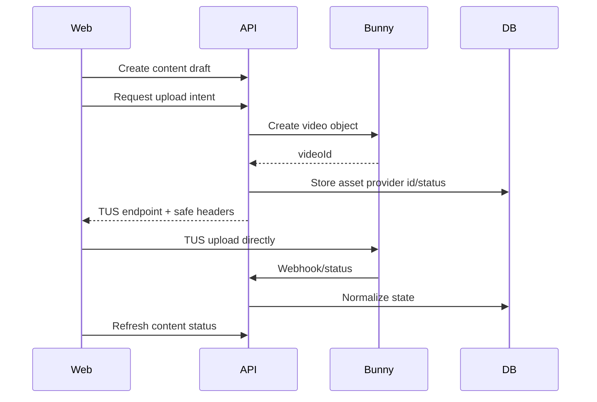
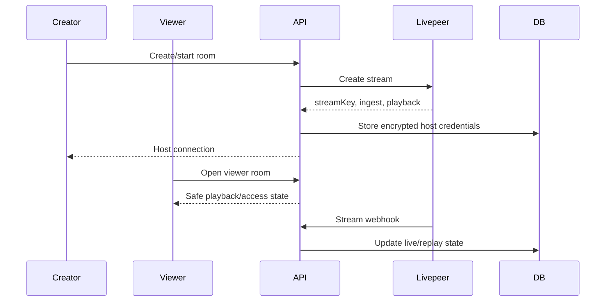

# Veel V2 Media And Live Provider Architecture

Status: proposed v2 architecture
Scope: Bunny, Livepeer, media, live
Last updated: 2026-06-03
Source of truth: proposal

## Provider Split

- Bunny Stream: VOD upload, transcoding, thumbnails, CDN playback.
- Livepeer: live room creation, stream key/ingest, live playback, replay handoff where useful.
- Veel backend: content state, access, moderation, provider mapping, frontend-safe resources.
- Frontend: official provider player/component integration wrapped in Veel layout primitives.

## Bunny VOD Flow



Rules:

- Bunny video object is created by backend before TUS upload.
- Bunny API key never reaches frontend.
- Frontend receives only upload target/headers needed for TUS.
- Provider payload is sanitized before frontend response.
- Paid full playback requires backend access state and backend-issued signed/tokenized Bunny playback.
- Full locked Bunny playback is never exposed as an unsigned long-lived URL.

## Livepeer Live Flow



Rules:

- Creator-only host endpoint exposes masked/revealed stream key only after authorization.
- Viewer never receives stream key or ingest URL.
- Replay state is separate from live state.
- Paid playback access uses Livepeer JWT provider access from day one.
- Use Livepeer React/player primitives where they fit the UX, especially for live/replay playback.
- Use provider-supported JWT access for paid/pass-gated streams and paid replay assets.
- Livepeer JWT signing keys stay backend-only.

## Live Monetisation Model

Live streams are paid products by default.

Viewer experience:

1. User opens live room.
2. First minute is a free teaser preview where the creator/product policy allows it.
3. After the teaser, playback and chat require a creator live pass.
4. Pass duration templates default to:
   - 30 minutes
   - 1 hour
   - 3 hours
5. Creator chooses which allowed durations to offer and sets pass prices above admin/env minimums.
6. Pass duration templates, minimum prices, teaser seconds, and chat access policy are configurable by environment and admin settings.
7. Admin policy can override environment defaults; environment remains the fallback.

Rules:

- Backend validates creator-selected pass price/duration against policy and owns entitlement, expiry, and chat access.
- Wallet approval is not access proof; pass entitlement begins only after backend-confirmed payment.
- Livepeer JWT is issued only for the active entitlement window.
- Chat access follows live pass state unless a product-specific override is configured.
- Viewer never receives stream key or ingest URL.
- Live replays are content items: they can have a free Bit/teaser segment and then follow normal replay/VOD monetisation chosen by the creator.

## Media Access Resource

Frontend receives:

- media type
- poster/thumbnail
- teaser playback
- full playback only when authorized
- provider label/status
- normalized processing state

Frontend does not receive:

- provider API keys
- raw provider payloads
- Bunny management URLs
- Livepeer stream key
- ingest URL for viewers
- signed full playback when locked

## Playback And Player Strategy

- Use official provider players/components before custom playback code.
- Use Bunny player or provider-supported Stream playback URLs where they reduce custom player work.
- Use Bunny Stream token authentication / signed or tokenized playback for all full locked playback.
- Use Livepeer JWT access control for paid streams/assets.
- Teaser playback can be public or short-lived signed, depending content risk and cost.
- Full locked playback requires backend entitlement before issuing safe playback resource.
- Veel UI wraps provider players for layout, gestures, action rails, sheets, and accessibility.

Token policy:

- defaults are env-configured
- admin policy can override env defaults
- short-lived playback tokens are preferred
- playback token endpoints are rate-limited and audited
- signed/tokenized playback resources are never logged

## Moderation Pipeline

```text
upload ready -> automated scan -> policy review if needed -> publish allowed
```

Moderation can block:

- publish
- discovery
- monetisation
- playback
- live room continuation

## Test Matrix

- Bunny TUS credentials safe
- Bunny duplicate webhook idempotent
- Bunny provider payload sanitized
- Bunny player/playback resource contains no management secrets
- locked full media not exposed
- unlocked viewer receives full playback
- Livepeer viewer no host credentials
- Livepeer creator host connection authorized
- Livepeer JWT/protected playback path works for paid streams
- replay resource safe
- live pass access controls playback/chat
- first-minute live teaser expires into pass-required state
