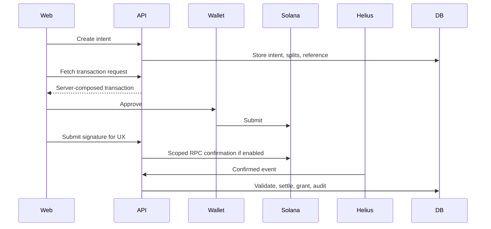

# Veel V2 Payments And Monetisation

Status: proposed v2 architecture
Scope: Solana Pay, monetisation, referrals
Last updated: 2026-06-01
Source of truth: proposal

## Payment Principles

- Noncustodial wallet approval.
- Backend computes amount, recipient, splits, reference, memo, and entitlement target.
- Wallet approval is not proof.
- Confirmed chain evidence plus backend validation is proof.
- Access grants, commissions, and creator balances are backend-only.

## Product Types

- paid clip/post/VOD/replay unlock
- tip/support
- paid message
- creator subscription
- premium live room
- live pass
- event ticket
- creator drop
- external referral commission

## Solana Pay Architecture



## Native SOL vs SPL/USDC

V2 must support both:

- native SOL for local/devnet testing and low-friction UX
- SPL token/USDC for production if selected

Mode-specific validation:

| Mode | Required checks |
| --- | --- |
| Native SOL | signature, reference, payer, lamports amount, recipient, split recipients, finality |
| SPL token | signature, reference, payer, token amount, mint, token program, recipient token account/owner, split recipients, finality |

Do not hardcode SOL-only architecture.

## Helius Usage

Helius is used only for payment/access evidence:

- unlocks
- subscriptions
- live passes
- support/tips if chosen for reconciliation
- paid messages
- tickets

Avoid broad `Any transaction` firehose except short fixture capture. Prefer scoped recipient/treasury/reference monitoring where provider supports it.

## Tips Policy

Tips do not unlock anything, but they still affect money and referral accounting.

Recommended:

- show immediate submitted UX after wallet signature
- run scoped RPC confirmation for exact signature
- include tips in Helius/reconciliation if they create referral commission, creator balance, or payout state
- if Helius cost becomes high, batch/reconcile tips with RPC/indexer polling, but do not mark financial totals final from client alone

## Referral Policy

- External share/referral can create attribution.
- Internal Veel DM share does not create commission by default.
- Self-referral blocked.
- Duplicate paid event blocked.
- Commission state is tied to payment intent and settlement.
- Frontend never sends payout amount.

## Payment API

```text
POST /v2/payment-intents
GET  /v2/payment-intents/:id
GET  /v2/payment-intents/:id/transaction-request
POST /v2/payment-intents/:id/submissions
POST /v2/webhooks/helius
GET  /v2/viewer/activity/payments
```

## Test Matrix

- create intent
- idempotency reuse
- transaction request
- wallet submission
- native SOL confirm
- SPL confirm
- wrong payer
- wrong amount
- wrong recipient
- wrong mint/program
- missing mandatory facts
- duplicate signature
- duplicate webhook
- expired intent
- already unlocked
- referral commission
- self-referral blocked

