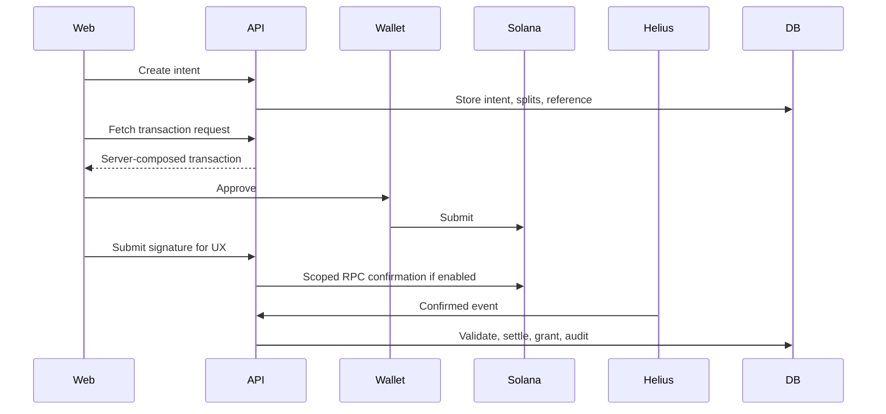

# Veel V2 Payments And Monetisation

Status: proposed v2 architecture
Scope: Solana Pay, monetisation, referrals
Last updated: 2026-06-03
Source of truth: proposal

## Payment Principles

- Noncustodial wallet approval.
- Backend computes amount, recipient, splits, reference, memo, and entitlement target.
- Wallet approval is not proof.
- Confirmed chain evidence plus backend validation is proof.
- Access grants, commissions, and creator balances are backend-only.

## Product Types

- paid clip/post/VOD/replay unlock
- tip/support
- paid message
- creator subscription
- premium live room
- live pass
- event ticket
- external referral commission

## Solana Pay Architecture

Veel stays noncustodial:

- backend configures the transaction request
- user wallet signs/approves the payment
- funds move directly to creator/platform/referral recipients where the product supports split transfers
- backend verifies chain facts before granting access or recording final revenue
- frontend wallet success is not final payment proof



## Native SOL vs SPL/USDC

V2 must support both:

- native SOL for local/devnet testing and low-friction UX
- SPL token/USDC for production if selected

Mode-specific validation:

| Mode | Required checks |
| --- | --- |
| Native SOL | signature, reference, payer, lamports amount, recipient, split recipients, finality |
| SPL token | signature, reference, payer, token amount, mint, token program, recipient token account/owner, split recipients, finality |

Do not hardcode SOL-only architecture.

## Helius Usage

Helius is used only for payment/access evidence:

- unlocks
- subscriptions
- live passes
- support/tips if chosen for reconciliation
- paid messages
- tickets

Avoid broad `Any transaction` firehose except short fixture capture. Prefer scoped recipient/treasury/reference monitoring where provider supports it.

## Tips Policy

Tips do not unlock anything, but they still affect money and referral accounting.

Recommended:

- show immediate submitted UX after wallet signature
- run scoped RPC confirmation for exact signature
- include tips in Helius/reconciliation if they create referral commission, creator balance, or payout state
- if Helius cost becomes high, batch/reconcile tips with RPC/indexer polling, but do not mark financial totals final from client alone

## Live Pass Product

Live streams are monetised live rooms by default.

Default viewer flow:

1. User opens live room.
2. First minute can be free teaser playback.
3. After teaser, playback and chat require a creator live pass.
4. Allowed pass duration templates default to 30 minutes, 1 hour, and 3 hours.
5. Creator chooses offered durations and pass prices within admin/env guardrails.
6. Backend confirms payment before issuing active pass entitlement and Livepeer JWT playback.

Config:

- live teaser seconds
- allowed pass duration templates
- minimum pass prices
- whether chat requires active pass
- grace period after pass expiry

These values are environment defaults with admin-configurable overrides. Creators own their live pass prices above policy minimums.

Live replays are ordinary content items after the stream ends. They can use a free Bit/teaser segment and creator-selected replay/VOD monetisation.

## Referral Policy

- External share/referral can create attribution.
- Internal Veel DM share does not create commission by default.
- Self-referral blocked.
- Duplicate paid event blocked.
- Commission state is tied to payment intent and settlement.
- Frontend never sends payout amount.

Referral types:

- User-generated external referral: user shares content/profile/event outside Veel; backend creates token/link; click/signup/payment attribution is server-owned; eligible paid actions can create commission from platform share.
- Internal Veel share: share to another Veel user/chat; creates share/activity record; no commission by default.
- Admin/partner referral: admin creates partner campaign/code with commission rules, cap, expiry, and audit trail.

## Payment API

```text
POST /v1/payments/intents
GET  /v1/payments/intents/:id
GET  /v1/payments/intents/:id/transaction-request
POST /v1/payments/intents/:id/submissions
POST /v1/webhooks/solana-indexer
GET  /v1/activity?kind=payments
```

## Test Matrix

- create intent
- idempotency reuse
- transaction request
- wallet submission
- native SOL confirm
- SPL confirm
- wrong payer
- wrong amount
- wrong recipient
- wrong mint/program
- missing mandatory facts
- duplicate signature
- duplicate webhook
- expired intent
- already unlocked
- referral commission
- self-referral blocked
