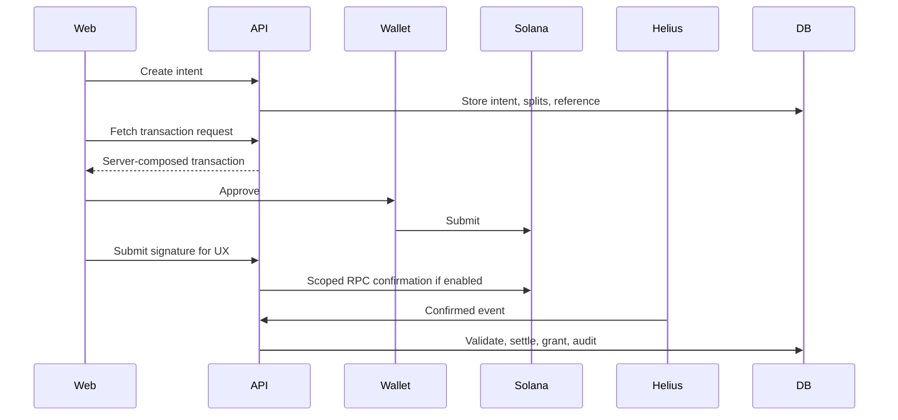

# Veel V2 Payments And Monetisation

Status: accepted
Scope: Solana Pay, monetisation, referrals
Last updated: 2026-08-11
Source of truth: yes

Owns:
- payments and monetisation decisions for its named domain

Defers to:
- INDEX.md, route-map.md, OpenAPI, schema blueprint, and ADRs where narrower

Does not own:
- unrelated domains, implementation shortcuts, provider secrets, or hidden source-of-truth rules

Launch scope:
- accepted v2 launch or phased behavior stated in this document

Non-goals:
- historical-context inference, duplicate systems, and unapproved provider/product expansion

Current implementation state:

- `POST /v1/payments/intents` creates a backend-owned voluntary `support` creator-split intent for app-ready users when `PAYMENT_PLATFORM_FEE_WALLET` is configured. `support` is the only accepted generic write type; historical `tip` rows remain readable and settle through compatibility logic only.
- The intent stores server-owned amount, asset, optional token mint/decimals, product target, creator wallet, optional Enterprise wallet, platform fee wallet, referral wallet, exact split amounts, accepted agreement snapshot, Solana cluster, and a unique Solana reference address. `PAYMENT_PLATFORM_TREASURY_WALLET` is legacy/platform-owned compatibility only and is not the creator monetisation recipient.
- Every new creator-recipient intent resolves its settlement wallet through `private.assert_recipient_monetisation_ready(...)` in the same database transaction that creates the intent. The policy requires an active individual creator, enabled product, accepted tax state, current age, the effective risk-based KYC policy, and a configured user-owned recipient wallet on the requested chain. Browser recipient overrides and arbitrary linked-wallet fallback fail closed.
- Earning eligibility, adult/performer eligibility, and Enterprise management are independent authorities as defined by ADR 0004. Reusable evidence can satisfy purpose-specific checks but never grants another capability implicitly.
- `GET /v1/payments/intents/{paymentIntentId}/transaction-request` is authenticated and mints a short-lived, 32-byte checkout capability. Only its SHA-256 hash and a redacted URL are persisted; the raw capability is returned once in the wallet-facing `solana:https://...` URL.
- Public `GET /v1/payments/checkout/{checkoutToken}` returns standard Solana Pay label/icon metadata. Public `POST /v1/payments/checkout/{checkoutToken}` accepts only the payer `account`, atomically binds that payer to the intent, and returns a base64 unsigned transaction. The capability is unguessable, expires with the pending intent, cannot switch payer, and is excluded from normal request logs.
- The wallet-facing POST intentionally does not require Veel's custom idempotency header because external Solana Pay wallets do not send application-specific headers. Its explicit `checkout-capability` idempotency policy is the short-lived capability plus atomic same-payer binding; retries by the same payer are safe and a different payer fails closed.
- The transaction pays buyer wallet directly to creator net, optional Enterprise management, Veel platform fee net, and optional referral recipients. Native SOL uses system transfers; one-time USDC uses exact SPL `transferChecked` instructions and idempotent associated-token-account creation.
- `POST /v1/payments/intents/{paymentIntentId}/submissions` records the wallet-submitted signature, then marks the intent confirmed only when backend Solana RPC verification finds a successful transaction at configured `confirmed` or `finalized` commitment with an on-chain block time no later than intent expiry, exact reference and decoded memo, expected payer, mint/decimals/token accounts where applicable, exact recipients/amounts, and no full creator payment to the legacy treasury wallet.
- Wallet approval, frontend success, and submitted signatures remain non-final until backend settlement verification confirms chain evidence.
- `POST /v1/content/{contentId}/unlock-intents` creates or reuses a backend-priced `content_unlock` intent from active content access rules. Paid live events, Event Access Passes, paid messages, platform plans, creator memberships, and content unlocks use product-specific backend-priced endpoints instead of the generic payment-intent endpoint.
- `POST /v1/live/rooms/{roomId}/event-access-intents` creates or reuses the room's single backend-priced paid-event intent. The internal `live_pass` product key remains a settlement compatibility detail; timed 30/60/180-minute products are not exposed. Wallet approval does not unlock chat or playback until backend settlement grants event access.
- `POST /v1/events/{eventId}/access-passes/intents` creates or reuses a backend-priced `event_access_pass` intent, grants free passes server-side when eligible, or returns an approval-required state for private events. The Event Access page uses this endpoint and the shared transaction-request handoff; QR/check-in access changes only after backend pass grant or confirmed settlement.
- `POST /v1/messages/conversations/{conversationId}/paid-message-intents` creates or reuses a backend-priced `paid_message` intent from the conversation policy and message body hash. The messages composer uses the normal message route for visible messages and this product-specific route for paid-message wallet handoff; delivery changes only after backend settlement.
- Confirmed `content_unlock` settlement grants an active content entitlement in the same backend transaction, and media/feed access projection returns `unlocked` only from backend entitlement state.
- Real API/test-DB coverage verifies the `content_unlock` route sequence through backend intent creation, confirmed settlement submission, wallet transaction and settlement attempt rows, active entitlement and entitlement event rows, content detail `unlocked` projection, and already-unlocked response.
- Real API/test-DB coverage verifies the `event_access_pass` route sequence through backend intent creation, confirmed settlement submission, wallet transaction and settlement attempt rows, access purchase request state, active Event Access Pass row, audit event, and access-pass activity projection.
- Real API/test-DB coverage verifies the `paid_message` route sequence through backend intent creation, confirmed settlement submission, wallet transaction and settlement attempt rows, delivered paid-message draft state, visible message row, audit event, and conversation message projection.
- Real API/test-DB coverage verifies paid live-event access through backend intent creation, confirmed settlement submission, wallet transaction and settlement attempt rows, purchase request, active event-access compatibility row, live-room entitlement, audit event, signed playback projection, and policy-gated chat write/list projection.
- Real API/test-DB coverage verifies the delegated subscription boundary through backend plan listing, authorization intent creation, verifier-scoped evidence submission, pending subscription projection, authorization intent/event rows, worker collection guards, and provider-event replay state updates. Active recurring access remains fail-closed until official Solana subscription provider verification is configured.
- Real API/test-DB coverage verifies refund/dispute request behavior after confirmed content unlock settlement: the request is idempotent by persisted request hash, writes one audit event, keeps payment and entitlement truth unchanged, and exposes only the no-custody review boundary.
- Confirmed `support` settlement posts creator earning and platform fee ledger entries from the stored split facts, but never writes an access grant. Historical `tip` rows are aggregated into Support reporting during compatibility; new writes, audit events, configuration, and UI use Support only.
- Confirmed `event_access_pass` settlement grants a backend Event Access Pass entitlement and QR/check-in record. Legacy `event_ticket` rows are normalized by migration and still settle through the same backend path during compatibility windows. Event Access is never created from wallet approval, redirect state, or frontend-computed payment success.
- `POST /v1/referrals/tokens` creates backend-owned external/internal referral tokens. Optional payment-intent `referralToken` values are resolved server-side, self-referrals are not attributed, and confirmed eligible support settlement creates at most one commission from Veel platform commission net of refunds and tax.
- `GET /v1/activity`, `GET /v1/activity/payments`, and `GET /v1/activity/wallet-transactions` expose normalized backend activity and wallet transaction history. Wallet transaction records are backend-observed submission/confirmation references, not settlement proof by themselves.
- Confirmed payment settlement records durable confirmation evidence: one receipt, receipt line, compliance-ledger payment-settled entry, in-app confirmation delivery, email confirmation delivery state, notification projection, and audit event. Email confirmation delivery is worker-owned and fail-closed: rows remain queued/provider-not-configured until a launch-approved transactional provider sends the durable confirmation; the browser must not fake durable confirmation delivery.
- In-app confirmations are useful fallback visibility and support evidence, but launch EU/EEA withdrawal-waiver confirmation should still use a durable outbound medium such as email when available. Staging must run `pnpm --filter @veel/worker email:smoke` only after `TRANSACTIONAL_EMAIL_PROVIDER=resend`, `RESEND_API_KEY`, `TRANSACTIONAL_EMAIL_FROM`, and `TRANSACTIONAL_EMAIL_SMOKE_TO` are configured with a verified sender domain.
- `GET /v1/activity/payments` includes backend-derived receipt number/state, in-app/email confirmation state, withdrawal-right status, latest refund/dispute review state, and whether a support review can be opened. `/app/activity` renders those facts and can submit the existing refund/access-issue review mutation for legal/policy exceptions; it still never executes refunds, moves funds, revokes access, or creates balances.
- `GET /v1/profiles/me/creator-dashboard` exposes creator monetisation readiness, backend-derived readiness score, product toggles, confirmed earning records, platform fees, referral commissions, and recent payment activity from backend tables only. Its policy boundary is `creator_records_only_no_balances_payout_queue_or_social_priority`.
- `GET /v1/profiles/me/creator-onboarding` exposes the backend-owned Become Creator checklist for profile, age, wallet, KYC, tax profile, earnings wallet, and product readiness, plus a backend-derived readiness score. It is an onboarding projection only and does not create balances, custody, payout queues, escrow, or social advantage.
- Admin reconciliation is available through role-gated read-only projections for payment intents, unlock entitlements, provider events, and operations counts. These projections never expose raw provider payloads, provider secrets, private keys, or frontend-computed payment truth.
- `GET /v1/subscriptions/plans` and `GET /v1/subscriptions` expose backend-owned plan and current subscription state for app-ready users; `/subscriptions` reads those projections and does not render fixture plans or subscription state.
- `/subscriptions` can request `POST /v1/subscriptions/intents`, display the backend setup reference/provider readiness, submit signed authorization evidence to `POST /v1/subscriptions/authorizations/{authorizationIntentId}/submissions`, and cancel renewal state through `PATCH /v1/subscriptions/{subscriptionId}/cancel`. The browser never marks a plan active, renews access, or treats wallet setup as payment proof.
- Membership/platform plan authorizations and recurring collection state are backend-owned. The supported recurring mode is `official_solana_subscription_program`, token-based only, with SPL Token / Token-2022 mints configured through `SUBSCRIPTIONS_SUPPORTED_MINTS`; native SOL recurring subscriptions are explicitly unsupported until an official path is implemented. If provider/program/RPC/mint/collector/merchant/on-chain verification config is missing, subscription intent creation fails closed.
- The worker owns the renewal tick: it leases only active, launch-approved, token-based delegated subscriptions from `subscriptions_next_collection_idx`, records one durable `subscription_collections` row and provider idempotency key per subscription period, calls the provider collection boundary, and advances access only after confirmed collection evidence. Lease ownership is token-guarded, stale leases are reclaimable, atomic amounts remain `bigint`, and every retry after the first reconciles provider state before another collection call. Unknown reconciliation fails closed instead of risking a duplicate debit. Cancelled, revoked, expired, unconfigured, native-SOL, or provider-mismatched subscriptions are not collected.
- Collection failures use bounded retry timing and an attempt ceiling. Exhausted collections enter `dead_letter`, suspend further subscription collection, appear in admin queue health, and can only return to `due` through the audited, idempotent admin recovery route after the underlying fault is corrected.

Official references checked:

- Solana Pay overview: https://solana.com/docs/tools/solana-pay
- Solana Pay transfer requests: https://solana.com/docs/tools/solana-pay/quickstart/transfer-requests
- Solana Pay transaction requests and validation: https://solana.com/docs/tools/solana-pay/quickstart/transaction-requests
- Solana Pay transaction request overview: https://docs.solanapay.com/core/transaction-request/overview
- Solana Subscriptions overview: https://solana.com/docs/payments/subscriptions/overview
- Solana fixed delegation: https://solana.com/docs/payments/subscriptions/fixed-delegation
- Solana recurring delegation: https://solana.com/docs/payments/subscriptions/recurring-delegation
- Solana subscription plan: https://solana.com/docs/payments/subscriptions/subscription-plan
- Solana RPC `getTransaction`: https://solana.com/docs/rpc/http/gettransaction
- Helius webhooks overview: https://www.helius.dev/docs/webhooks
- Helius webhook `authHeader`: https://www.helius.dev/docs/api-reference/webhooks/create-webhook
- ESMA MiCA overview: https://www.esma.europa.eu/esmas-activities/digital-finance-and-innovation/markets-crypto-assets-regulation-mica
- FTC cryptocurrency consumer guidance: https://consumer.ftc.gov/articles/what-know-about-cryptocurrency-scams
- EU Consumer Rights Directive 2011/83/EU: https://eur-lex.europa.eu/legal-content/EN/TXT/PDF/?uri=CELEX%3A32011L0083
- Resend Node.js sending guide: https://resend.com/docs/send-with-nodejs
- Resend SMTP/idempotency reference: https://resend.com/docs/send-with-smtp
- Resend idempotency keys: https://resend.com/docs/dashboard/emails/idempotency-keys
- EU consumer withdrawal overview: https://europa.eu/youreurope/citizens/consumers/shopping/returns/index_en.htm
- Directive (EU) 2023/2673 withdrawal-function update: https://eur-lex.europa.eu/legal-content/EN/TXT/PDF/?uri=OJ:L_202302673
- FTC Negative Option Rule reference: https://www.ftc.gov/legal-library/browse/rules/negative-option-rule
- Swiss SME e-commerce obligations: https://www.kmu.admin.ch/kmu/en/home/concrete-know-how/sme-management/e-commerce/creating-own-website/statutory-obligations-in-switzerland-and-the-eu%20.html

## Payment Principles

- Noncustodial wallet approval.
- Direct recipient settlement for creator/platform/referral splits.
- No custody, escrow, internal credits, stored creator balances, pending payouts, or withdrawal queues.
- Backend computes amount, recipient, splits, reference, memo, and entitlement target.
- Wallet approval is not proof.
- Confirmed chain evidence plus backend validation is proof.
- Access grants, commissions, earnings projections, and revenue records are backend-only.
- Compliance ledger entries, receipts, VAT determinations, invoices/statements, and entitlement grants are backend-only.

## Product Types

- content unlock for paid clip/post/VOD/replay
- support (`tip` is legacy-read-only compatibility)
- paid message
- Creator Membership
- platform plans: Free Verified, Veel Plus, Veel Ultra, Veel Studio, Enterprise
- paid live event (internal settlement compatibility key: `live_pass`)
- Event Access Pass
- external referral commission

## Solana Pay Architecture

Veel stays noncustodial:

- backend configures the transaction request
- user wallet signs/approves the payment
- funds move directly to creator/platform/referral recipients where the product supports split transfers
- backend verifies chain facts before granting access or recording final revenue
- frontend wallet success is not final payment proof

Required settlement ordering:

```text
confirmed chain evidence
  -> immutable compliance ledger entry
  -> receipt and VAT/invoice determination
  -> entitlement/access/membership grant
  -> activity/admin projection
```



## Native SOL vs SPL/USDC

V2 must support both:

- native SOL for local/devnet testing and low-friction UX
- SPL token/USDC for production if selected

Mode-specific validation:

| Mode | Required checks |
| --- | --- |
| Native SOL | signature, exact memo/reference, payer, lamports amount, recipient, split recipients, on-chain block time, configured finality |
| SPL token | signature, exact memo/reference, payer/authority, atomic token amount, mint, decimals, source/destination associated token accounts, token program, split recipients, on-chain block time, configured finality |

Do not hardcode SOL-only architecture.

Atomic amounts are constrained to JavaScript's safe-integer range until the public contract migrates to decimal strings. Split calculations use `bigint`; the database rejects values that the current numeric API could round. Human-facing surfaces format SOL and USDC using their configured decimals and never display raw atomic values as whole assets.

The default USDC Support minimum is `500000` atomic units at six decimals, exactly 0.50 USDC. The SOL minimum is an operator-configured lamport threshold because a fixed fiat minimum cannot be represented safely without an approved price-oracle policy; production must set it through `PAYMENT_MIN_SUPPORT_SOL_LAMPORTS` or choose USDC as the default asset.

## Helius Usage

Helius is used only for payment/access evidence:

- content unlocks
- subscriptions
- paid live events
- support if chosen for reconciliation
- paid messages
- Event Access Passes

Avoid broad `Any transaction` firehose except short fixture capture. Prefer scoped creator, platform-fee, allocation, and reference monitoring where provider supports it.

The API only accepts Helius deliveries when the configured webhook `authHeader` value is present as the request `Authorization` header. The backend records the provider event idempotently, hashes the shared authorization value for audit storage, then still verifies the exact Solana settlement facts before granting access or financial ledger state.

## Support Policy

Support does not unlock anything by default, but it still affects money, referral, tax/compliance, receipt, and audit accounting.

Recommended:

- show immediate submitted UX after wallet signature
- run scoped RPC confirmation for exact signature
- post creator earning and platform fee ledger entries only after backend-confirmed settlement
- include support in Helius/reconciliation if it creates referral commission, creator earning records, platform revenue state, or compliance ledger state
- if Helius cost becomes high, batch/reconcile support with RPC/indexer polling, but do not mark financial totals final from client alone

## Live Access Product

Any verified account can host public live video. A room has one backend-owned primary access mode: `public`, `profile_members`, or `paid_event`. Public rooms may use members-only chat. Profile-member rooms retain a safe public countdown, thumbnail, and preview. Paid events have one event price and a disclosed replay window; existing profile members may be included by explicit room policy. Ordinary 30/60/180-minute pass choices are retired rather than exposed as a competing access model.

Every room supports Support, Share, Join, and Report, but the client renders one primary access action. Backend-confirmed membership or Event Access entitlement is required before Livepeer JWT playback. Replays inherit room access unless the host explicitly publishes a safe public highlight.

## Referral Policy

- External share/referral can create attribution.
- Internal Veel DM share does not create commission by default.
- Self-referral blocked.
- Duplicate paid event blocked.
- Commission state is tied to payment intent and settlement.
- Commission is paid only from Veel platform commission net of refunds and tax.
- Priority is Partner Referral, then Invite Referral, then Share Referral; only one attribution can win.
- Frontend never sends recipient amount, commission amount, or final financial-truth payloads.

Referral types:

- User-generated external referral: user shares content/profile/event outside Veel; backend creates token/link; click/signup/payment attribution is server-owned; eligible paid actions can create commission from platform share.
- Internal Veel share: share to another Veel user/chat; creates share/activity record; no commission by default.
- Admin/partner referral: admin creates partner campaign/code with commission rules, cap, expiry, and audit trail.

## Refund And Dispute Policy

Crypto settlement finality means Veel cannot promise automatic reversals, card-style chargebacks, or platform-funded refunds for creator-delivered products. It does not remove consumer-protection, subscription-cancellation, non-delivery, misdescription, duplicate-settlement, fraud, age/KYC rejection, provider-failure, outage, or mandatory statutory-rights obligations.

Launch policy:

- Checkout copy may say purchases are final after immediate digital access is delivered, except where required by law or where the seller, provider, or platform failed to deliver the purchased access.
- For EU/EEA consumer distance contracts, the change-of-mind withdrawal right can be treated as lost for digital content/service access only when the user gave prior express consent to immediate supply, acknowledged that withdrawal rights are lost once access begins, access actually begins, and Veel/seller sends durable confirmation of that consent/acknowledgement.
- Creator content, paid messages, paid live events, Event Access Passes, creator Memberships, and creator support are creator-sold products where the creator/event owner is the seller/responsible party where legally supportable.
- Platform plans and platform software features are Veel-sold products, so Veel owns cancellation, non-delivery, support, and legally required remedy obligations for those products.
- Refund/dispute routes create audited review state only. They do not execute a refund, debit a creator wallet, create a Veel balance, create a creator balance, create escrow, create a payout queue, or revoke access by themselves.
- Admin refund/dispute resolution can record evidence-only remediation facts such as creator refund attestation, replacement access, access revocation, technical remediation, or no-refund denial. These records are idempotent, audited, tied to the original payment intent, and constrained by `evidence_only_no_platform_custody_no_payout_queue`; they are not settlement proof, custody, balances, or a payout workflow.
- If a refund is approved for a creator-sold product, the normal path is seller-funded noncustodial refund transaction evidence plus any policy-approved entitlement revocation/replacement. Veel may choose platform-funded goodwill only when Veel is responsible or counsel approves the exception.
- Subscription cancellation stops future collections. No pro-rata refund is promised after the current access period starts unless law, provider failure, platform failure, or approved policy requires a remedy.
- Payment intents expose a `refundPolicy` evidence block and store `withdrawal_waiver_*`, `terms_version`, durable-confirmation requirement, and refund-value basis. Confirmed settlement creates backend receipt/compliance/delivery evidence for later receipt/email confirmation and refund review without making frontend state the legal or payment source of truth.
- If a refund is legally required, use same-means reimbursement where feasible: original wallet when safe, otherwise a user-verified wallet/payment route agreed by the buyer. Resolution records must specify whether value basis is original crypto amount, fiat value at purchase, or manual resolution.
- From 19 June 2026, EU-facing online withdrawal flows need an electronic withdrawal function where a withdrawal right still exists. If valid immediate-access waiver has already ended that right, the UI should show that withdrawal is unavailable for change-of-mind reasons while still allowing support/refund claims for non-delivery, technical failure, fraud, duplicate payment, sanctions/AML, underage, or legal exceptions.

## Payment API

```text
POST /v1/payments/intents
GET  /v1/payments/intents/:id
GET  /v1/payments/intents/:id/transaction-request
GET  /v1/payments/checkout/:checkoutToken
POST /v1/payments/checkout/:checkoutToken
POST /v1/payments/intents/:id/submissions
POST /v1/content/:id/unlock-intents
POST /v1/webhooks/solana-indexer
GET  /v1/activity
GET  /v1/activity/payments
GET  /v1/activity/wallet-transactions
GET  /v1/activity/referrals
```

## Test Matrix

- create intent
- idempotency reuse
- transaction request
- wallet submission
- native SOL confirm
- SPL confirm
- wrong payer
- wrong amount
- wrong recipient
- wrong mint/program
- missing mandatory facts
- duplicate signature
- duplicate webhook
- expired intent
- already unlocked
- referral commission
- self-referral blocked
