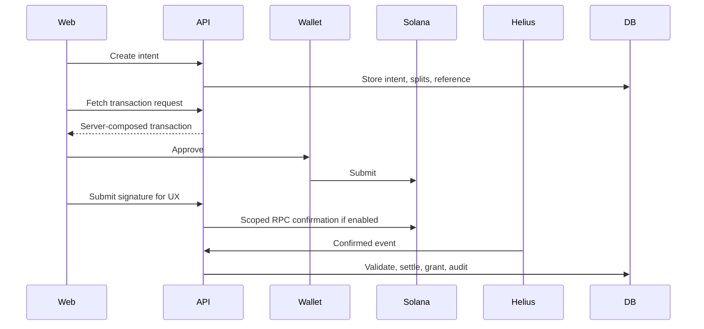

# Veel V2 Payments And Monetisation

Status: accepted
Scope: Solana Pay, monetisation, referrals
Last updated: 2026-06-05
Source of truth: yes

Owns:
- payments and monetisation decisions for its named domain

Defers to:
- INDEX.md, route-map.md, OpenAPI, schema blueprint, and ADRs where narrower

Does not own:
- unrelated domains, implementation shortcuts, provider secrets, or hidden source-of-truth rules

Launch scope:
- accepted v2 launch or phased behavior stated in this document

Non-goals:
- historical-context inference, duplicate systems, and unapproved provider/product expansion

Current implementation state:

- `POST /v1/payments/intents` creates a backend-owned native SOL payment intent for app-ready users when `PAYMENT_PLATFORM_TREASURY_WALLET` is configured.
- The intent stores server-owned amount, currency, product target, treasury wallet, Solana cluster, and a unique Solana reference address.
- `GET /v1/payments/intents/{paymentIntentId}/transaction-request` returns a Solana Pay transfer request URL for native SOL devnet settlement.
- `POST /v1/payments/intents/{paymentIntentId}/submissions` records the wallet-submitted signature, then marks the intent confirmed only when backend Solana RPC verification finds a successful transaction with the expected reference address, treasury recipient, and lamport amount.
- Wallet approval, frontend success, and submitted signatures remain non-final until backend settlement verification confirms chain evidence.
- `POST /v1/content/{contentId}/unlock-intents` creates or reuses a backend-priced `content_unlock` intent from active content access rules. The generic payment-intent endpoint does not accept client-priced content unlocks.
- Confirmed `content_unlock` settlement grants an active content entitlement in the same backend transaction, and media/feed access projection returns `unlocked` only from backend entitlement state.
- Confirmed `tip` and `support` compatibility settlement posts creator earning and platform fee ledger entries using the documented launch platform fee, but never writes an access grant. UI copy should say support.
- Confirmed `event_ticket` compatibility settlement grants a backend Event Access Pass entitlement and QR/check-in record. Event Access is never created from wallet approval, redirect state, or frontend-computed payment success.
- `POST /v1/referrals/tokens` creates backend-owned external/internal referral tokens. Optional payment-intent `referralToken` values are resolved server-side, self-referrals are not attributed, and confirmed eligible support settlement creates at most one commission from Veel platform commission net of refunds and tax.
- `GET /v1/activity`, `GET /v1/activity/payments`, and `GET /v1/activity/wallet-transactions` expose normalized backend activity and wallet transaction history. Wallet transaction records are backend-observed submission/confirmation references, not settlement proof by themselves.
- `GET /v1/profiles/me/creator-dashboard` exposes creator monetisation readiness, product toggles, confirmed earning records, platform fees, referral commissions, and recent payment activity from backend tables only.
- Admin reconciliation is available through role-gated read-only projections for payment intents, unlock entitlements, provider events, and operations counts. These projections never expose raw provider payloads, provider secrets, private keys, or frontend-computed payment truth.
- Membership/platform plan authorizations and recurring collection state are backend-owned. The primary path is auto-renewing Solana delegated subscriptions: the user authorizes bounded token collection once, backend/worker collection runs each period until cancellation/revocation, and access changes only after verified authorization or collection evidence.
- The worker owns the renewal tick: it leases due delegated subscriptions from `subscriptions_next_collection_idx`, records a `subscription_collections` row, calls the provider collection boundary, and advances access only after confirmed collection evidence. Failed collections enter retry/grace state; verified delegation revocation closes renewal state instead of creating debt or a frontend-granted access claim.

Official references checked:

- Solana Pay overview: https://solana.com/docs/tools/solana-pay
- Solana Pay transfer requests: https://solana.com/docs/tools/solana-pay/quickstart/transfer-requests
- Solana Pay transaction requests and validation: https://solana.com/docs/tools/solana-pay/quickstart/transaction-requests
- Solana Subscriptions overview: https://solana.com/docs/payments/subscriptions/overview
- Solana fixed delegation: https://solana.com/docs/payments/subscriptions/fixed-delegation
- Solana recurring delegation: https://solana.com/docs/payments/subscriptions/recurring-delegation
- Solana subscription plan: https://solana.com/docs/payments/subscriptions/subscription-plan
- Solana RPC `getTransaction`: https://solana.com/docs/rpc/http/gettransaction
- Helius webhooks overview: https://www.helius.dev/docs/webhooks
- Helius webhook `authHeader`: https://www.helius.dev/docs/api-reference/webhooks/create-webhook

## Payment Principles

- Noncustodial wallet approval.
- Direct recipient settlement for creator/platform/referral splits.
- No custody, escrow, internal credits, stored creator balances, pending payouts, or withdrawal queues.
- Backend computes amount, recipient, splits, reference, memo, and entitlement target.
- Wallet approval is not proof.
- Confirmed chain evidence plus backend validation is proof.
- Access grants, commissions, earnings projections, and revenue records are backend-only.
- Compliance ledger entries, receipts, VAT determinations, invoices/statements, and entitlement grants are backend-only.

## Product Types

- content unlock for paid clip/post/VOD/replay
- tip/support
- paid message
- Creator Membership
- platform plans: Free Verified, Veel Plus, Veel Studio, Enterprise
- live pass
- Event Access Pass
- external referral commission

## Solana Pay Architecture

Veel stays noncustodial:

- backend configures the transaction request
- user wallet signs/approves the payment
- funds move directly to creator/platform/referral recipients where the product supports split transfers
- backend verifies chain facts before granting access or recording final revenue
- frontend wallet success is not final payment proof

Required settlement ordering:

```text
confirmed chain evidence
  -> immutable compliance ledger entry
  -> receipt and VAT/invoice determination
  -> entitlement/access/membership grant
  -> activity/admin projection
```



## Native SOL vs SPL/USDC

V2 must support both:

- native SOL for local/devnet testing and low-friction UX
- SPL token/USDC for production if selected

Mode-specific validation:

| Mode | Required checks |
| --- | --- |
| Native SOL | signature, reference, payer, lamports amount, recipient, split recipients, finality |
| SPL token | signature, reference, payer, token amount, mint, token program, recipient token account/owner, split recipients, finality |

Do not hardcode SOL-only architecture.

## Helius Usage

Helius is used only for payment/access evidence:

- content unlocks
- subscriptions
- live passes
- support if chosen for reconciliation
- paid messages
- Event Access Passes

Avoid broad `Any transaction` firehose except short fixture capture. Prefer scoped recipient/treasury/reference monitoring where provider supports it.

The API only accepts Helius deliveries when the configured webhook `authHeader` value is present as the request `Authorization` header. The backend records the provider event idempotently, hashes the shared authorization value for audit storage, then still verifies the exact Solana settlement facts before granting access or financial ledger state.

## Support Policy

Support does not unlock anything by default, but it still affects money, referral, tax/compliance, receipt, and audit accounting.

Recommended:

- show immediate submitted UX after wallet signature
- run scoped RPC confirmation for exact signature
- post creator earning and platform fee ledger entries only after backend-confirmed settlement
- include support in Helius/reconciliation if it creates referral commission, creator earning records, platform revenue state, or compliance ledger state
- if Helius cost becomes high, batch/reconcile support with RPC/indexer polling, but do not mark financial totals final from client alone

## Live Pass Product

Live streams are monetised live rooms by default.

Default viewer flow:

1. User opens live room.
2. First minute can be free teaser playback.
3. After teaser, playback and chat require a creator live pass.
4. Allowed pass duration templates default to 30 minutes, 1 hour, and 3 hours.
5. Creator chooses offered durations and pass prices within admin/env guardrails.
6. Backend confirms payment before issuing active pass entitlement and Livepeer JWT playback.

Config:

- live teaser seconds
- allowed pass duration templates
- minimum pass prices
- whether chat requires active pass
- grace period after pass expiry

These values are environment defaults with admin-configurable overrides. Creators own their live pass prices above policy minimums.

Live replays are ordinary content items after the stream ends. They can use a free Bit/teaser segment and creator-selected replay/VOD monetisation.

## Referral Policy

- External share/referral can create attribution.
- Internal Veel DM share does not create commission by default.
- Self-referral blocked.
- Duplicate paid event blocked.
- Commission state is tied to payment intent and settlement.
- Commission is paid only from Veel platform commission net of refunds and tax.
- Priority is Partner Referral, then Invite Referral, then Share Referral; only one attribution can win.
- Frontend never sends recipient amount, commission amount, or final financial-truth payloads.

Referral types:

- User-generated external referral: user shares content/profile/event outside Veel; backend creates token/link; click/signup/payment attribution is server-owned; eligible paid actions can create commission from platform share.
- Internal Veel share: share to another Veel user/chat; creates share/activity record; no commission by default.
- Admin/partner referral: admin creates partner campaign/code with commission rules, cap, expiry, and audit trail.

## Payment API

```text
POST /v1/payments/intents
GET  /v1/payments/intents/:id
GET  /v1/payments/intents/:id/transaction-request
POST /v1/payments/intents/:id/submissions
POST /v1/content/:id/unlock-intents
POST /v1/webhooks/solana-indexer
GET  /v1/activity
GET  /v1/activity/payments
GET  /v1/activity/wallet-transactions
GET  /v1/activity/referrals
```

## Test Matrix

- create intent
- idempotency reuse
- transaction request
- wallet submission
- native SOL confirm
- SPL confirm
- wrong payer
- wrong amount
- wrong recipient
- wrong mint/program
- missing mandatory facts
- duplicate signature
- duplicate webhook
- expired intent
- already unlocked
- referral commission
- self-referral blocked
