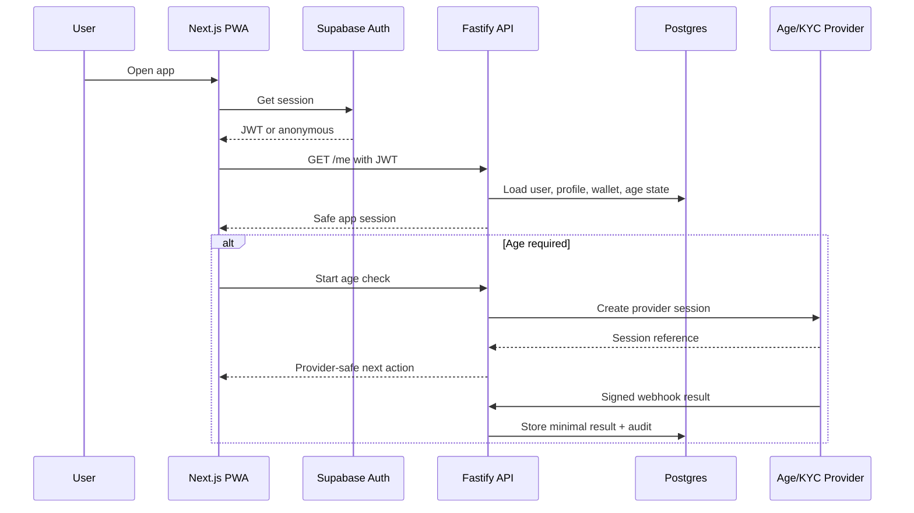
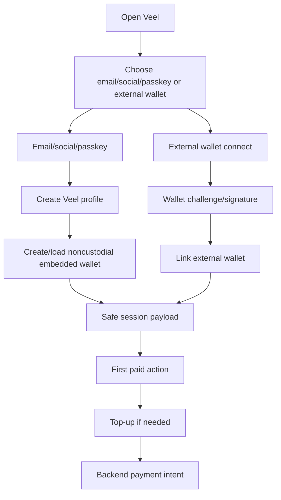
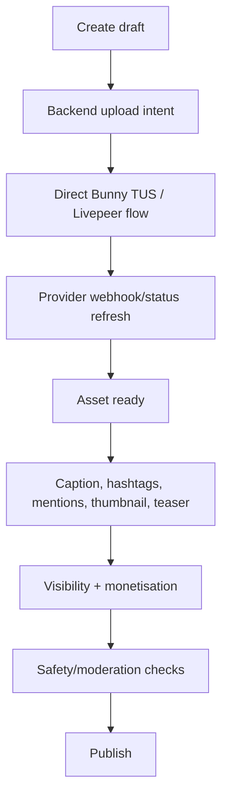
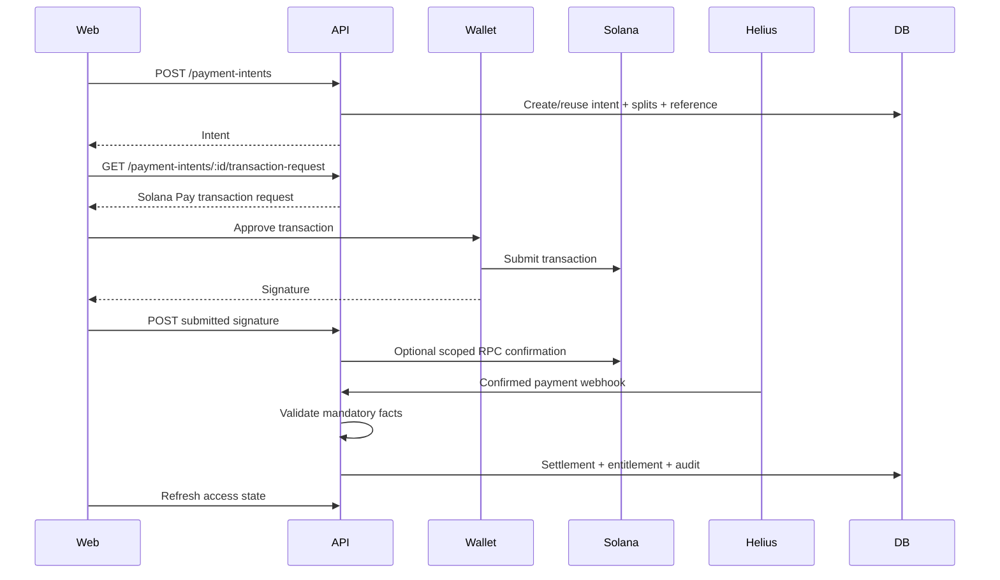
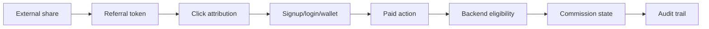
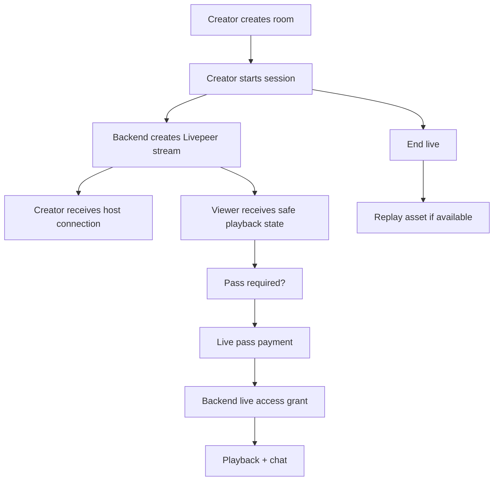

# Veel V2 Product Flows

Status: proposed v2 architecture
Scope: product workflows
Last updated: 2026-06-01
Source of truth: proposal

## Flow Principles

- Critical actions require visible controls and confirmation.
- Gestures are shortcuts, never the only way to spend, publish, match, report, or unlock.
- All business outcomes are backend-derived.
- Frontend can show pending UI, but backend decides final truth.

## Auth And Access Flow

Rules:

- Supabase Auth identifies the user.
- Fastify maps identity to Veel profile, age gate, wallet, monetisation, and permissions.
- KYC/KYB is separate from normal viewing age access.
- External wallet is not mandatory at signup. Mainstream users can enter with email/social/passkey and receive a user-controlled embedded wallet before the first wallet-required action.

## Wallet Onboarding Flow

Rules:

- wallet can be created lazily before the first wallet-required action if provider cost requires it
- onramp funds the user wallet, not a Veel custodial balance
- payment/access still goes through backend-created intent and verified settlement
- user can choose embedded wallet or linked external wallet as primary

## Home And Media Discovery

Home is mixed media:

- followed creators
- recommended media
- clips
- bits
- pictures
- live rooms
- replays
- premium teasers

Bits is immersive vertical media.

Discover is search/explore.

Source context rule:

- Home-origin media keeps Home active.
- Bits-origin media keeps Bits active.
- Public creator profile does not activate own Profile nav.

## Create/Edit Media

Create MVP:

- upload/capture
- caption
- hashtags/mentions
- sound/music metadata if available
- crop/trim
- text overlay
- thumbnail/frame
- teaser range
- visibility/access
- monetisation toggle
- optional dating enable
- optional event attach
- publish/review

Not MVP:

- CapCut-level timeline editor
- client-owned video processing
- direct provider object creation from frontend

## Paid Unlock Flow

Access is granted only after backend verification.

## Tips And Support

Tips/support do not unlock content by themselves. They still require:

- backend-created intent
- backend-computed splits
- wallet approval
- confirmed settlement for financial records
- audit trail

For low-cost microtips, v2 can use:

- immediate `submitted` UX after wallet signature
- scoped RPC confirmation for the submitted signature
- Helius/reconciliation for final evidence

Do not let frontend mark creator balance or referral commission final.

If the user has an embedded wallet with insufficient balance, the same sheet should offer top-up through the selected onramp provider and then return to the pending tip/support intent. The onramp session itself is not payment proof.

## Referral Flow

Rules:

- Internal DM share does not create commission by default.
- External invite/referral token can create attribution.
- Self-referral blocked.
- Duplicate commission blocked.
- Commission linked to payment intent and settlement.

## Live Room Flow

Viewers never receive stream keys or ingest URLs.

## Messages Flow

Messages support:

- normal messages
- paid messages
- tips
- attachments
- GIFs if provider configured
- block/report
- match/event contexts later

Realtime:

- backend writes message row
- Supabase Realtime notifies authorized clients
- RLS ensures participants only

## Events Flow

Events are content-attached conversion flows.

- creator attaches event config
- user opens ticket sheet
- wallet confirms payment if paid
- backend verifies payment
- backend grants ticket entitlement
- QR/receipt generated from backend ticket record

## Dating Flow

Dating is explicit mode.

- content-level dating enable
- dating feed only after opt-in
- left/right gestures only inside dating mode
- match chat lives in Messages
- report/block/age gate required
