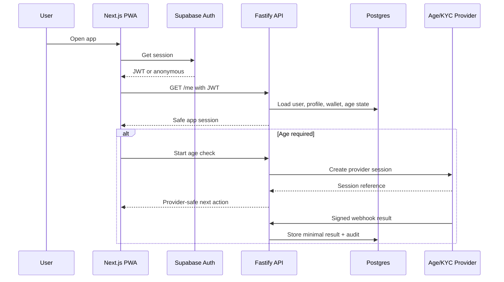
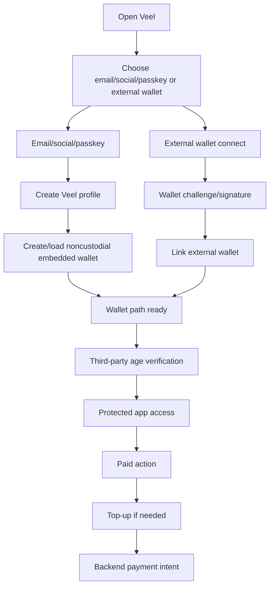
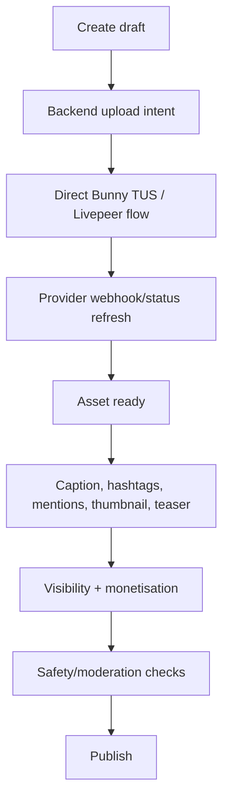
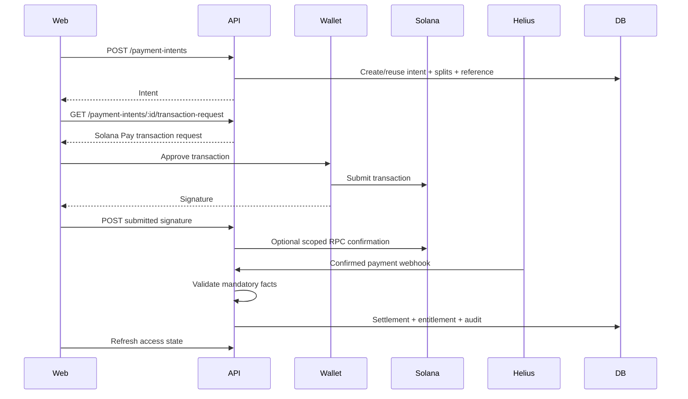
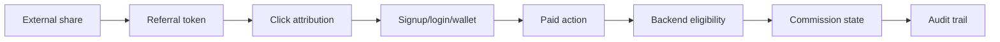
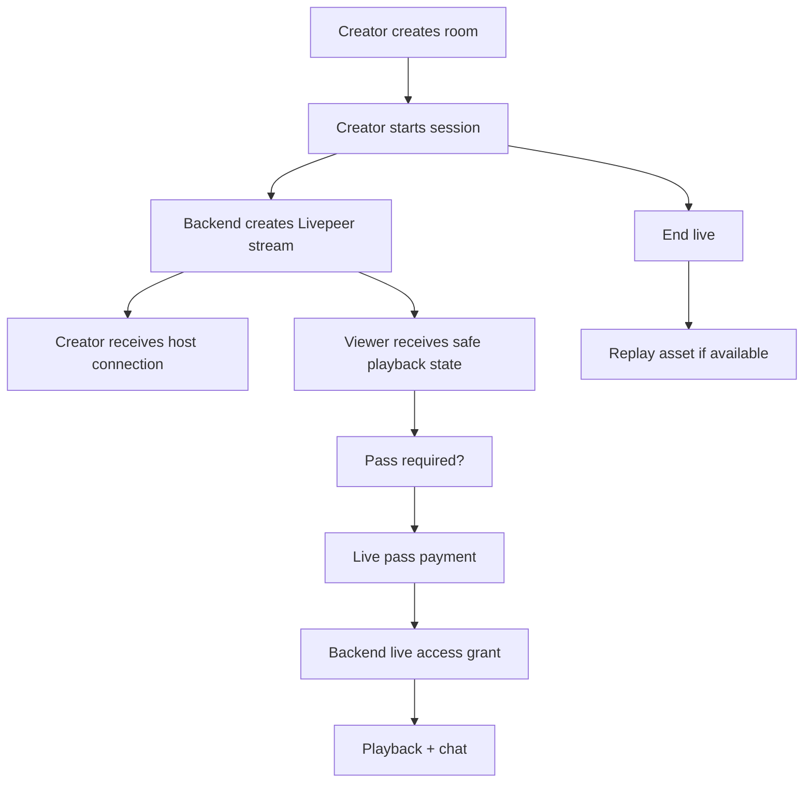

# Veel V2 Product Flows

Status: accepted
Scope: product workflows
Last updated: 2026-06-03
Source of truth: yes

Owns:
- product flows decisions for its named domain

Defers to:
- INDEX.md, route-map.md, OpenAPI, schema blueprint, and ADRs where narrower

Does not own:
- unrelated domains, implementation shortcuts, provider secrets, or hidden source-of-truth rules

Launch scope:
- accepted v2 launch or phased behavior stated in this document

Non-goals:
- historical-context inference, duplicate systems, and unapproved provider/product expansion

## Flow Principles

- Critical actions require visible controls and confirmation.
- Gestures are shortcuts, never the only way to spend, publish, match, report, or unlock.
- All business outcomes are backend-derived.
- Frontend can show pending UI, but backend decides final truth.

## Auth And Access Flow

Rules:

- Supabase Auth identifies the user.
- Fastify maps identity to Veel profile, mandatory age gate, wallet, monetisation, and permissions.
- Protected app access requires age verified and a wallet path: external wallet linked or embedded noncustodial wallet created/loaded.
- KYC/KYB is separate from normal viewing age access.
- Onboarding order is strict:
  1. identity choice creates the user session
  2. wallet path is created or linked immediately: embedded wallet for email/social/passkey, or native external wallet for wallet-first users
  3. age verification completes the app gate
  4. protected app access opens
- External wallet is not mandatory at signup. Mainstream users can enter with email/social/passkey and receive a user-controlled embedded wallet before age verification and protected app access.

## Wallet Onboarding Flow

Rules:

- wallet path must exist before protected app access
- onramp funds the user wallet, not a Veel custodial balance
- payment/access still goes through backend-created intent and verified settlement
- user can choose embedded wallet or linked external wallet as primary

## Home And Media Discovery

Home is mixed media:

- followed creators
- recommended media
- clips
- bits
- pictures
- live rooms
- replays
- premium teasers

Bits is immersive vertical media.

Discover is search/explore.

Source context rule:

- Home-origin media keeps Home active.
- Bits-origin media keeps Bits active.
- Public creator profile does not activate own Profile nav.

## Create/Edit Media

Create MVP is intentionally raw and simple:

1. Record or upload media.
2. Edit essentials:
   - trim/crop where provider/browser support is simple
   - choose thumbnail/frame
   - if video is longer than Bit length, choose the free Bit/teaser segment
3. Add caption:
   - caption text
   - hashtags `#`
   - mentions `@`
   - optional location
4. Label and attach:
   - required NSFW/adult/sensitive label
   - optional event toggle
   - no dating toggle; Dating Mode is enabled from profile/settings and appears on eligible creator media automatically
5. Monetisation:
   - free
   - teaser + content unlock
   - subscriber/pass where relevant
   - tip/support enabled
6. Preview.
7. Publish or submit for review if moderation requires it.

Not MVP:

- CapCut-level timeline editor
- client-owned video processing
- direct provider object creation from frontend
- unlicensed music uploads as a platform-provided feature
- dating controls inside Create

Location UX:

- use browser geolocation only after explicit user permission
- allow manual street/place search for users who do not want location detection
- use OpenStreetMap-backed geocoding for launch, with public Nominatim limited to light dev/test and a hosted or self-hosted geocoder for production scale
- store normalized place label, coarse coordinates when needed, and provider/place reference; do not expose precise private location without explicit user intent
- cache geocode results and rate-limit autocomplete/reverse geocoding
- complex multi-track editing

## Paid Unlock Flow

Access is granted only after backend verification.

## Tips And Support

Tips/support do not unlock content by themselves. They still require:

- backend-created intent
- backend-computed splits
- wallet approval
- confirmed settlement for financial records
- audit trail

For low-cost microtips, v2 can use:

- immediate `submitted` UX after wallet signature
- scoped RPC confirmation for the submitted signature
- Helius/reconciliation for final evidence

Do not let frontend mark creator earning records, platform revenue, or referral commission final.

If the user has an embedded wallet with insufficient balance, the same sheet should offer top-up through the selected user-wallet funding path and then return to the pending tip/support intent. The funding session itself is not payment proof and must not be product checkout.

## Referral Flow

Rules:

- Internal DM share does not create commission by default.
- External invite/referral token can create attribution.
- Self-referral blocked.
- Duplicate commission blocked.
- Commission linked to payment intent and settlement.

## Live Room Flow

Viewers never receive stream keys or ingest URLs.

## Messages Flow

Messages support:

- normal messages
- paid messages
- tips
- attachments
- block/report
- match/event contexts later

Realtime:

- backend writes message row
- Supabase Realtime notifies authorized clients
- RLS ensures participants only

## Events Flow

Events are content-attached conversion flows.

- creator attaches event config from Create/Edit:
  - title
  - description
  - date/time
  - ticket amount/capacity
  - public ticket sale or private request-to-join/apply
  - digital live stream or physical location
  - location selected through map/autodetect/manual search
- user opens ticket sheet
- wallet confirms payment if paid
- backend verifies payment
- backend grants ticket entitlement
- QR/receipt generated from backend ticket record

## Dating Flow

Dating is profile/settings-owned explicit mode.

- creator enables Dating Mode in profile/settings
- creator media shows a dating-active icon/badge when the creator is visible in Dating Mode
- viewers only see/use dating actions if they also enabled Dating Mode and accepted dating conduct rules
- dating feed only after opt-in
- left/right gestures or visible Yes/Not interested buttons are active on eligible creator media only inside Dating Mode
- match chat lives in Messages
- report/block/age gate required
