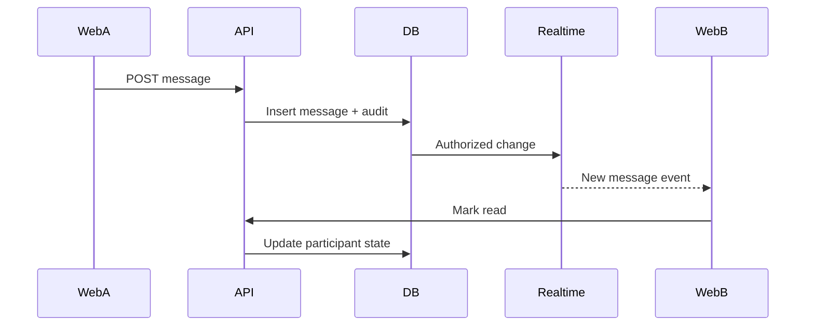

# Veel V2 Realtime, Messages, And Activity

Status: accepted
Scope: realtime, messages, notifications, activity
Last updated: 2026-06-04
Source of truth: yes

Owns:
- realtime messages activity decisions for its named domain

Defers to:
- INDEX.md, route-map.md, OpenAPI, schema blueprint, and ADRs where narrower

Does not own:
- unrelated domains, implementation shortcuts, provider secrets, or hidden source-of-truth rules

Launch scope:
- accepted v2 launch or phased behavior stated in this document

Non-goals:
- historical-context inference, duplicate systems, and unapproved provider/product expansion

## Realtime Decision

Use Supabase Realtime selectively. Do not build a custom websocket server unless Supabase cannot satisfy a specific requirement.

## Realtime Channels

| Use case | Mechanism | Notes |
| --- | --- | --- |
| Direct messages | Postgres Changes or Broadcast after backend write | Participants only through RLS. |
| Typing indicators | Presence/Broadcast | Ephemeral, no DB write required. |
| Online state | Presence | No business truth. |
| Notifications | Postgres Changes on notification projection | User-owned rows only. |
| Live viewer count | Presence plus backend heartbeat aggregate | Avoid precise billing from presence alone. |
| Live room status | Backend write + realtime projection | Backend remains source. |
| Payment status | Backend event to user channel or polling | Do not expose internal settlements directly. |
| Activity | Projection rows | Backend-derived. |

## Message Flow

## Paid Message Flow

Paid messages require:

- payment intent
- wallet approval
- confirmed settlement
- message delivery after backend confirmation
- idempotent delivery

Frontend may draft the body, but backend decides when the paid message becomes visible.

Current implementation slice:

- `GET /v1/messages/conversations` lists participant conversations through the API.
- `GET /v1/messages/conversations/:id/messages` returns participant-visible message rows.
- `POST /v1/messages/conversations/:id/messages` writes normal messages through Fastify.
- `POST /v1/messages/conversations/:id/paid-message-intents` stores the paid-message body server-side and creates a server-priced `paid_message` payment intent.
- Confirmed backend settlement inserts the paid message and audit event transactionally.
- New public message tables have RLS enabled. Baseline read policies are participant-scoped before direct Postgres Changes exposure.

## Activity Model

Activity is backend-derived:

- likes
- saves
- comments
- shares
- unlocks/purchases
- tips/support
- subscriptions
- live passes
- event tickets
- referral shares
- commissions
- wallet transactions
- reports/safety actions if user-visible
- badges and verification status changes
- ranking changes if user-visible

No fake counters.

Current implementation slice:

- `GET /v1/activity` returns a backend-derived activity feed composed from payment and wallet transaction records.
- `GET /v1/activity/payments` returns normalized payment-intent activity for the authenticated, age-verified user.
- `GET /v1/activity/wallet-transactions` returns backend-observed wallet transaction records created during payment submission/settlement handling.
- Wallet transaction records carry submission and confirmation references for user accountability, but do not grant access or revenue by themselves.

## Profile And Ranking Activity

Own activity may show:

- age verified
- wallet linked
- badge earned
- badge revoked
- creator rank changed
- event hosted/attended
- subscriber milestone
- support/tip milestone

Public ranking projections must be sanitized and opt-out aware where product policy allows.

## RLS Requirements

Baseline:

- `0017_rls_policy_baseline.sql` enables RLS on current public-schema tables that were created before explicit realtime policy work.
- Direct Supabase reads are authenticated only and read-only for browser roles.
- Business mutations still go through Fastify.

Messages:

- sender and recipient can read.
- blocked users obey backend block state.
- admin/moderator access goes through backend/admin tools, not broad client RLS.

Notifications:

- user can read own notifications.

Activity:

- user can read own private activity.
- public creator activity is a separate sanitized projection.

## Anti-Abuse

- rate limit messages
- rate limit paid message attempts
- report/block visible everywhere
- media attachments virus/moderation scan
- paid message refund/reversal policy documented before scale
