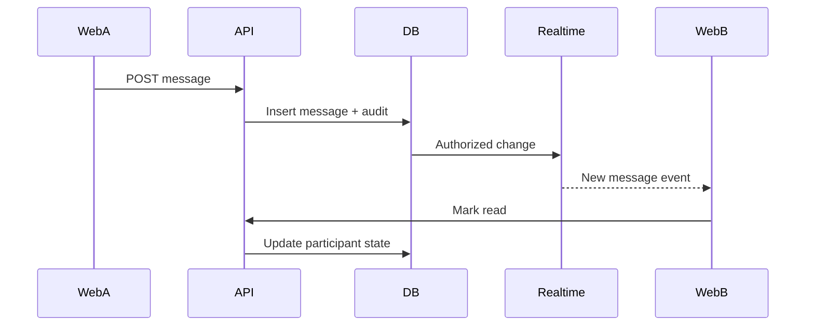

# Veel V2 Realtime, Messages, And Activity

Status: proposed v2 architecture
Scope: realtime, messages, notifications, activity
Last updated: 2026-06-01
Source of truth: proposal

## Realtime Decision

Use Supabase Realtime selectively. Do not build a custom websocket server unless Supabase cannot satisfy a specific requirement.

## Realtime Channels

| Use case | Mechanism | Notes |
| --- | --- | --- |
| Direct messages | Postgres Changes or Broadcast after backend write | Participants only through RLS. |
| Typing indicators | Presence/Broadcast | Ephemeral, no DB write required. |
| Online state | Presence | No business truth. |
| Notifications | Postgres Changes on notification projection | User-owned rows only. |
| Live viewer count | Presence plus backend heartbeat aggregate | Avoid precise billing from presence alone. |
| Live room status | Backend write + realtime projection | Backend remains source. |
| Payment status | Backend event to user channel or polling | Do not expose internal settlements directly. |
| Activity | Projection rows | Backend-derived. |

## Message Flow

## Paid Message Flow

Paid messages require:

- payment intent
- wallet approval
- confirmed settlement
- message delivery after backend confirmation
- idempotent delivery

Frontend may draft the body, but backend decides when the paid message becomes visible.

## Activity Model

Activity is backend-derived:

- likes
- saves
- comments
- shares
- unlocks/purchases
- tips/support
- subscriptions
- live passes
- event tickets
- referral shares
- commissions
- wallet transactions
- reports/safety actions if user-visible

No fake counters.

## RLS Requirements

Messages:

- sender and recipient can read.
- blocked users obey backend block state.
- admin/moderator access goes through backend/admin tools, not broad client RLS.

Notifications:

- user can read own notifications.

Activity:

- user can read own private activity.
- public creator activity is a separate sanitized projection.

## Anti-Abuse

- rate limit messages
- rate limit paid message attempts
- report/block visible everywhere
- media attachments virus/moderation scan
- paid message refund/reversal policy documented before scale

