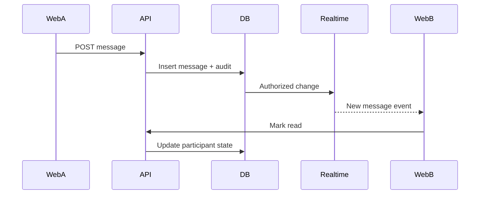

# Veel V2 Realtime, Messages, And Activity

Status: accepted
Release state: CODE_COMPLETE_PROVIDER_BLOCKED
Scope: realtime, messages, notifications, activity
Last updated: 2026-08-23
Source of truth: yes

Owns:
- realtime messages activity decisions for its named domain

Defers to:
- INDEX.md, route-map.md, OpenAPI, schema blueprint, and ADRs where narrower

Does not own:
- unrelated domains, implementation shortcuts, provider secrets, or hidden source-of-truth rules

Launch scope:
- accepted v2 launch or phased behavior stated in this document

Non-goals:
- historical-context inference, duplicate systems, and unapproved provider/product expansion

## Realtime Decision

Use Supabase Realtime selectively. Do not build a custom websocket server unless Supabase cannot satisfy a specific requirement.

## Convergence 05 Behavior Lock

Convergence 05 replaces the current broad account-level Postgres Changes subscription and
`router.refresh()` with private scoped Broadcast topics. The account topic is derived from the
canonical WeVid user ID; conversation and live topics are authorized from current membership,
block/request, access, and live-safety facts. Realtime carries only a safe resource kind, opaque
resource ID, event key, and monotonically increasing topic version. Every connect and reconnect
invalidates the corresponding typed API query before events are consumed, so missed events recover
from canonical API state rather than replaying private rows.

The browser may send typing and presence only as ephemeral hints on a topic it is currently allowed
to join. Those hints are bounded, schema-checked, never persisted as business truth, and never grant
message, payment, access, moderation, or live authority. Token refresh updates the active Realtime
connection; expiry, authorization change, channel error, timeout, or closure tears down the scoped
channel and retries with bounded backoff. Connection-state telemetry contains enums and counters only,
not message bodies, provider tokens, wallet material, or full topic values.

Message requests permit one bounded introduction until the recipient accepts. No read receipt,
paid surface, offer, reply continuation, attachment, or ephemeral presence may bypass a pending or
declined request, a block, or current messaging settings. Mute remains a local notification/read
control, not a covert sender-visible access decision. Historical `paid_message` records
remain readable, but the new-product UI is replaced by accepted-conversation creator media offers
and a two-phase structured creator request. Payment buys only the defined media entitlement or
accepted deliverable; it never buys inbox entry, reply priority, attention, romantic/sexual access,
or offline access.

Creator SFW attestation creates a monitoring-pending room and private host preview only. Public
playback and chat require the exact room, provider stream, moderation target, signed provider
acknowledgement, and fresh monitoring heartbeat to converge in one backend-owned release predicate.
Heartbeat loss, target disconnect, severe normalized safety evidence, replayed/forged callbacks, or
provider inconsistency first denies local playback and chat, then queues provider suspension and
restricted operations follow-up. Provider suspension failure cannot reopen local delivery. Adult live
remains disabled and every replay re-enters the ordinary quarantined VOD revision workflow.

The repository accepts only the closed normalized severe-signal vocabulary recorded in migration
`0112`. No public or generic moderation webhook is exposed: a launch-approved moderation adapter must
authenticate and normalize its documented provider payload before calling that boundary. Until that
adapter and real staging evidence exist, missing heartbeats hold the room and this capability remains
provider-blocked rather than fabricating safety evidence.

## Realtime Channels

| Use case | Mechanism | Notes |
| --- | --- | --- |
| Direct messages | Private Broadcast invalidation after backend write | Participants only through `realtime.messages` RLS; canonical API refetch owns displayed truth. |
| Typing indicators | Presence/Broadcast | Ephemeral, no DB write required. |
| Online state | Presence | No business truth. |
| Notifications | Private account-topic Broadcast invalidation | Minimal versioned event; user-owned API projection only. |
| Live viewer count | Presence plus backend heartbeat aggregate | Avoid precise billing from presence alone. |
| Live room status | Backend write + realtime projection | Backend remains source. |
| Payment status | Backend event to user channel or polling | Do not expose internal settlements directly. |
| Activity | Projection rows | Backend-derived. |

## Current Notification Implementation State

- The notification foundation includes OpenAPI routes, RLS-protected notification/preference/device tables, a Fastify notification module, backend tests, and settings-page preference reads.
- Web push device registration stores hashes for lookup and optional encrypted endpoint/key material for server-only delivery. API/admin/frontend responses return only sanitized device projections.
- Notification delivery attempts are queued and token-leased by the worker through `notification_delivery_attempts`; stale leases are reclaimed, retries use bounded backoff with jitter and an attempt ceiling, and exhausted attempts become `dead_letter`. The delivery provider boundary records delivered, failed, revoked, and dead-letter outcomes without frontend truth. Admin health exposes counts and queue age, while recovery requires an audited idempotent admin command.
- Admin notification health counts are exposed through a staff-only sanitized projection, including delivery queue state counts.
- Settings includes browser service-worker enrollment. Enrollment is gated by `GET /v1/notifications/push-config`, browser Push API support, browser permission, and the canonical WeVid application session.
- Settings exposes backend-owned category and push preferences as explicit switches. The app notification inbox lists only the authenticated user's projection and marks rows read through idempotent Fastify mutations.
- The worker includes a server-only VAPID Web Push send-provider boundary. It uses encrypted browser subscription material, sends sanitized notification payloads, retries transient push failures, and revokes devices when push services return expired subscription responses.
- Migration `0112` removes private notification/message/member/request/chat rows from the logical-replication publication and emits only versioned private Broadcast invalidations through backend-owned database triggers. Browser wiring invalidates exact typed API caches; it never treats the event payload as payment, access, messaging, notification, live-safety, or social truth.
- Wallet-first and recovery sessions converge before Realtime: `POST /v1/realtime/token` verifies the opaque canonical application session and the same active-profile, current-age-verification, and wallet-readiness predicate as protected messaging before minting a short-lived ES256 custom JWT. Its `sub` is the canonical WeVid user UUID, its server-only `wevid_session=true` claim selects the canonical RLS identity path, and the response exposes only that user's private `account:{userId}` topic. The private imported JWK remains API-only. Missing signing configuration returns `503` and leaves canonical API refetch as the safe fallback. `POST /v1/realtime/telemetry` records only bounded topic-kind/state/reason/attempt health signals; it never accepts a topic identifier, event payload, or message content.
- Migration `0095` rechecks protected-app readiness inside the RLS projection boundary, so an expired/revoked age decision or removed wallet immediately denies already-issued Realtime tokens. Participant message RLS exposes only `delivery_state = visible`; hidden or pending-payment message bodies never enter browser Postgres Changes. Staff and moderator access stays behind audited backend/admin projections rather than broad client RLS.
- Browser roles retain `SELECT` only. Migration `0095` makes the required Realtime projection grants explicit for new Supabase projects and removes direct mutation privileges and policies from notifications, preferences, and devices; validation, authorization, idempotency, and audit boundaries remain in Fastify.
- The browser retries initial Realtime token failures with bounded exponential backoff and reconnects after channel errors, timeouts, or closure. Typed API reads and server rendering remain the fallback and source of displayed truth.
- Production still needs real VAPID key configuration, staging push-service verification across target browsers, and live Supabase Realtime staging verification with real RLS claims.
- In unconfigured environments, user-facing notification copy must show browser push as waiting for provider configuration rather than active delivery.

## Message Flow

## Consent-Safe Messaging And Creator Commercial Interaction

Current implementation slice:

- `GET /v1/messages/conversations` lists participant conversations through the API.
- `GET /v1/messages/conversations/:id/messages` returns participant-visible message rows.
- `POST /v1/messages/conversations/:id/messages` writes normal messages through Fastify.
- `POST /v1/messages/conversations` creates or reuses one direct conversation per unordered user pair.
- A non-Mutual/non-reciprocal-follow sender gets a pending request and may send exactly one bounded introduction. The recipient must explicitly accept before either participant can continue normal messaging; decline closes messaging. Active Mutuals or reciprocal follows start accepted, and a pending request is promoted transactionally if that trusted relationship becomes active later. There is no payment bypass.
- `PATCH /v1/messages/conversations/:id/request` is recipient-only and allows exactly one terminal transition from pending to accepted or declined. Conversation creation, request response, and read-cursor commands persist the original response body, replay it exactly for the same request, and reject changed-input key reuse. `PATCH /v1/messages/conversations/:id/read` advances only that participant's read cursor and the web does not mark a thread read until its visible message projection loaded successfully.
- Replies, reactions, safe internal shares, and up to four creator-owned attachments are accepted only after conversation consent. Attachments reference an already-approved `content_items.content_revision`; messaging never creates an alternate upload or moderation path.
- Typing and presence use private ephemeral Realtime messages only. The reconnect path refetches canonical queries, optimistic sends reconcile by backend ID, and a bounded 25-item device queue retries offline sends with the original idempotency key.
- The former paid-message creation endpoint is removed. Historical `paid_message` payment and delivery records remain readable and settle through the compatibility handler, but no new API or UI creates that product.
- An approved-media creator offer can be created only by the media owner in an accepted conversation. Buyer payment uses the existing `content_unlock` settlement and canonical entitlement authority; the offer becomes purchased only after verified settlement.
- A structured creator request is proposed without payment. Only the named creator can accept, decline, or propose terms; only the requester can accept revised terms. The payment-intent route returns a conflict until creator acceptance. Verified settlement rechecks the active accepted conversation and both-direction blocks before activating delivery. A changed relationship enters remediation instead of exposing a deliverable.
- The delivery workspace records active, delivered, remediation, and completed states. Payment buys the exact agreed deliverable only—not a reply, personal attention, romantic/sexual access, offline access, or social priority.
- New public message tables have RLS enabled. Baseline read policies are participant-scoped before direct Postgres Changes exposure.
- Migration `0095` refuses malformed legacy direct threads (anything other than exactly two members or more than one thread for an unordered pair) instead of guessing. Its down migration refuses to erase live request decisions or durable action receipts; application rollback must leave the additive schema in place after Launch 05 receives traffic.
- `/messages` reads the participant inbox, selected thread, and commercial workspace through typed API helpers. It does not render local conversation or payment fixtures.
- Every selected conversation exposes user-report and block actions next to the request state; the browser submits only typed safety commands while the backend rechecks the relationship for every regular or paid delivery.
- Public creator profiles expose one `Message` action for authenticated ready users; the API, not the profile UI, decides whether the result is accepted or a request.

## Activity Model

Activity is backend-derived:

- likes
- saves
- comments
- shares
- unlocks/purchases
- tips/support
- subscriptions
- live passes
- Event Access Passes
- referral shares
- commissions
- wallet transactions
- reports/safety actions if user-visible
- badges and verification status changes
- ranking changes if user-visible

No fake counters.

Current implementation slice:

- `GET /v1/activity` returns a backend-derived activity feed composed from payment and wallet transaction records.
- `GET /v1/activity/payments` returns normalized payment-intent activity for the authenticated, age-verified user, including backend-derived receipt number/state, durable confirmation delivery state, withdrawal-right status, latest refund/dispute review state, and whether an exception review request can be opened.
- `GET /v1/activity/wallet-transactions` returns backend-observed wallet transaction records created during payment submission/settlement handling.
- `GET /v1/activity/referrals` is the activity route-map alias for the same backend-derived referral activity returned by `GET /v1/referrals/activity`.
- `/activity` reads payment activity and wallet transactions through the typed web API helper and does not render local payment or wallet transaction fixtures.
- Wallet transaction records carry submission and confirmation references for user accountability, but do not grant access or revenue by themselves.

## Profile And Ranking Activity

Own activity may show:

- age verified
- wallet linked
- badge earned
- badge revoked
- creator rank changed
- event hosted/attended
- subscriber milestone
- support/tip milestone

Public ranking projections must be sanitized and opt-out aware where product policy allows.

## RLS Requirements

Baseline:

- `0017_rls_policy_baseline.sql` enables RLS on current public-schema tables that were created before explicit realtime policy work.
- Direct Supabase reads are authenticated only and read-only for browser roles.
- Business mutations still go through Fastify.

Messages:

- sender and recipient can read.
- blocked users obey backend block state.
- admin/moderator access goes through backend/admin tools, not broad client RLS.

Notifications:

- are backend-derived projections from existing business events
- may inform the user about engagement, messages, media-offer or structured-request state, access/pass state, Membership renewal/cancel/grace state, wallet action required, age/KYC action required, creator/studio setup tasks, safety/admin decisions, provider incidents, and account issues
- never grant access, confirm payment, create revenue, change settlement state, create Mutuals, raise ranking, or override backend access truth
- must be user-owned rows under RLS before direct Realtime exposure
- must support explicit preference controls and device revocation
- direct client-facing resources must not include raw web-push endpoints, browser auth keys, provider secrets, raw provider payloads, or service-role data

- user can read own notifications.

Activity:

- user can read own private activity.
- public creator activity is a separate sanitized projection.

## Provider Verification And Staging Gate

Implementation was rechecked on 2026-08-23 against the current official Supabase custom-JWT and private Broadcast boundaries:

- Custom JWT client and claim requirements: `https://supabase.com/docs/guides/auth/jwts`
- Imported asymmetric signing keys: `https://supabase.com/docs/guides/auth/signing-keys`
- Realtime Authorization and `realtime.messages` RLS: `https://supabase.com/docs/guides/realtime/authorization`
- Private Broadcast and database-trigger delivery: `https://supabase.com/docs/guides/realtime/broadcast`
- Broadcast-from-database `realtime.send`: `https://supabase.com/docs/guides/realtime/subscribing-to-database-changes`
- JavaScript Realtime token refresh behavior: `https://supabase.com/docs/reference/javascript/setauth`

Convergence 05 remains provider-blocked until staging proves the imported ES256 key and `kid`, canonical-session token mint/refresh on the active socket, private account/conversation/live topic RLS, cross-user and expired-access denial, reconnect gap recovery through canonical API refetch, connection telemetry, and real VAPID delivery/revocation across target browsers. Staging must also establish and record a bounded concurrent-connection/event-rate ceiling. Provider proof is a pre-production gate, not a second authentication authority.

## Anti-Abuse

- rate limit messages
- serialize direct-pair creation and request actions with ordered database locks
- enforce the one-introduction request ceiling transactionally under concurrency
- prove that concurrent pending-request sends produce exactly one message and all later attempts are rejected
- rate limit creator offers, structured requests, and payment-intent attempts
- report/block visible everywhere
- media attachments virus/moderation scan
- creator-request cancellation/remediation and media-offer refund policy documented before scale
