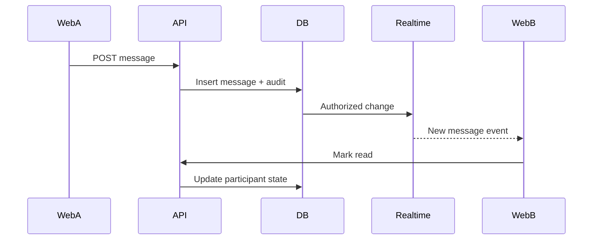

# Veel V2 Realtime, Messages, And Activity

Status: accepted
Release state: CODE_COMPLETE_PROVIDER_BLOCKED
Scope: realtime, messages, notifications, activity
Last updated: 2026-08-15
Source of truth: yes

Owns:
- realtime messages activity decisions for its named domain

Defers to:
- INDEX.md, route-map.md, OpenAPI, schema blueprint, and ADRs where narrower

Does not own:
- unrelated domains, implementation shortcuts, provider secrets, or hidden source-of-truth rules

Launch scope:
- accepted v2 launch or phased behavior stated in this document

Non-goals:
- historical-context inference, duplicate systems, and unapproved provider/product expansion

## Realtime Decision

Use Supabase Realtime selectively. Do not build a custom websocket server unless Supabase cannot satisfy a specific requirement.

## Realtime Channels

| Use case | Mechanism | Notes |
| --- | --- | --- |
| Direct messages | Postgres Changes or Broadcast after backend write | Participants only through RLS. |
| Typing indicators | Presence/Broadcast | Ephemeral, no DB write required. |
| Online state | Presence | No business truth. |
| Notifications | Postgres Changes on notification projection | User-owned rows only. |
| Live viewer count | Presence plus backend heartbeat aggregate | Avoid precise billing from presence alone. |
| Live room status | Backend write + realtime projection | Backend remains source. |
| Payment status | Backend event to user channel or polling | Do not expose internal settlements directly. |
| Activity | Projection rows | Backend-derived. |

## Current Notification Implementation State

- The notification foundation includes OpenAPI routes, RLS-protected notification/preference/device tables, a Fastify notification module, backend tests, and settings-page preference reads.
- Web push device registration stores hashes for lookup and optional encrypted endpoint/key material for server-only delivery. API/admin/frontend responses return only sanitized device projections.
- Notification delivery attempts are queued and token-leased by the worker through `notification_delivery_attempts`; stale leases are reclaimed, retries use bounded backoff with jitter and an attempt ceiling, and exhausted attempts become `dead_letter`. The delivery provider boundary records delivered, failed, revoked, and dead-letter outcomes without frontend truth. Admin health exposes counts and queue age, while recovery requires an audited idempotent admin command.
- Admin notification health counts are exposed through a staff-only sanitized projection, including delivery queue state counts.
- Settings includes browser service-worker enrollment. Enrollment is gated by `GET /v1/notifications/push-config`, browser Push API support, browser permission, and the canonical WeVid application session.
- Settings exposes backend-owned category and push preferences as explicit switches. The app notification inbox lists only the authenticated user's projection and marks rows read through idempotent Fastify mutations.
- The worker includes a server-only VAPID Web Push send-provider boundary. It uses encrypted browser subscription material, sends sanitized notification payloads, retries transient push failures, and revokes devices when push services return expired subscription responses.
- Supabase Realtime publication DDL includes only `notifications`, `messages`, `conversation_members`, and `direct_message_requests` as participant-owned projection tables. Browser realtime wiring invalidates typed API caches and refreshes server-owned projections; it does not compute payment, access, messaging, notification, or social truth from realtime payloads.
- Wallet-first and recovery sessions converge before Realtime: `POST /v1/realtime/token` verifies the opaque canonical application session and the same active-profile, current-age-verification, and wallet-readiness predicate as protected messaging before minting a short-lived ES256 custom JWT. Its `sub` is the canonical WeVid user UUID and its server-only `wevid_session=true` claim selects the canonical RLS identity path. The private imported JWK remains API-only. Missing signing configuration returns `503` and leaves server refresh as the safe fallback.
- Migration `0095` rechecks protected-app readiness inside the RLS projection boundary, so an expired/revoked age decision or removed wallet immediately denies already-issued Realtime tokens. Participant message RLS exposes only `delivery_state = visible`; hidden or pending-payment message bodies never enter browser Postgres Changes. Staff and moderator access stays behind audited backend/admin projections rather than broad client RLS.
- Browser roles retain `SELECT` only. Migration `0095` makes the required Realtime projection grants explicit for new Supabase projects and removes direct mutation privileges and policies from notifications, preferences, and devices; validation, authorization, idempotency, and audit boundaries remain in Fastify.
- The browser retries initial Realtime token failures with bounded exponential backoff and reconnects after channel errors, timeouts, or closure. Typed API reads and server rendering remain the fallback and source of displayed truth.
- Production still needs real VAPID key configuration, staging push-service verification across target browsers, and live Supabase Realtime staging verification with real RLS claims.
- In unconfigured environments, user-facing notification copy must show browser push as waiting for provider configuration rather than active delivery.

## Message Flow

## Paid Message Flow

Paid messages require:

- payment intent
- wallet approval
- confirmed settlement
- message delivery after backend confirmation
- idempotent delivery

Frontend may draft the body, but backend decides when the paid message becomes visible.

Current implementation slice:

- `GET /v1/messages/conversations` lists participant conversations through the API.
- `GET /v1/messages/conversations/:id/messages` returns participant-visible message rows.
- `POST /v1/messages/conversations/:id/messages` writes normal messages through Fastify.
- `POST /v1/messages/conversations` creates or reuses one direct conversation per unordered user pair.
- A non-Mutual/non-reciprocal-follow sender gets a pending request and may send at most two regular messages. The recipient must explicitly accept before either participant can continue normal messaging; decline closes regular messaging. Active Mutuals or reciprocal follows start accepted, and a pending request is promoted transactionally if that trusted relationship becomes active later. Paid messages bypass the two-message request ceiling but never bypass a block or declined request.
- `PATCH /v1/messages/conversations/:id/request` is recipient-only and allows exactly one terminal transition from pending to accepted or declined. Conversation creation, request response, and read-cursor commands persist the original response body, replay it exactly for the same request, and reject changed-input key reuse. `PATCH /v1/messages/conversations/:id/read` advances only that participant's read cursor and the web does not mark a thread read until its visible message projection loaded successfully.
- Blocks in either direction deny regular sends and paid-message intent creation. Paid settlement acquires the same ordered conversation/member/user/request locks as safety mutations, then rechecks the conversation, both-direction block state, and declined-request state. Any newly ineligible delivery is cancelled, audited, and paired with a sender-visible payment remediation notification rather than exposing the message or leaving delivery silently pending.
- `POST /v1/messages/conversations/:id/paid-message-intents` stores the paid-message body server-side and creates a server-priced `paid_message` payment intent.
- Confirmed backend settlement inserts the paid message, recipient notification, and audit event transactionally when the safety relationship remains eligible.
- New public message tables have RLS enabled. Baseline read policies are participant-scoped before direct Postgres Changes exposure.
- Migration `0095` refuses malformed legacy direct threads (anything other than exactly two members or more than one thread for an unordered pair) instead of guessing. Its down migration refuses to erase live request decisions or durable action receipts; application rollback must leave the additive schema in place after Launch 05 receives traffic.
- `/messages` reads the participant inbox and selected conversation through the typed web API helper. It does not render local conversation or paid-message fixtures.
- Every selected conversation exposes user-report and block actions next to the request state; the browser submits only typed safety commands while the backend rechecks the relationship for every regular or paid delivery.
- Public creator profiles expose one `Message` action for authenticated ready users; the API, not the profile UI, decides whether the result is accepted or a request.

## Activity Model

Activity is backend-derived:

- likes
- saves
- comments
- shares
- unlocks/purchases
- tips/support
- subscriptions
- live passes
- Event Access Passes
- referral shares
- commissions
- wallet transactions
- reports/safety actions if user-visible
- badges and verification status changes
- ranking changes if user-visible

No fake counters.

Current implementation slice:

- `GET /v1/activity` returns a backend-derived activity feed composed from payment and wallet transaction records.
- `GET /v1/activity/payments` returns normalized payment-intent activity for the authenticated, age-verified user, including backend-derived receipt number/state, durable confirmation delivery state, withdrawal-right status, latest refund/dispute review state, and whether an exception review request can be opened.
- `GET /v1/activity/wallet-transactions` returns backend-observed wallet transaction records created during payment submission/settlement handling.
- `GET /v1/activity/referrals` is the activity route-map alias for the same backend-derived referral activity returned by `GET /v1/referrals/activity`.
- `/activity` reads payment activity and wallet transactions through the typed web API helper and does not render local payment or wallet transaction fixtures.
- Wallet transaction records carry submission and confirmation references for user accountability, but do not grant access or revenue by themselves.

## Profile And Ranking Activity

Own activity may show:

- age verified
- wallet linked
- badge earned
- badge revoked
- creator rank changed
- event hosted/attended
- subscriber milestone
- support/tip milestone

Public ranking projections must be sanitized and opt-out aware where product policy allows.

## RLS Requirements

Baseline:

- `0017_rls_policy_baseline.sql` enables RLS on current public-schema tables that were created before explicit realtime policy work.
- Direct Supabase reads are authenticated only and read-only for browser roles.
- Business mutations still go through Fastify.

Messages:

- sender and recipient can read.
- blocked users obey backend block state.
- admin/moderator access goes through backend/admin tools, not broad client RLS.

Notifications:

- are backend-derived projections from existing business events
- may inform the user about engagement, messages, paid-message delivery, access/pass state, Membership renewal/cancel/grace state, wallet action required, age/KYC action required, creator/studio setup tasks, safety/admin decisions, provider incidents, and account issues
- never grant access, confirm payment, create revenue, change settlement state, create Mutuals, raise ranking, or override backend access truth
- must be user-owned rows under RLS before direct Realtime exposure
- must support explicit preference controls and device revocation
- direct client-facing resources must not include raw web-push endpoints, browser auth keys, provider secrets, raw provider payloads, or service-role data

- user can read own notifications.

Activity:

- user can read own private activity.
- public creator activity is a separate sanitized projection.

## Provider Verification And Staging Gate

Implementation follows the current official Supabase custom-JWT and Postgres Changes boundaries:

- Custom JWT client and claim requirements: `https://supabase.com/docs/guides/auth/jwts`
- Imported asymmetric signing keys: `https://supabase.com/docs/guides/auth/signing-keys`
- Realtime Postgres Changes, filters, and RLS behavior: `https://supabase.com/docs/guides/realtime/postgres-changes`
- JavaScript Realtime token refresh behavior: `https://supabase.com/docs/reference/javascript/setauth`

Launch 05 remains `CODE_COMPLETE_PROVIDER_BLOCKED` until staging proves the imported ES256 key and `kid`, canonical-session token mint/refresh, four approved table subscriptions under real RLS claims, cross-user and expired-access denial, reconnect behavior, and real VAPID delivery/revocation across target browsers. Because Postgres Changes authorizes each change against subscribers, staging must also establish and record a bounded concurrent-connection/event-rate ceiling; if that ceiling is below launch demand, replace the four global Postgres Changes subscriptions with private per-user Broadcast invalidations before production. Provider proof is a pre-production gate, not a second authentication authority.

## Anti-Abuse

- rate limit messages
- serialize direct-pair creation and request actions with ordered database locks
- enforce two-message request ceilings transactionally under concurrency
- prove that three concurrent pending-request sends produce exactly two messages and one rejection
- rate limit paid message attempts
- report/block visible everywhere
- media attachments virus/moderation scan
- paid message refund/reversal policy documented before scale
