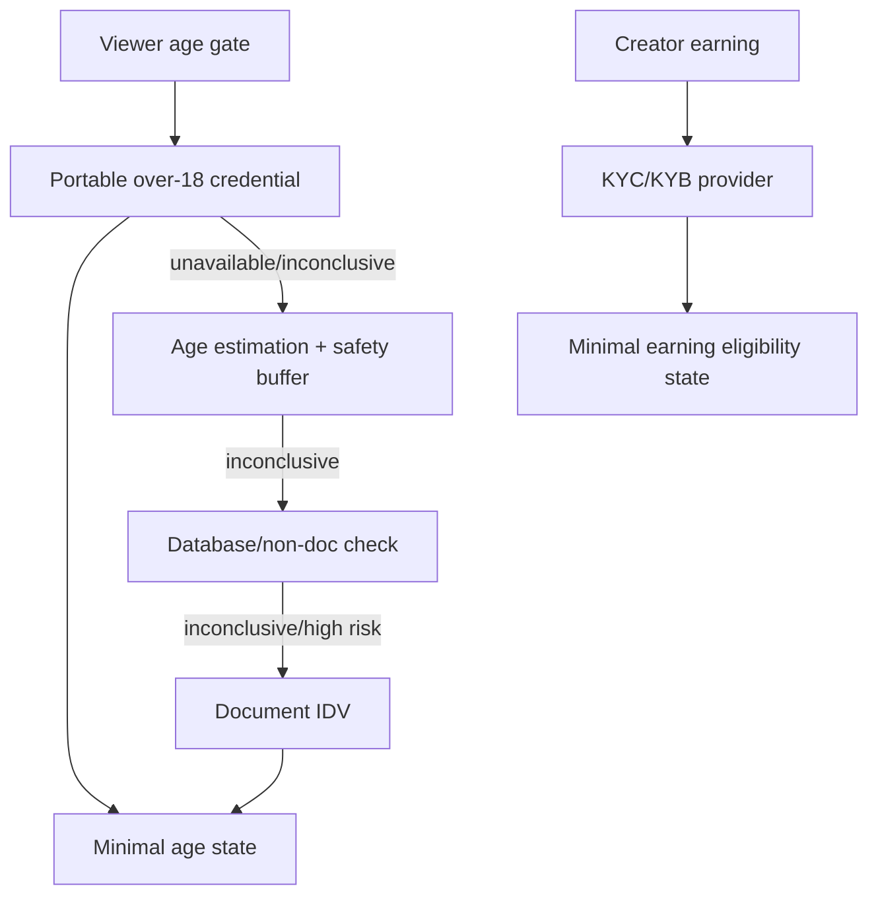

# Veel V2 Safety, Admin, And AI/MCP

Status: accepted
Scope: safety, admin, AI/MCP
Last updated: 2026-06-01
Source of truth: yes

Owns:
- safety admin ai decisions for its named domain

Defers to:
- INDEX.md, route-map.md, OpenAPI, schema blueprint, and ADRs where narrower

Does not own:
- unrelated domains, implementation shortcuts, provider secrets, or hidden source-of-truth rules

Launch scope:
- accepted v2 launch or phased behavior stated in this document

Non-goals:
- historical-context inference, duplicate systems, and unapproved provider/product expansion

## Safety Architecture

Safety is not a UI feature; it is a backend policy layer.

Required:

- adult-content compliance policy before launch
- age gate before protected app/media/Mutuals/messaging/wallet actions
- report/block on content, profiles, messages, live rooms
- moderation states for content/live/messages
- creator verification, consent, recordkeeping, and takedown workflows for adult content
- monetisation holds
- viewer payment holds
- KYC/KYB for earning, tax, and compliance where required
- audit logs
- admin review queues

The v2 build must carry forward `docs/v2-new-build/compliance/adult-content-compliance.md` and `docs/v2-new-build/compliance/age-kyc-jurisdictions.md`. Those documents are safety and compliance requirements, not marketing notes.

## Age/KYC

Recommended provider waterfall:

1. Portable/reusable over-18 credential where available.
2. Privacy-preserving age estimation with safety buffer.
3. Database or non-document check where provider and jurisdiction support it.
4. Document identity verification only when required by risk, jurisdiction, or previous inconclusive outcome.

Launch provider strategy:

- reusable-first viewer age assurance: Didit, Yoti Digital ID, EUDI Wallet, Scytales, pending legal/vendor review
- light/free viewer fallback: Didit age estimation and Persona/Didit document proof, pending legal/vendor review
- creator/compliance escalation only: Sumsub and Veriff for Studio/enterprise, creator publishing, tax, fraud, merchant, or regulated partner workflows
- do not force KYC/KYB for ordinary viewers unless product/legal policy requires it

Do not store raw identity images/docs unless provider/legal workflow explicitly requires it. Store:

- provider
- provider reference
- result/state
- threshold/rule/country metadata
- timestamps
- audit event

## Admin Surface

Admin is separate from normal app nav.

Admin modules:

- users
- content
- reports
- payments
- unlocks
- referrals
- commissions
- live rooms
- media providers
- age/KYC
- audit logs
- ops diagnostics

Rules:

- role/policy required
- every mutation audited
- dangerous actions require confirmation
- provider diagnostics sanitized
- no raw secrets in admin UI

## AI/MCP Scope

AI/MCP is permissioned and audited.

The practical launch scope is defined in `ai-mcp-use-cases.md`. AI should start as a lightweight MCP connection layer for creator productivity, user self-service, and admin operations summaries/drafts. External AI clients bring their own LLMs by default. Do not build a generic chatbot, autonomous admin agent, or unrestricted MCP gateway.

The launch implementation is an audited tool gateway, not a direct LLM-to-provider or LLM-to-admin bridge. AI/MCP sessions are scoped, short-lived, and backed by a server-side allowlist. Tool calls store redacted input/output summaries only.

Allowed user tools:

- app help
- draft caption
- suggest hashtags
- summarize own activity
- find own purchases/saved items

Allowed creator tools:

- draft content metadata
- summarize own creator analytics
- suggest live schedule

Admin-only tools:

- provider diagnostics
- payment lookup
- moderation queue assistance
- report clustering
- support/refund/ban preparation with explicit confirmation state

Not allowed:

- spend money
- unlock/buy content
- publish without explicit confirmation
- message users without confirmation
- bypass age/KYC/access
- use admin tools without admin role
- expose provider secrets
- store raw prompts, provider payloads, private message bodies, or secrets in AI audit rows

Confirmation-required tools may prepare a draft or decision record, but launch code must not send messages, refund/revoke, ban/restrict, publish, or alter safety/admin state from an AI tool call.

## Audit For AI

Every tool call logs:

- actor
- session
- tool
- scope
- input summary
- output summary
- confirmation state
- affected resource
- timestamp
